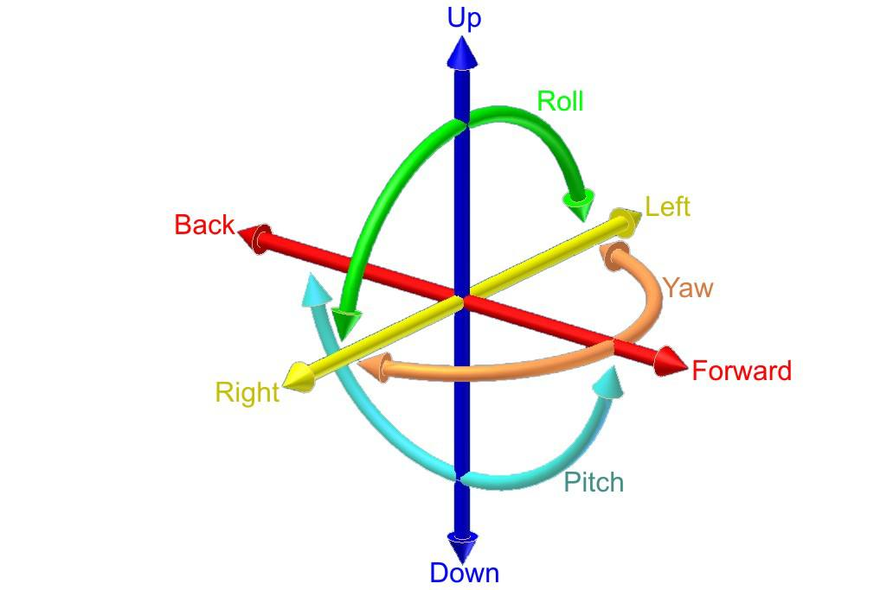
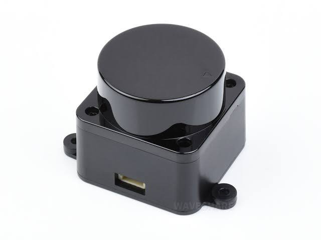
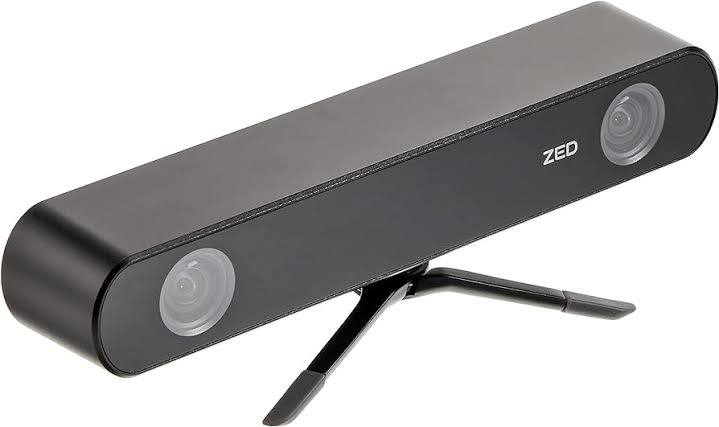
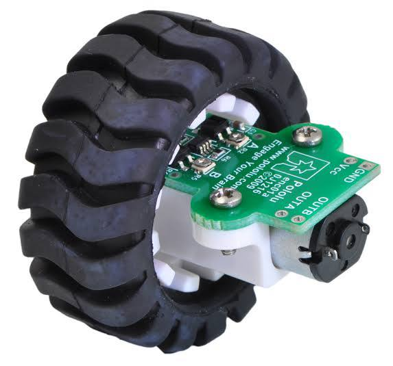
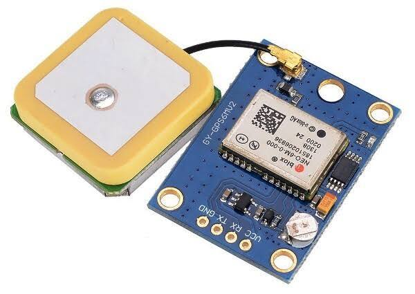

# Localization

*Localization theory for mobile robots involves algorithms and mathematical models used to estimate the robot's position and orientation within an environment. It integrates data from various sensors—like GPS, LIDAR, and odometry—to provide accurate positioning. Key concepts include probabilistic methods (e.g., Monte Carlo Localization), which account for uncertainties and noise in sensor measurements, and filtering techniques (e.g., Kalman Filters) that combine sensor data with a robot's motion model to refine position estimates. This theory helps robots navigate complex environments by continuously updating and correcting their position in real-time.*

.jpg>)

### There are two types of localization : Local and Global localization 

**Local localization** *A fundamental aspect of robotic systems, enabling them to understand their position relative to a **known reference points** (usually the Start Point), while **Global localization** enabling them to understand their position relative to a **map**.*

## Sensors Used in Localization:

#### 1- Odometry 

* Description: Measures the robot's movement based on wheel encoders or inertial measurement units (IMUs).

* Function: Provides estimates of the robot's displacement over time, which can be used to infer its position relative to its previous location.

* Limitations: Odometry is prone to accumulating errors over time due to factors like wheel slippage or uneven terrain, which can lead to drift.

#### 2-Laser Scanners (LIDAR)

* Description: Uses laser beams to scan the environment and create a detailed 2D or 3D map.

* Function: Provides precise distance measurements to obstacles, which can be used to compare with a known map to estimate the robot’s position.

* Advantages: High accuracy and can detect obstacles even in cluttered environments.

#### 3-Cameras (Visual Odometry) 

* Description: Uses visual data from cameras to estimate movement and orientation.

* Function: Analyzes changes in the visual input to infer the robot's movement relative to its starting point.

* Advantages: Can provide rich environmental details and work in diverse lighting conditions.

#### 4-Ultrasonic Sensors

* Description: Emits sound waves and measures the time it takes for them to return after hitting an object.

* Function: Detects nearby objects and obstacles, helping in mapping the immediate surroundings.

* Limitations: Less effective in complex environments and can be affected by noise.

#### 5-IMUs (Inertial Measurement Units)
.jpg>)
* Description: Measures acceleration and angular velocity.

* Function: Helps in tracking changes in orientation and movement, complementing odometry data to improve localization accuracy.

* Advantages: Provides additional information about the robot’s movement that can be useful in dynamic environments.

#### 6- Wheel Encoders:

* Description: These encoders are attached to the robot's wheels or axles. They track the number of wheel rotations or partial rotations by generating pulses as the wheels turn.

* Function: By counting the pulses, the robot can calculate how far it has traveled. Combining this data with the wheel's diameter, the robot estimates its linear displacement.

* Advantages: Provides straightforward and effective measurements of distance traveled. Useful for odometry calculations.

* Limitations: Susceptible to errors from wheel slippage, uneven terrain, or wear and tear.

#### 7-GPS (Global Positioning System)

* Description: Uses satellites to provide location data based on geographical coordinates.

* Function: Offers global positioning with high accuracy outdoors, helping robots determine their position on a global scale.

* Limitations: Less effective indoors or in areas with poor satellite visibility.