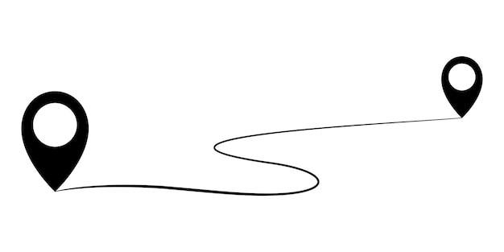
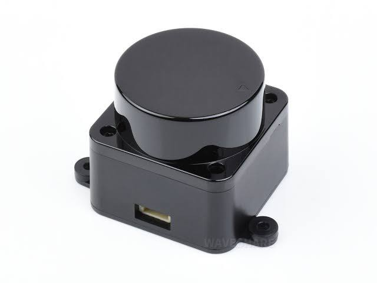
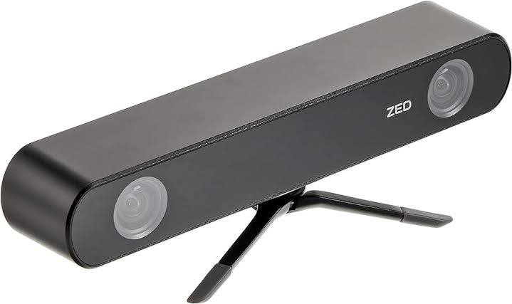
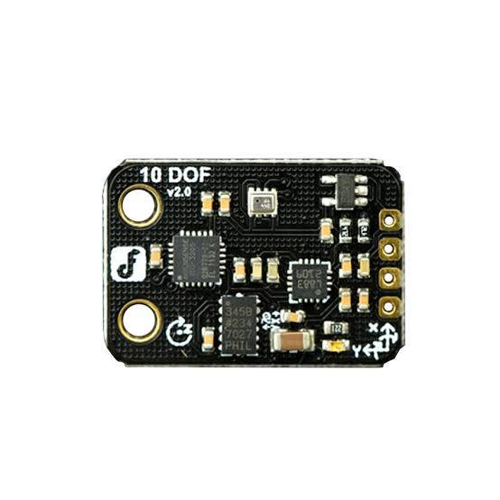
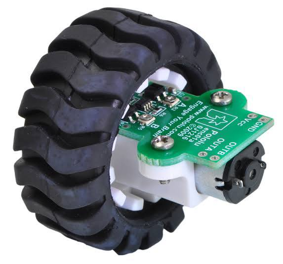
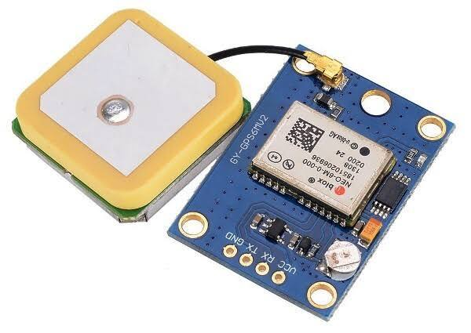

Auther: Rashidy
Reviwer: KG

---

# Localization

**Localization theory for mobile robots** involves algorithms and mathematical models used to estimate the robot's **pose**—its position and orientation— within an environment. It integrates data from various sensors—like GPS, LIDAR, Cameras, IMUs and odometry—to provide accurate positioning. Key concepts include:

- **Probabilistic Methods:** Algorithms like **Monte Carlo Localization**, represent the robot's belief about its position using probability distributions, accounting for uncertainty and noise in sensor measurements.
  
- **Filtering Techniques:** Filters such as the **Kalman Filter** and **Extended Kalman Filter (EKF)** estimate the robot's current state by combining prior knowledge with new measurements, effectively reducing uncertainty.

This theory helps robots navigate complex environments by continuously updating and correcting their position in real-time.

---

## Localization Challenges

There are three different types of localization challenges:

### **1. Local Localization(Position Tracking)**

**Local localization** involves assessing a robot's pose (position and orientation in space) as it moves through its environment. assuming a **known initial pose**. It focuses on tracking the robot's movement from that starting point. filters like the **Kalman Filter** can be employed to minimize inaccuracies in sensor readings, addressing the challenges associated with cumulative errors due to sensor noise and model inaccuracies.

### **2. Global Localization**

**In global localization**, the robot starts with **no prior knowledge** of it's initial pose and must determine its position relative to a ground truth map. This challenge includes dealing with the **aliasing problem**, where different locations may appear similar due to sensor limitations.
to addressing this challenge, algorithms such as the **Extended Kalman Filter, Monte Carlo methods**  (Particle Filters) can be utilized to address these issues.

### **3. Kidnapped Robot Problem**

The **kidnapped robot problem** resembles global localization but with the added complexity that the robot can be unexpectedly "kidnapped" and relocated to a different spot on the map at any time, The robot must then correctly **relocalize** itself on the map. Algorithms robust to this problem can recover from significant errors or unexpected changes.

> **Note:** In this course, we will focus exclusively on **static** (unchanging) environments, where conditions consistently align with the ground truth map. In contrast, **dynamic** environments involve objects within the map that may move over time, making localization and navigation more complex due to additional uncertainties requiring adaptive algorithms.

---

## Sensors Used in Localization

### 1. Laser Scanners (LIDAR)

- **Description**: Uses laser beams to scan the environment and create a detailed 2D or 3D map.

- **Function**: Provides precise distance measurements to obstacles, which can be used to compare with a known map to estimate the robot’s position.

- **Advantages**: High accuracy and can detect obstacles even in cluttered environments.

- **Limitations** :
  - High cost and power consumption.
  - Performance can degrade in adverse weather conditions like rain, fog, or snow.
    -Difficulty in detecting transparent or reflective surfaces.

### 2. Cameras (Visual Odometry)

- **Description**: Uses visual data from cameras to estimate movement and orientation.

- **Function**: Analyzes changes in the visual input to infer the robot's movement relative to its starting point.

- **Advantages**:
  - Can provide rich environmental details and work in diverse lighting conditions.
  - Works in diverse lighting conditions with appropriate algorithms.

- **Limitations**:

  - Sensitive to lighting conditions, shadows, and glare.
  - Computationally intensive due to image processing requirements.
  - May struggle in feature-poor environments (e.g., blank walls).

### 3. Inertial Measurement Units (IMUs)

- **Description**: Measures acceleration and angular velocity.

- **Function**: Helps in tracking changes in orientation and movement, complementing odometry data to improve localization accuracy.

- **Advantages**:
  - Provides additional information about the robot’s movement that can be useful in dynamic environments.

- **Limitations**:

  - Drift over time due to the accumulation of small measurement errors.
  - Requires calibration to maintain accuracy.
  
### 4. Wheel Encoders

- **Description**: encoders attached to the robot's wheels or axles track the number of wheel rotations or partial rotations by generating pulses as the wheels turn.

- **Function**: By counting the pulses, the robot can calculate how far it has traveled. Combining this data with the wheel's diameter, the robot estimates its linear displacement.

- **Advantages**:
  - Provides straightforward and effective measurements of distance traveled.
  - Useful for odometry calculations.

- **Limitations**:
  - Susceptible to errors from wheel slippage, uneven terrain, or wear and tear.
  - Affected by mechanical wear, which can change the wheel diameter.

### 5. Global Positioning System (GPS)

- **Description**: Uses satellites to provide location data based on geographical coordinates.

- **Function**: Offers global positioning with high accuracy outdoors, helping robots determine their position on a global scale.

- **Limitations**:
  - Less effective indoors or in areas with poor satellite visibility.
  - Accuracy limited to several meters, which may not be sufficient for precise localization.
  - Signal can be blocked or reflected, causing errors.

### 6. Ultrasonic Sensors

- **Description**: Use sound waves to detect objects.

- **Function**: Measure the time it takes for a sound pulse to return after hitting an object to calculate distance.

- **Advantages**:

  - Useful for short-range distance measurements.
  Limitations:

- **Limited** range and resolution compared to LIDAR.

### 7. Magnetic Sensors

- **Description**: Detect magnetic fields to determine orientation or position.

- **Function**: Can be used in environments with established magnetic patterns.

- **Advantages**:

- Not affected by visual obstructions.

- **Limitations**:

- Sensitive to electromagnetic interference.

### 8. Wi-Fi or RFID Positioning

- **Description**: Utilize signal strengths from Wi-Fi access points or RFID tags for indoor localization.

- **Function**: Estimate position based on the known locations of signal sources.

- **Advantages**:

  - Useful in environments where GPS is unavailable.

- **Limitations**:

  - Requires infrastructure setup.
  - Less accurate due to signal variability.

---

## Examples and Applications

- **Autonomous Cars**: Use LIDAR and cameras to localize and navigate roads.

- **Robotic Vacuum Cleaners**: Utilize bump sensors and simple mapping techniques for home navigation.

- **Warehouse Robots**: Use QR codes or markers on the floor for precise localization.

- **Drones**: Employ GPS and visual odometry for outdoor navigation.

---

## References for Further Reading

**Textbooks**:

- *Introduction to Autonomous Mobile Robots* by Roland Siegwart, Illah Nourbakhsh, and Davide Scaramuzza.
- *Probabilistic Robotics* by Sebastian Thrun, Wolfram Burgard, and Dieter Fox.