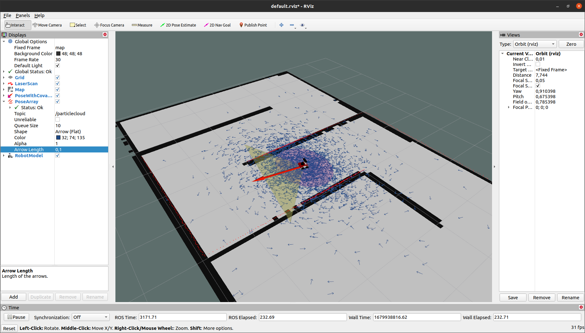

Author:
Reviewer: KG

# Monte Carlo Localization (MCL)

## 1. **MCL Overview**

**Monte Carlo Localization (MCL)** is a probabilistic algorithm used in robotics to estimate the position and orientation (**pose**) of a mobile robot within a known environment

* MCL represents the robot's belief about its position using a set of **particles**, each representing a possible pose of the robot.

* Each particle has a **weight**, that indicates the likelihood of that particle's pose being correct based on the robot’s sensor data.

 

## **2. Problems Solved by MCL**

Monte Carlo Localization (MCL) can address both **local localization** and **global localization** problems

### **2.1. Local Localization:**

* **Problem** : The robot has a rough estimate of its initial position within a known environment and needs to correct small errors due to noise or movement.

* **MCL Solution** : Initialize MCL with particles concentrated around the robot's estimated position. As the robot moves and gathers sensor data, MCL refines its pose estimate by adjusting the particles based on the sensor measurements.

### **2.2. Global Localization:**

* **Problem** : The robot has no prior knowledge of its initial position within a known map and must determine its location from scratch.

* **MCL Solution** : Initialize MCL with particles uniformly distributed across the entire map. As the robot moves and collects sensor data, MCL eliminates unlikely positions and converges on the correct location by comparing sensor readings with the map.

### **3. Particle Filter**

The key idea of MCL is to represent the robot's belief using a set of samples (particles), drawn according to the posterior distribution over robot poses.

* A **particle filter** is a type of **Bayesian filtering** technique that approximates the probability distribution of a system's state using a set of particles.
  
* Each particle represents a hypothesis of the robot's position and orientation.

* **Bayesian filtering** estimates the state of a dynamic system over time using noisy observations and prior knowledge.

Each particle includes:

* **x** : The x-coordinate of the robot’s position in a 2D plane.
* **y** : The y-coordinate of the robot’s position in the same 2D plane.
* **θ (theta)** : The orientation (heading) of the robot, typically measured in radians or degrees.
* **w** : The weight of the particle, representing the likelihood that this particle's pose corresponds to the robot’s actual pose.

* **Initialization**: Particles are spread randomly and uniformly throughout the map (global localization) or concentrated around an estimated position (local localization).
* **Resampling**: Particles with higher weights are more likely to be selected for the next iteration, while those with lower weights may be discarded.
* **Convergence**: After several iterations, particles converge towards the true pose of the robot.

### **4. MCL vs. Kalman Filter(KF)**

#### 4.1. Measurements

* **MCL** Can use raw measurements from various sensors without needing explicit associations to landmarks.
  
* **Extended Kalman Filter (EKF)**: Requires measurements to be related to specific landmarks or features with known correspondences.

#### 4.2. Measurement Noise

* **MCL**: Handles any type of noise, including non-Gaussian noise and outliers.

* **EKF**: Assumes noise is normally distributed (Gaussian), which can limit effectiveness in real-world scenarios with non-Gaussian noise.

#### 4.3. Posterior Distribution

* **MCL**: Represents the posterior distribution as a set of particles, allowing for multi-modal distributions (multiple hypotheses).
* **EKF**: Assumes the posterior distribution is Gaussian (unimodal), representing the belief with a mean and covariance matrix.

>Example: In a cluttered environment, the robot's position may be uncertain with multiple likely positions (multi-modal distribution). MCL can represent this uncertainty, whereas EKF may struggle due to its unimodal assumption.

### 4.4. Computational Efficiency

- **MCL**: Computational cost depends on the number of particles; more particles increase accuracy but require more computation.
- **EKF**: Generally more computationally efficient for linear systems but may become complex with high-dimensional states or non-linearities.

### 4.5. Ease of Implementation

- **MCL**: Conceptually simple but can be computationally intensive.
- **EKF**: Requires linearization of non-linear models, which can be mathematically complex.

#### 4.6. Robustness

- **MCL**: More robust to non-linearities and non-Gaussian noise due to its non-parametric representation.
- **EKF**: Less robust to significant deviations and outliers because of its reliance on Gaussian assumptions and linear approximations.

#### 4.7. Memory and Resolution Control

- **MCL**: Allows control over resolution and memory usage by adjusting the number of particles.
- **EKF**: Fixed memory usage determined by the state and covariance matrices.

#### 4.8. Global Localization

- **MCL**: Capable of handling both local and global localization problems.
- **EKF**: Typically limited to local localization due to its unimodal representation.

## 5. Bayes Filter

MCL estimates the posterior distribution of the robot's pose based on sensory information using a recursive **Bayes filter**.

- **Goal**: Estimate the probability density over the state space conditioned on the measurements.
- The posterior probability, or **belief**, is denoted as:

\[
\text{Bel}(x_t) = P(x_t | z_{1:t}, u_{1:t-1})
\]

Where:

- \( x_t \): State of the robot at time \( t \).
- \( z_{1:t} \): Sequence of observations up to time \( t \).
- \( u_{1:t-1} \): Sequence of control inputs up to time \( t-1 \).

The Bayes filter updates the belief recursively using the motion model and the observation model.

## 6. MCL Algorithm Explanation and Pseudocode

The Monte Carlo Localization algorithm consists of two main steps in each iteration:

1. **Motion and Measurement Update**:

   - **Motion Update**: For each particle, sample a new state \( x_t^{[k]} \) based on the previous state \( x_{t-1}^{[k]} \) and the control input \( u_t \) using the motion model \( p(x_t | x_{t-1}^{[k]}, u_t) \).
   - **Measurement Update**: Compute the weight \( w_t^{[k]} \) of each particle based on the likelihood of the observed measurement \( z_t \) given the particle's state \( x_t^{[k]} \) using the observation model \( p(z_t | x_t^{[k]}) \).

2. **Resampling Process**:

   - Normalize the weights so that they sum to 1.
   - Resample \( M \) particles from the current set, where the probability of selecting each particle is proportional to its weight.
   - This step focuses computational resources on the most probable hypotheses.

**Algorithm Steps**:

- **Initialization**:

  - Generate \( M \) particles \( \{ x_0^{[k]} \} \) with initial weights \( w_0^{[k]} = \frac{1}{M} \).

- **For each time step \( t \)**:

  1. **Motion Update**:

     - For each particle \( k \):
       \[
       x_t^{[k]} \sim p(x_t | x_{t-1}^{[k]}, u_t)
       \]

  2. **Measurement Update**:

     - For each particle \( k \):
       \[
       w_t^{[k]} = p(z_t | x_t^{[k]})
       \]

  3. **Normalization**:

     - Normalize weights:
       \[
       w_t^{[k]} = \frac{w_t^{[k]}}{\sum_{i=1}^{M} w_t^{[i]}}
       \]

  4. **Resampling**:

     - Draw \( M \) particles with replacement from the current set based on the normalized weights.

- **Output**:

  - Estimate the robot's pose using the weighted mean or by selecting the particle with the highest weight.

## 7. The AMCL Package in ROS

The **AMCL (Adaptive Monte Carlo Localization)** package provides the `amcl` node in ROS, which implements the MCL algorithm to track a robot's pose in a 2D space.

- **Subscriptions**:

  - **Laser Scan Data**: Provides sensor measurements.
  - **Map Data**: A pre-existing map of the environment.
  - **Transformations (tf)**: Robot's odometry and pose estimates.

- **Publications**:

  - **Estimated Pose**: The robot's estimated position and orientation in the map frame.

On startup, the `amcl` node initializes its particle filter based on provided parameters.

**Adaptive Aspect**:

- The "Adaptive" component refers to the algorithm's ability to adjust the number of particles dynamically based on the robot's uncertainty.
- This adaptation improves efficiency by using more particles when the robot's pose is uncertain and fewer particles when the pose is well-defined.

**Reference**: [AMCL ROS Wiki](https://wiki.ros.org/amcl)

## 8. AMCL Tuning

To optimize the performance of the AMCL algorithm, several parameters can be tuned:

- **Particle Parameters**:

  - `min_particles`: Minimum number of particles.
  - `max_particles`: Maximum number of particles.

- **Update Parameters**:

  - `update_min_d`: Minimum distance traveled before updating.
  - `update_min_a`: Minimum angular change before updating.

- **Sensor Model Parameters**:

  - `laser_max_range`: Maximum range of the laser scanner.
  - `laser_z_hit`: Weight for the match between observed and expected measurements.
  - `laser_z_rand`: Weight for random measurements.

- **Motion Model Parameters**:

  - `odom_alpha1` to `odom_alpha4`: Parameters defining the noise in the odometry.

Proper tuning involves adjusting these parameters based on the robot's sensors, motion characteristics, and the environment to achieve accurate and efficient localization.

[-Back to main](../README.md)
