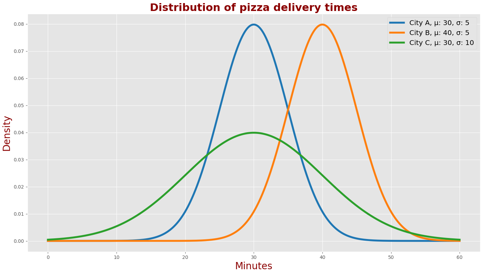
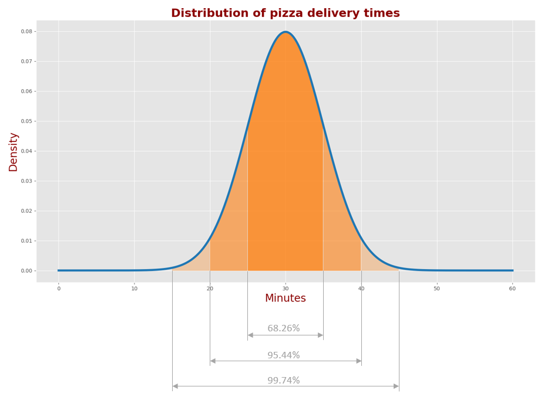
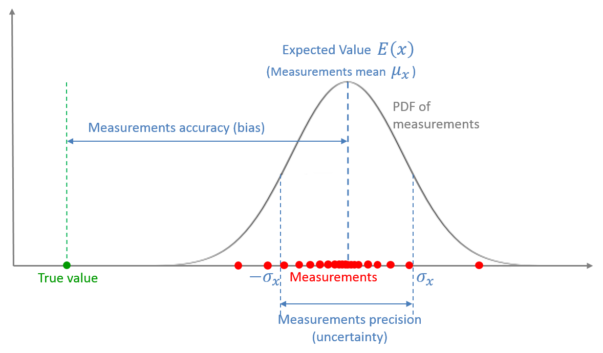
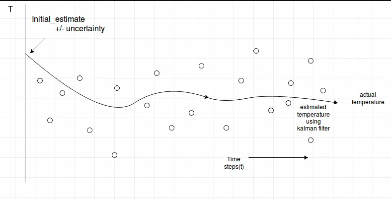
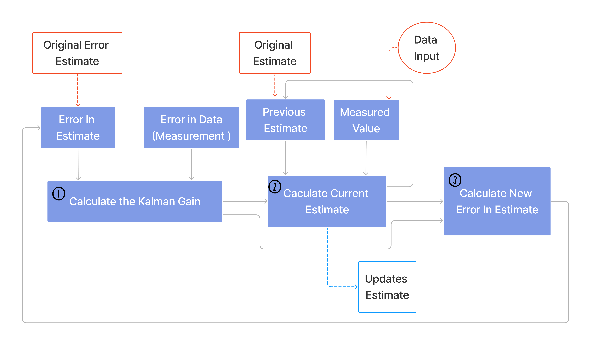
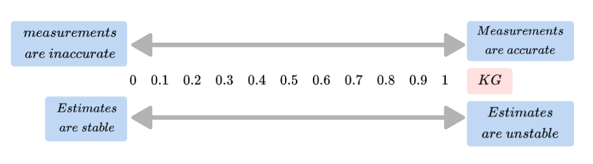
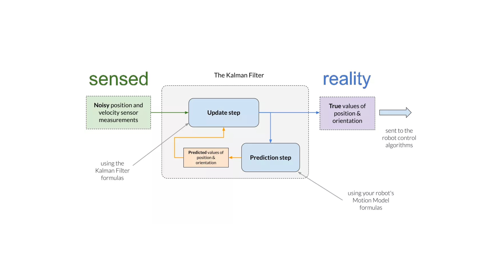
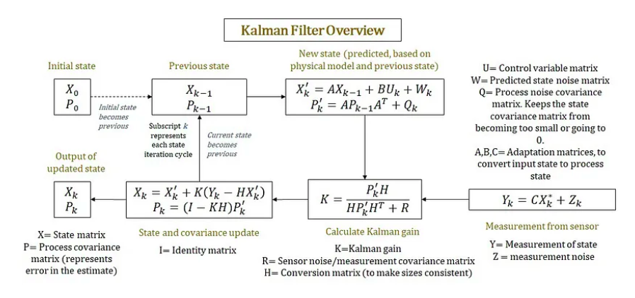

intro

Before we start, I would like to explain several fundamental terms such as variance, standard deviation, normal distribution, estimate, accuracy, precision, mean, expected value, and random variable.

**Mean ($\mu$)** and **Expected Value ($E$)**

* for example ,we have a For example, given five coins – two 5-cent coins and three 10-cent coins, we can easily calculate the mean value by averaging the values of the coins.

$$
\mu = \frac{1}{N} \sum _{n=1}^{N}V_{n}= \frac{1}{5} \left( 5+5+10+10+10 \right) = 8 cent
$$

The above outcome
1.the system states (the coin values) are given
2.we used the entire population (all 5 coins)
so it is mean value calculation.

* assume five different weight measurements of the same person: $79.8kg, 80kg, 80.1kg, 79.8kg, and 80.2kg$.
  The person is a system, and the person's weight is a system state.
  1. The measurements are different due to the random measurement error of the scales.
  2. We do not know the true value of the weight since it is a Hidden State.
  3. we can estimate the weight by averaging the scales' measurements.

$$
E(w) = \frac{1}{N} \sum _{n=1}^{N}W_{n}= \frac{1}{5} \left( 79.8+80+80.1+79.8+80.2 \right) = 79.98kg
$$

so The outcome of the estimate is the expected value of the weight.

The expected value is the value you would expect your hidden variable to have over a long time or many trials.
**Variance** and **Standard deviation**

* The **Variance $\sigma^{2}$** is a measure of the spreading of the data set from its mean.
* The **Standard Deviation $\sigma$** is the square root of the variance.
* Suppose we want to compare the heights of two high school basketball teams.
  The following table provides the players' heights and the mean height of each team.

|        | player1 | player2 | player3 | player4 | player5 | Mean   |
| ------ | ------- | ------- | ------- | ------- | ------- | ------ |
| Team A | 1.89 m  | 2.10m   | 1.75m   | 1.98m   | 1.85m   | 1.914m |
| Team B | 1.94m   | 1.90m   | 1.97m   | 1.89m   | 1.87m   | 1.914m |

1. the mean height of both teams is the same
2. Let us examine the height variance.

   1. We can calculate the distance from the mean for each variable by subtracting the mean from each variable.

   $$
   x_{n} -  \mu = x_{n}-1.914m
   $$

   $x : height $
   The following table presents the distance from the mean for each variable.|

   |        | player1 | player2 | player3 | player4 | player5 |
   | ------ | ------- | ------- | ------- | ------- | ------- |
   | Team A | -0.024m | 0.186m  | -0.164m | 0.066m  | -0.064m |
   | Team B | 0.026m  | -0.014m | 0.056m  | -0.024m | -0.044m |


   2. To get rid of the negative values, let us square the distance from the mean.

   $$
   \left( x_{n}-  \mu  \right) ^{2} =  \left( x_{n}- 1.914m \right) ^{2}
   $$

   |        | Player 1          | Player 2         | Player 3         | Player 4        | Player 5        |
   | ------ | ----------------- | ---------------- | ---------------- | --------------- | --------------- |
   | Team A | $0.000576m^{2}$ | $0.034596m^2$  | $0.026896m^2	$ | $0.004356m^2$ | $0.004096m^2$ |
   | Team B | $0.000676m^2	$  | $0.000196m^2	$ | $0.003136m^2$  | $0.000576m^2$ | $0.001936m^2$ |

   3. To get the variance, we need to average the squared distances from the mean.

   $$
   sigma^{2}= \frac{1}{N} \sum _{n=1}^{N} \left( x_{n}-  \mu  \right) ^{2}
   $$

For team A, the variance would be:
$\sigma_{\scriptscriptstyle \!A}^{2} = \frac{1}{N} \sum _{n=1}^{N} \left( x_{\scriptscriptstyle \!A_{n}} -  \mu  \right) ^{2}= \frac{1}{5} \left( 0.000576+ 0.034596+ 0.026896+ 0.004356+ 0.004096 \right) = 0.014m^{2}$
For team B, the variance would be:
$\sigma_{\scriptscriptstyle \!B}^{2} = \frac{1}{N} \sum _{n=1}^{N} \left( x_{\scriptscriptstyle \!B_{n}} -  \mu  \right) ^{2}= \frac{1}{5} \left( 0.000676+ 0.000196+ 0.003136+ 0.000576+ 0.001936 \right) = 0.0013m^{2}$
*We can see that although the mean of both teams is the same

* the measure of the height spreading of Team A is higher than the measure of the height spreading of Team B.
  *Therefore, the Team A players are more diverse than the Team B players.
  *There are players for different positions like ball handler, center, and guards, while the Team B players are not versatile.
  the standard deviation.

$$
\sigma =\sqrt[]{\frac{1}{N} \sum _{n=1}^{N} \left( x_{n}-  \mu  \right) ^{2}}
$$

The standard deviation of Team A players' heights would be 0.12m.

The standard deviation of Team B players' heights would be 0.036m.

**Normal Distribution (Gaussian)**
described by

$$
f \left( x; \mu , \sigma ^{2} \right) = \frac{1}{\sqrt[]{2 \pi  \sigma ^{2}}}e^{\frac{- \left( x- \mu  \right) ^{2}}{2 \sigma ^{2}}}
$$

The Gaussian curve is also called the Probability Density Function (PDF) for the normal distribution.

The following chart describes PDFs of the pizza delivery time in three cities: city 'A,' city 'B,' and city 'C.'


We can see that

1. the Gaussian shapes of the city 'A' and city 'B' pizza delivery times are identical;
   however, their centers are different. That means that in city 'A,' you wait for pizza for 10 minutes less on average, while the measure of spread in pizza delivery time is the same.
2. the centers of Gaussians in the city 'A' and city 'C' are the same.
   however, their shapes are different. Therefore the average pizza delivery time in both cities is the same, but the measure of spread is different.

The following chart describes the proportions of the normal distribution.

Usually, measurement errors are distributed normally. The Kalman Filter design assumes a normal distribution of the measurement errors.
**Random Variables**
A random variable describes the hidden state of the system. Almost any physical quantity is a random variable. Quantities like your weight, height, and body temperature are random variables, and you can measure them up to a certain precision.

In this tutorial, the random variables are characterized by the following:

*The mean of the sequence of measurements.
*The variance of the sequence of measurements.
**Estimate, Accuracy and Precision**
An **Estimate** is about evaluating the hidden state of the system
For example, the true position of the aircraft is hidden from the observer. We can estimate the aircraft position using sensors, such as radar. The estimate can be significantly improved by using multiple sensors and applying advanced estimation and tracking algorithms (such as the Kalman Filter). Every measured or computed parameter is an estimate.

**Accuracy** indicates how close the measurement is to the true value.

**Precision** describes the variability in a series of measurements of the same parameter.
The following figure illustrates accuracy and precision.

**summary**

A measurement is a **random variable**, described by the **Probability Density Function (PDF)**.

The mean of the measurements is the **Expected Value** of the random variable.

The offset between the mean of the measurements and the true value is the **accuracy of the measurements**, also known as bias or **systematic measurement error**.

The dispersion of the distribution is the measurement **precision, also known as the **measurement noise, random measurement error**, or **measurement uncertainty**.

okey let's  now go deep with the kalman filter

# kalman filter

* It is an iterative mathematical process that uses a set of equations and consecutive data inputs to equickly estimate the true value , position , velocity , etc of the object being measured , when the measured values contain  acertain amount of uncertainty or variation .

suppose we are measuring the temperature(T) of object using a thermometer(it has a certain amount of uncertainty or error). see below diagram. Initially Kalman filter starts out with random estimate temperature with more uncertainty then it gets sensor data(small circles) it quickly narrows down near the actual temperature and finally over time it gets more accurate estimate of the temperature.



in this example here there's only one measured value however this can be used in rader technology or GPS tracking satellites we will talke about it later now lets understant how kalman filter actaully work with single measruement

### why kalman filter?

### How kalman filter work ?

let's take a look at this diagram to know what actually goes on


there are three main iterative calculations that have to happen over and over and over again for the estimate to zoom into the actual correct value

1. calculate the kalman gain
   kalman gain : used to determine how much of the new measurements to use to update the new estimate
   it puts a relative importance in the error in the estimate versus the error in the data if the error in the estimate is smaller we put more importance in it if the error in the data is small we put more importance than that so what feeds the ultimate recalculation will depend upon how much we can turst in the estimate and in the data how big those errors are .

Kalman Gain = $KG$
Error In Estimate = $E_{EST}$
Error In Measurement = $E_{MEA}$

$$
KG = \frac{E_{EST}}{E_{EST}+E_{MEA}}
$$

note : $0< KG<1$



that mean if $KG$ is high close to 1 , measurements are accurate (error in measruement is very small compare to error in the estimate) in other case if the $KG$ is small that mean the error in the measurement is large relative to the error in the estimate

2. calculate the current estimate.: each time we need to update the estimate
   Current Estimate $:EST_{t}$
   Previous Estimate $:EST_{t-1}$
   Measurement $:MEA$

$$
EST_{t}=EST_{t-1}+KG[MEA-EST_{t-1}]
$$

note : if the $KG$ is large close to $1$ contribute much of the update to the estimate by the measurement that we took ,in other case if $KG$ is small close to $0$ that means the estimates are becoming stable , we put more weight in the current and the previous estimate to update the current estimate putting less weight in the measured value

the error in estimate is large compare to the error in measurement so we will take alot of this difference into consideration to update the current estimate , as the measurement must be accurate
  3. recalculate the new error in the estimate: each estimate comes with a predicted amount of error

$$
E_{EST_{t}} = \frac{E_{MEA}*E_{EST_{t-1}}}{E_{MEA}+E_{EST_{t-1}}} \longrightarrow E_{EST_{t}}=[1-KG]E_{EST_{t-1}}
$$

note : the factor that multiply the previous error is the inverse of the size of the kalman gain if $KG$ is large this mean the error in measurement is very small which means that new data put in can then quickly get to the true value and we will reduce the error in the estimate because the error in the measurement is small that means we will have small variation as new data comes in and the error in the estimate will get small very quickly .

### example:

* measuring the temperature with a certain thermometer we get this results

- True measurment = 72
- Initial Estimate = 68
- Initial Estimate error $(E_{EST})$ =2
- Initial Measurment = 75
- Error in Measurement = 4

 first etiration :

$$
KG=\frac{2}{2+4}=0.33\\
EST=68+0.33(75-68)=70.33\\
E_{est}=(1-0.33)(2)=1.33\\
$$

second etiration :

$$
KG=\frac{1.33}{1.33+4}=0.25\\
EST=70.33+(0.25)(71-70.33)=70.50\\
E_{est}=(1-0.25)(1.33)=1\\
$$

third etiration :

$$
KG=\frac{1}{1+4}=0.20\\
EST=70.50+(0.20)(70-70.50)=70.40\\
E_{est}=(1-.20)(1)=0.80
$$

- form privious results

|        | $MEA$ | $E_{MEA}$ | $EST$   | $E_{EST_{t-1}}$ | $KG$   | $E_{EST_{t}}$ |
| :-----: | ------- | ----------- | --------- | ----------------- | -------- | --------------- |
| $t-1$ |         |             | $68$    | $2$             |          |                 |
|  $t$  | $75$  | $4$       | $70.33$ |                   | $0.33$ | $1.33$        |
| $t+1$ | $71$  | $4$       | $70.50$ |                   | $0.25$ | $1.00$        |
| $t+2$ | $70$  | $4$       | $70.40$ |                   | $0.20$ | $0.80$        |
| $t+3$ | $74$  | $4$       | $71$    |                   | $0.17$ | $0.66$        |

note :

over time the size of kalman gain will get smaller and smaller which means the estimate are becoming closer to the true value

###########################################################

### How it work ? -kalman filter

* Kalman filter is a real-time optimal estimation algorithm that uses a model of the system being measured and updates the model as new measurements that contain noise become available. The filter works by making a prediction of the current state of the system based on the previous state estimate and the system model, and then combining this prediction with a new measurement to obtain an updated state estimate



- **to** **understand the necessity of a tracking and prediction algorithm.**

let's take the example of a tracking radar:


Suppose we have a track cycle of 5 seconds. At intervals of 5 seconds, the radar samples the target by directing a dedicated pencil beam.

Once the radar "visits" the target, it proceeds to estimate the current position and velocity of the target. The radar also estimates (or predicts) the target's position at the time of the next track beam.

The future target position can be easily calculated using Newton's motion equations:

$$
x=x_{o}+v_{0}\Delta t + \frac{1}{2} a \Delta t^{2}
$$

$Where:$

$ x :$  is the target position
$ x_{0}:$ is the initial target position$ v_{0}:$ is the initial target velocity$ a:$ is the target acceleration$\Delta t:$ is the time interval (5 seconds in our example)

* When dealing with three dimensions, Newton's motion equations can be expressed as a system of equations:

$$
\left\{ \begin{array}{cl}
x=x_{o}+v_{x_{0}}\Delta t + \frac{1}{2} a_{x_{0}} \Delta t^{2}\\
y=y_{o}+v_{y_{0}}\Delta t + \frac{1}{2} a_{y_{0}} \Delta t^{2}\\
z=z_{o}+v_{z_{0}}\Delta t + \frac{1}{2} a_{z_{0}} \Delta t^{2}
\end{array} \right.
$$

The set of target parameters $[x,y,z,v_{x},v_{y},v_{z},a_{x},a_{y},a_{z}]$is known as the **System State**. The current state serves as the input for the prediction algorithm, while the algorithm's output is the future state, which includes the target parameters for the subsequent time interval.

The system of equations mentioned above is known as a **Dynamic Model** or **State Space Model**. The dynamic model describes the relationship between the input and output of the system.

Apparently, if the target's current state and dynamic model are known, predicting the target's subsequent state can be easily accomplished.

In reality, the radar measurement is not entirely accurate. It contains random errors or uncertainties that can affect the accuracy of the predicted target state. The magnitude of the errors depends on various factors, such as radar calibration, beam width, and signal-to-noise ratio of the returned echo. The random errors or uncertainties in the radar measurement are known as **Measurement Noise**.

In addition, the target motion is not always aligned with the motion equations due to external factors like wind, air turbulence, and pilot maneuvers. This misalignment between the motion equations and the actual target motion results in an error or uncertainty in the dynamic model, which is called **Process Noise**.

Due to the Measurement Noise and the Process Noise, the estimated target position can be far away from the actual target position. In this case, the radar might send the track beam in the wrong direction and miss the target.

In order to improve the radar's tracking accuracy, it is essential to employ a prediction algorithm that accounts for both process and measurement uncertainty.

# Matrix format of the kalman filter



## initial State

1. state matrix $X_k$
   simply contains position and velocity of the thing you're trying to track

* in one dimention :

```math
X=\begin{bmatrix}
x\\
\dot x 
\end{bmatrix}
  \ \ \ \ \ \ \ \ \ \ \ \ 
 X=\begin{bmatrix}
y\\
\dot y
\end{bmatrix}
```

* in two dimentions :

```math
X=\begin{bmatrix}
x\\
y\\
\dot x \\
\dot y 
\end{bmatrix}
  \ \ \ \ \ \ \ \ \ \ \ \ 
 X=\begin{bmatrix}
x\\
\dot x\\
y\\
\dot y
\end{bmatrix}
```

* in three dimentions :

```math
X=\begin{bmatrix}
x\\
y\\
z\\
\dot x\\
\dot y\\
\dot z
\end{bmatrix}
  \ \ \ \ \ \ \ \ \ \ \ \ 
 X=\begin{bmatrix}
x\\
\dot x\\
y\\
\dot y\\
z\\
\dot z
\end{bmatrix}
```

* when we need to track something we need to keep track of it in terms of the equations of kinamatics

$$
x=x_{0}+\dot x t +\frac{1}{2} \ddot x t^{2}
$$

2. process covariacne matrix $P_{k}$
   simply represents the error in the estimate or the process  as we keep track of that error as we go through the process

## the initial become the previous

$$
X_{k} \Rightarrow X_{k-1} \\ ~\\
P_{k} \Rightarrow P_{k-1}
$$

## New State(Prediction)

$$
X_k=AX_{k-1}+Bu_{k}+w_{k} \\ ~\\
P_{k}=AP_{k-1}A^{T}+Q
$$

$u:$ Control Variable Matrix
$w:$ Noise In The Process
$\Delta t:$ Time For 1 Cycle

* It is a theoretical prediction based upon

1. the previous estimation $X_{k-1}$ which we cal
2. $u$ Vector : the control variable Matrix for example an object that is flying free through space  gravity controls.it's  defines how gravity
   affects the position and the velocity of our state of our particular object.
3. $w$  some noise in that prediction we wil take it zero for now
4. $A ,B $ adaptation matrices
   we will discuss the State Covariance Matrix $P$ later now let's calculate the new state

## State (Matrix)

* definition : it is a matri

### Eamples:

1. **fluid rise in tank** : (position $p_{y}$ , velocity $v_{y}$)

* state vector :

```math
x=\begin{bmatrix}
p_{y} \\
v_{y}
\end{bmatrix}
```

* adaptation matrix :

```math
A=\begin{bmatrix}
1 &\Delta t \\
0&1
\end{bmatrix}
```

from diff eq :

$$
p_{y}=p_{0}+v_{y}t+\frac{1}{2}a_{y}t^{2}\\
v_{y}=0+v_{y}
$$

$$
Ax=\begin{bmatrix}
1&\Delta t\\
0&1
\end{bmatrix}
\begin{bmatrix}
p_{y}\\
v_{y}
\end{bmatrix}=
\begin{bmatrix}
p_{y}+v_{y}\Delta t\\
0+v_{y}
\end{bmatrix}
$$

1. 1D mobile robot (X-axis : position , velocity)

* state vector :

```math
x=\begin{bmatrix}
p_{x} \\
v_{x}
\end{bmatrix}
```

* adaptation matrix :

```math
A=\begin{bmatrix}
1 &\Delta t \\
0&1
\end{bmatrix}
```

$$
p_{x}=p_{0}+v_{x}t+\frac{1}{2}a_{x}t^{2}\\
v_{x}=0+v_{x}\\
Ax=\begin{bmatrix}
1&\Delta t\\
0&1
\end{bmatrix}
\begin{bmatrix}
p_{x}\\
v_{x}
\end{bmatrix}=
\begin{bmatrix}
p_{x}+v_{x}\Delta t\\
v_{x}
\end{bmatrix}
$$

## Control Matrix

### Examples

1. Rising fluid tank

$$
x=\begin{bmatrix}
p_{y} \\
v_{y}
\end{bmatrix}
A=\begin{bmatrix}
1 &\Delta t \\
0&1
\end{bmatrix}
$$

$$
B=\begin{bmatrix}
 \frac{1}{2}\Delta t^2\\
 \Delta t
\end{bmatrix}  u=\begin{bmatrix}
0
\end{bmatrix}
$$

$$
Bu=\begin{bmatrix}
 0\\0
\end{bmatrix}
$$

2. falling object :

$$
x=\begin{bmatrix}
p_{y} \\
v_{y}
\end{bmatrix}
A=\begin{bmatrix}
1 &\Delta t \\
0&1
\end{bmatrix}
$$

$$
B=\begin{bmatrix}
 \frac{1}{2}\Delta t^2\\
 \Delta t
\end{bmatrix}  u=\begin{bmatrix}
9
\end{bmatrix}
$$

$$
Bu=\begin{bmatrix}
 \frac{9}{2}\Delta t^2\\
 9\Delta t\end{bmatrix}
$$

lets take : $p_{x_{k-1}} =20 $ , $v_{x_{k-1}} =0$ , $\Delta t = 1$

$$
x_{k}=\begin{bmatrix}
p_{y-1} \\
v_{y-1}
\end{bmatrix}
A=\begin{bmatrix}
0&\Delta t \\
0&1
\end{bmatrix}
u=\begin{bmatrix}
9
\end{bmatrix}
B=\begin{bmatrix}
\frac{1}{2}\Delta t^{2}\\
\Delta t
\end{bmatrix}
$$

$$
x_{k-1}=\begin{bmatrix}
p_{y_{k-1}}+v_{y_{k-1}} +\frac{1}{2}\Delta t^{2}g\\
0+v_{y{k-1}}+\Delta tg
\end{bmatrix}=
\begin{bmatrix}
20+0 +\frac{1}{2}\Delta (1)^{2}(-9.81)\\
0+0+\Delta (1)(-9.81)
\end{bmatrix}=
\begin{bmatrix}
15.1\\-9.81
\end{bmatrix}
$$

## Measurement

$$
Y_{k}=Cx_{k}+Z_{R}
$$

$$
x_{k}=\begin{bmatrix}
p_{x} \\
v_{x}
\end{bmatrix}C=\begin{bmatrix}
1 &0
\end{bmatrix}
C=\begin{bmatrix}
1 &0\\
0&1
\end{bmatrix}
\\
$$

## state matrix (2D)

$$
x\begin{bmatrix}
p_{x}\\p_{y}\\v_{x}\\v_{y}
\end{bmatrix}
A=\begin{bmatrix}
1&0&\Delta t &0 \\
0&1&0&\Delta t\\
0&0&1&0\\
0&0&0&1
\end{bmatrix} \longrightarrow 
Ax_{k}=\begin{bmatrix}
 p_{x}+v_{x}\Delta t\\
 p_{y}+v_{y}\Delta t\\
v_{x}\\
v_{y}
\end{bmatrix}
$$

$$
u=\begin{bmatrix}
a_x\\
a_y
\end{bmatrix}
B=\begin{bmatrix}
\frac{1}{2}\Delta t^2 &0\\
0&\frac{1}{2}\Delta t^2\\
\Delta t & 0\\
0&\Delta t
\end{bmatrix} \longrightarrow 
Bu=\begin{bmatrix}
\frac{1}{2}\Delta t^2 a_{x}\\
\frac{1}{2}\Delta t^2 a_{y}\\
\Delta t a_{x}\\

\Delta t a_{y}\\

\end{bmatrix}
$$

## state matrix (3D)

$$
x=\begin{bmatrix}
p_{x}\\
p_{y}\\
p_{z}\\
v_{x}\\
v_{y}\\
v_{y}
\end{bmatrix}
A=\begin{bmatrix}
1&0&0&\Delta t &0&0\\
0&1&0&0&\Delta t &0\\
0&0&1&0&0&\Delta t \\
0&0&0&1&0&0\\
0&0&0&0&1&0\\
0&0&0&0&0&1
\end{bmatrix}
$$

$$
u=\begin{bmatrix}
a_{x}\\
a_{y}\\
a_{y}
\end{bmatrix}
B=\begin{bmatrix}
\frac{1}{2}\Delta t^2 &0&0\\
0&\frac{1}{2}\Delta t^2&0\\
0&0&\frac{1}{2}\Delta t^2 \\
\Delta t &0&0\\
0&\Delta t & 0\\
0&0&\Delta t

\end{bmatrix}
$$

## covariance matrix

general view of what we are trying to understand look at this two equations

$$
P_{k}=AP_{k-1}+Q
$$

$$
K_{k}=\frac{P_{k}H^{T}}{HP_{k}H^{T}+R}
$$

where:
$P:$ State Covariance Matrix (error in the estimate)
$Q:$ Process Noise Covariance Matrix may be there is some noise in the input of the system there is some wind or some things that interfere with the ability of the thing we are tracking to follow it's normal path
$R:$ Measurement Covariance Matrix (error in measurement)
$K:$ Kalman Gain (weight factor based on comparing the error in the estimate to the error in the measurement)
if $R \longrightarrow 0$
then $K \longrightarrow 1$ (adjust primary with the measurement update)
if $R \longrightarrow large $
then $K \longrightarrow 0$ (adjust primary with the prediction update)
if $P \longrightarrow 0$ then measurement updates are mostly ignored
which is abad thing because that is a valuable information

## what it the variance - covariacne matrix ?

 assume we measured the length of an object and come up with this values
 $x= 2,5,4,5,3$
 $y= 3,4,5,6,7$
$X_{i}:$ Individual Measurements
$\overline{X}:$ Average of the Measurements
$\overline{X}-X_{i}:$ Deviation from the Average
$(\overline{X}-X_{i})^{2}:$ Squared of the Deviation
$\sigma_{X}^2=\dfrac{\sum_{i=1}^{N}(\overline{X}-X_{i})^{2}}{N}:$ Variance
$\sigma_{X}\sigma_{Y}=\dfrac{\sum_{i=1}^{N}{(\overline{X}-X_{i})(\overline{Y}-Y_{i})}}{N}:$ Covariance
$\sigma_{X}=\sqrt{\sigma_{X}^2}=\sqrt{\dfrac{\sum_{i=1}^{N}(\overline{X}-X_{i})^{2}}{N}}:$ Standard Deviation

$$
1-D \Rightarrow  \left[\dfrac{\sum(\overline X -X_{i})^{2}}{N} \right]
$$

$$
2-D \Rightarrow \begin{bmatrix}
 \dfrac{\sum(\overline{X}-X_{i})^{2}}{N} &\dfrac{\sum{(\overline{X}-X_{i})(\overline{Y}-Y_{i})}}{N}\\
 \dfrac{\sum{(\overline{Y}-Y_{i})(\overline{X}-X_{i})}}{N}& \dfrac{\sum(\overline{Y}-Y_{i})^{2}}{N}
\end{bmatrix}\Rightarrow \begin{bmatrix}
\sigma_{X}^{2}& \sigma_{x} \sigma_{Y} \\
 \sigma_{Y} \sigma_{X}&\sigma_{Y}^{2}
\end{bmatrix}
$$

$$
3-D \Rightarrow \begin{bmatrix}
\sigma_{X}^{2}& \sigma_{X} \sigma_{Y}& \sigma_{X} \sigma_{Z}\\
 \sigma_{Y} \sigma_{X}&\sigma_{Y}^{2}&\sigma_{Y} \sigma_{Z}\\
 \sigma_{Z} \sigma_{X}&\sigma_{Z} \sigma_{Y}&\sigma_{Z}^{2}
\end{bmatrix}
$$

## full scale 2-D example tracking an airplane

* Given :

```math
v_{0_{x}}=280 \ m/\sec \ \ \ \ x_{0}=4000 \ m\\
v_{0_{y}}=120 \ m/\sec \ \ \ \ y_{0}=3000 \ m
```

* Observations:

```math
x_{0}=4000 \ m \ \ \ \ v_{0_{x}}=280 \ m/\sec \\
x_{1}=4260 \ m \ \ \ \ v_{1_{x}}=282 \ m/\sec \\
x_{2}=4550 \ m \ \ \ \ v_{2_{x}}=285 \ m/\sec \\
x_{3}=4860 \ m \ \ \ \ v_{3_{x}}=286 \ m/\sec \\
x_{4}=5110 \ m \ \ \ \ v_{4_{x}}=290 \ m/\sec
```

* Initial Conditions :

```math
a_{x}=2\ m/\sec^{2} \ \ \ \ \Delta t = 1 \sec \\
v_{x}=280 m/\sec \ \ \ \ \Delta x = 25 \ m
```

* Process Errors In Process Covariance Matrix

```math
\Delta P_{x} = 20 \ m \ \ \ \ \Delta P_{v_{x}} = 5 \ m/\sec
```

* Observation Errors :

```math
\Delta x = 25 \ m \ \ \ \ \Delta v_{x}=6 \ m/\sec
```

1. The Predicted State

```math
X_{k_{P}}=AX_{k-1}+Bu_{k}+w_{k}\\ ~\\
X_{k_{P}}=\begin{bmatrix}1 & \Delta t \\ 0 & 1\end{bmatrix}\begin{bmatrix}x_{0}\\v_{0_{x}}\end{bmatrix}+\begin{bmatrix}\frac{1}{2}\Delta t^{2}\\\Delta t\end{bmatrix}\begin{bmatrix}a_{x_{0}}\end{bmatrix}+0   \\ ~\\ 
X_{k_{P}}=\begin{bmatrix}1 & 1 \\ 0 &1 \end{bmatrix}\begin{bmatrix}4000\\280 \end{bmatrix} + \begin{bmatrix}\frac{1}{2} \\ 1 \end{bmatrix}\begin{bmatrix} 2 \end{bmatrix}\\ ~\\
X_{k_{P}}=\begin{bmatrix} 4280 \\ 280 \end{bmatrix}+\begin{bmatrix}1 \\ 2 \end{bmatrix}\\ ~\\
X_{k_{P}}=\begin{bmatrix} 4281 \\ 282 \end{bmatrix}
```

2. The Initial Process Covariance Matrix
   given :

```math
\Delta x=20\ m \ \ \ \ \Delta v_{x}=5\ m/\sec
```

then

```math
P_{k-1}=\begin{bmatrix}\Delta x^{2} & \Delta x \Delta v \\ \Delta x \Delta v & \Delta v_{x}^{2} \end{bmatrix}=\begin{bmatrix}400 & 100 \\ 100 & 25 \end{bmatrix} \\~\\
P_{k-1}=\begin{bmatrix}400 & 0 \\ 0 &25 \end{bmatrix}

```

3. The Predicted Process Covariance Matrix

```math
P_{k_{P}}=AP_{k-1}A^{T}+Q_{R} \\ ~\\
P_{k_{P}}=\begin{bmatrix}1 & \Delta t \\ 0 &1 \end{bmatrix} \begin{bmatrix}400 & 0 \\ 0 &25 \end{bmatrix} \begin{bmatrix}1 & 0 \\ \Delta t &1 \end{bmatrix}+0 \\ ~\\
P_{k_{P}}=\begin{bmatrix}1 & 1\\0&1 \end{bmatrix}\begin{bmatrix}400 & 0\\0&25 \end{bmatrix}\begin{bmatrix}1 & 0\\1&1 \end{bmatrix} \\ ~\\
P_{k_{P}}=\begin{bmatrix}400 & 25\\0&25 \end{bmatrix}\begin{bmatrix}1 & 0\\1&1 \end{bmatrix}\\ ~\\
P_{k_{P}}=\begin{bmatrix}425 & 25\\25&25 \end{bmatrix}
```

4. Calculating the Kalman Gain

```math
K_{k} = \dfrac{P_{k_{P}}H^{T}}{HP_{k_{P}}H^{T}+R} \\ ~\\
K_{k} = \dfrac{\begin{bmatrix}425 & 0\\0&25 \end{bmatrix}\begin{bmatrix}1 & 0\\0&1 \end{bmatrix}}{\begin{bmatrix}1 & 0\\0&1 \end{bmatrix}\begin{bmatrix}425 & 0\\0&25 \end{bmatrix}\begin{bmatrix}1 & 0\\0&1 \end{bmatrix}+ \begin{bmatrix}625 & 0\\0&36 \end{bmatrix}} \\ ~\\
K_{k} = \dfrac{\begin{bmatrix}425 & 0\\0&25 \end{bmatrix}}{\begin{bmatrix}425 & 0\\0&25 \end{bmatrix}+\begin{bmatrix}625 & 0\\0&36 \end{bmatrix}} ~ = \dfrac{\begin{bmatrix}425 & 0\\0&25\end{bmatrix}}{\begin{bmatrix}1050 & 0\\0&61 \end{bmatrix}} ~= \begin{bmatrix}0.405 & 0\\0&0.410\end{bmatrix}
```

5.The New Observation

```math
Y_{k} = CY_{k_{m}}+Z_{k} \\ ~\\
Y_{k} = \begin{bmatrix}1 & 0\\0&1 \end{bmatrix}\begin{bmatrix}4260 \\282 \end{bmatrix}+0 \\ ~\\
Y_{k} = \begin{bmatrix}4260 \\282 \end{bmatrix}
```

6. Calculating The Current State

```math
X_{k} = X_{k_{P}}+K_{k}[Y_{k}-HX_{k_{P}}] \\ ~\\
X_{k} = \begin{bmatrix}4281 \\282 \end{bmatrix}+\begin{bmatrix}0.405 & 0\\ 0 & 0.410 \end{bmatrix}\begin{pmatrix} \begin{bmatrix}4260\\ 282 \end{bmatrix} -\begin{bmatrix}1 & 0\\ 0 & 1 \end{bmatrix}\begin{bmatrix}4281\\  282 \end{bmatrix}\end{pmatrix}\\ ~\\
X_{K}=\begin{bmatrix}4281 \\282 \end{bmatrix}+\begin{bmatrix}0.405 & 0 \\0 & 0.410 \end{bmatrix}\begin{bmatrix}-21 \\0 \end{bmatrix} \\ ~\\
X_{k}=\begin{bmatrix}4281 \\282 \end{bmatrix}+\begin{bmatrix}-85\\0 \end{bmatrix} \\ ~\\
X_{K}=\begin{bmatrix}4272.5 \\282 \end{bmatrix}
```

7. Updating The Process Covariance Matrix

```math
P_{k}=(I-KH)P_{k_{P}} \\ ~\\
P_{k}=\begin{bmatrix}\begin{bmatrix}1 & 0\\0&1 \end{bmatrix}-\begin{bmatrix}0.405 & 0\\0&0.410 \end{bmatrix}\begin{bmatrix}1 & 0\\0&1 \end{bmatrix} \end{bmatrix}\begin{bmatrix}425 & 0\\0&25 \end{bmatrix} \\ ~\\
P_{k}=\begin{bmatrix}\begin{bmatrix}1 & 0\\0&1 \end{bmatrix}-\begin{bmatrix}0.405 & 0\\0&0.410 \end{bmatrix}\end{bmatrix}\begin{bmatrix}425 & 0\\0&25 \end{bmatrix} \\ ~\\
P_{k}=\begin{bmatrix}0.595 & 0\\0&0.590 \end{bmatrix}\begin{bmatrix}425 & 0\\0&25 \end{bmatrix}\\ ~\\
P_{k}=\begin{bmatrix}253 & 0\\0&14.8\end{bmatrix}

```

$$
X_{k}=\begin{bmatrix}4272.5 \\282 \end{bmatrix}  \Longrightarrow X_{k-1} \Longrightarrow X_{k_{P}}=AX_{k-1}+Bu_{k}+w_{k}
\\ ~\\
P_{k}=\begin{bmatrix}253 & 0\\0&14.8\end{bmatrix} \Longrightarrow P_{k-1} \Longrightarrow P_{k_{P}}=AP_{k-1}A^{T}+Q_{k}
$$

second Round

```math
X_{k_{P}}=AX_{k-1}+Bu_{k}+w_{k}\\ ~\\
X_{k_{P}}=\begin{bmatrix}1 & \Delta t\\0&1\end{bmatrix}\begin{bmatrix}4272.5\\282\end{bmatrix}+\begin{bmatrix}\frac{1}{2}\Delta t^t \\ \Delta t\end{bmatrix}\begin{bmatrix}2\end{bmatrix}+0 \\ ~\\
X_{K_{P}}=\begin{bmatrix}1 & 1 \\ 0 & 1\end{bmatrix}\begin{bmatrix}4272.5\\282\end{bmatrix}+\begin{bmatrix}\frac{1}{2}\\1\end{bmatrix}\begin{bmatrix}2\end{bmatrix}+0 \\ ~\\
X_{K_{P}}=\begin{bmatrix}4554.5\\282\end{bmatrix}+\begin{bmatrix}1\\2\end{bmatrix} = \begin{bmatrix}4555.5\\284\end{bmatrix}
```

```math
P_{k_{P}}=AP_{k-1}A^{T}+Q_{K} \\ ~\\
P_{k_{P}}=\begin{bmatrix}1&1\\0&1\end{bmatrix}\begin{bmatrix}253&0\\0&14.8\end{bmatrix}\begin{bmatrix}1&0\\1&1\end{bmatrix}+0 \\~\\
P_{k_{P}}=\begin{bmatrix}253&14.8\\0&14.8\end{bmatrix}\begin{bmatrix}1 & 0 \\ 1 & 1\end{bmatrix}\\ ~\\
P_{k_{P}}=\begin{bmatrix}267.6 & 14.8\\14.8&14.8\end{bmatrix}=\begin{bmatrix}257.8 & 0 \\ 0 & 14.8\end{bmatrix}
```

4. Kalman Gain

```math
K = \dfrac {P_{k_{P}}H^{T}}{HP_{k_{P}}H^{T}+R} \\ ~\\
K = \dfrac {\begin{bmatrix}257.8 & 0 \\ 0 &14.8\end{bmatrix}\begin{bmatrix}1 & 0 \\ 0 & 1\end{bmatrix}}{\begin{bmatrix}1 & 0 \\ 0 & 1\end{bmatrix}\begin{bmatrix}267.8 & 0 \\ 0 & 14.8\end{bmatrix}\begin{bmatrix}1 & 0 \\ 0 & 1\end{bmatrix}+\begin{bmatrix}625 & 0 \\ 0 & 36\end{bmatrix}}\\ ~\\
K=\dfrac{\begin{bmatrix}267.8 & 0 \\ 0 & 14.8\end{bmatrix}}{\begin{bmatrix}892.8 & 0 \\ 0 & 50.8\end{bmatrix}}=\begin{bmatrix}0.300 & 0 \\ 0 & 0.291\end{bmatrix}
```

5. Current Observation

```math
Y_{k} = CY_{K}+Z_{K}=\begin{bmatrix}1 & 0 \\ 0 &1\end{bmatrix}\begin{bmatrix}4550\\ 285\end{bmatrix}+0=\begin{bmatrix}4550\\285\end{bmatrix}
```

6. Current State Matrix

```math
X_{k} = X_{k_{P}}+K_{k}[Y_{k}-HX_{P_{K}}] \\ ~\\
X_{k} = \begin{bmatrix}4555.5\\284\end{bmatrix}+\begin{bmatrix}0.300 & 0 \\ 0 &0.291\end{bmatrix}\begin{bmatrix}\begin{bmatrix}4550 \\ 285\end{bmatrix}-\begin{bmatrix}1 & 0 \\ 0 &1\end{bmatrix}\begin{bmatrix}4555.5 \\ 284\end{bmatrix}\end{bmatrix}\\ ~\\
X_{k}=\begin{bmatrix}4555.5\\284\end{bmatrix}+\begin{bmatrix}0.300 & 0 \\ 0 &0.291\end{bmatrix}\begin{bmatrix}-5.5 \\ 1\end{bmatrix}\\ ~\\
X_{k}=\begin{bmatrix}4555.5\\284\end{bmatrix}+\begin{bmatrix}-1.7 \\ 0.3\end{bmatrix}\\ ~\\
X_{k}=\begin{bmatrix}4553.8\\284.3\end{bmatrix} \Longrightarrow X_{k-1}
```

7. Current Process Covariance Matrix

```math
P_{k}=(I-KH)P_{k_{P}} \\ ~\\
P_{k}=\begin{bmatrix}\begin{bmatrix}1 & 0 \\ 0 &1\end{bmatrix}-\begin{bmatrix}0.300 & 0 \\ 0 &0.291\end{bmatrix}\end{bmatrix}\begin{bmatrix}267.8 & 0 \\ 0 &14.8\end{bmatrix}\\ ~\\
P_{k}=\begin{bmatrix}0.7 & 0 \\ 0 &0.709\end{bmatrix}\begin{bmatrix}267.8 & 0 \\ 0 &14.8\end{bmatrix}\\ ~\\
P_{k}=\begin{bmatrix}187.06 & 0 \\ 0 &10.5\end{bmatrix} \Longrightarrow P_{k-1}
```

third Round

```math
X_{k_{p}}=AX_{k-1}+Bu_{k}+w_{k}\\ ~\\
X_{k_{p}}=\begin{bmatrix}1 &1\\0&1\end{bmatrix}\begin{bmatrix}4553.8 \\284.3\end{bmatrix}+\begin{bmatrix}\frac{1}{2}\\2\end{bmatrix}\begin{bmatrix}2\end{bmatrix}+0 \\ ~\\
X_{k_{p}}=\begin{bmatrix}4838.1 \\ 284.3\end{bmatrix}+\begin{bmatrix}1\\2\end{bmatrix}=\begin{bmatrix}4839.1\\286.3\end{bmatrix}
```

```math
P_{k_{p}}=AP_{k-1}A^{T}+Q_{k}\\ ~\\
P_{k_{p}}=\begin{bmatrix}1 & 1 \\ 0 &1\end{bmatrix}\begin{bmatrix}187.5 &0\\0&10.5\end{bmatrix}\begin{bmatrix}1 &0\\1&1\end{bmatrix}+0 \\ ~\\
P_{k_{p}}=\begin{bmatrix}187.5 & 10.5\\0&10.5\end{bmatrix}\begin{bmatrix}1 &0\\1&1\end{bmatrix}=\begin{bmatrix}187.5 &10.5\\10.5&10.5\end{bmatrix}=\begin{bmatrix}187.5 &0\\0&10.5\end{bmatrix}
```

```math
K = \dfrac {P_{k_{p}}H^{T}}{HP_{k_{p}}H^{T}+R}=\dfrac{\begin{bmatrix}187.5 &0\\0&10.5\end{bmatrix}}{\begin{bmatrix}187.5 &0\\0&10.5\end{bmatrix}+\begin{bmatrix}625 &0\\0&36\end{bmatrix}}=\dfrac{\begin{bmatrix}187.5 &0\\0&10.5\end{bmatrix}}{\begin{bmatrix}812.5 &0\\0&46.5\end{bmatrix}}\\ ~\\
K=\begin{bmatrix}0.231 & 0 \\ 0 & 0.226\end{bmatrix}
```

```math
Y_{k}=\begin{bmatrix}4860\\286\end{bmatrix}
```

```math
X_{k}=X_{k_{p}}+K[Y_{k}-HX_{k_{p}}]\\ ~\\
X_{k}=\begin{bmatrix}4839.1\\286.3\end{bmatrix}+\begin{bmatrix}0.231 &0\\0&0.226\end{bmatrix}\begin{bmatrix}\begin{bmatrix}4860\\286\end{bmatrix}-\begin{bmatrix}1 &0\\0&1\end{bmatrix}\begin{bmatrix}4839.1\\286.3\end{bmatrix}\end{bmatrix} \\ ~\\
X_{k}=\begin{bmatrix}4839.1\\286.3\end{bmatrix}+\begin{bmatrix}0.231 &0\\0&0.226\end{bmatrix}\begin{bmatrix}20.9\\-0.3\end{bmatrix}\\ ~\\
X_{k}=\begin{bmatrix}4839.1\\286.3\end{bmatrix}+\begin{bmatrix}4.8\\-0.1\end{bmatrix}=\begin{bmatrix}4843.9\\286.2\end{bmatrix}
```

```math
P_{k}=(I-KH)P_{k_{p}}=\begin{bmatrix}\begin{bmatrix}1 &0\\0&1\end{bmatrix}-\begin{bmatrix}0.231 &0\\0&0.226\end{bmatrix}\begin{bmatrix}1 &0\\0&1\end{bmatrix}\end{bmatrix}\begin{bmatrix}187.5 &0\\0&10.5\end{bmatrix}\\ ~\\
P_{k}=\begin{bmatrix}0.769 &0\\0&0.774\end{bmatrix}\begin{bmatrix}187.5 &0\\0&10.5\end{bmatrix}=\begin{bmatrix}144.2 &0\\0&8.1\end{bmatrix}
```
