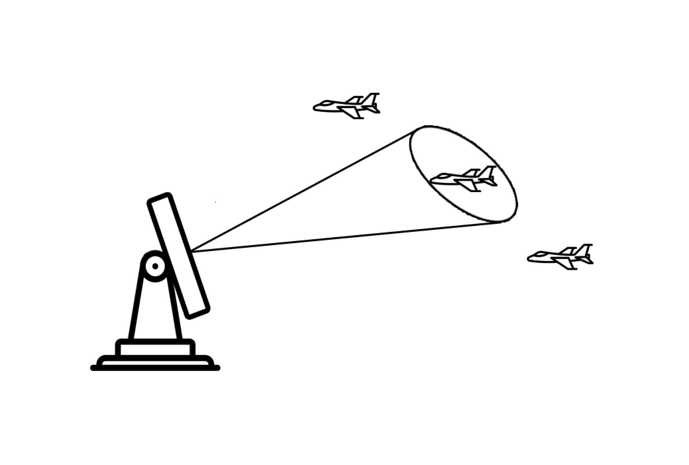

# kalman filter

* It is designed to estimate the hidden states of the system, even when the measurements are imprecise and uncertain.

### How it work ?

* Kalman filter is a real-time optimal estimation algorithm that uses a model of the system being measured and updates the model as new measurements that contain noise become available. The filter works by making a prediction of the current state of the system based on the previous state estimate and the system model, and then combining this prediction with a new measurement to obtain an updated state estimate


- **to** **understand the necessity of a tracking and prediction algorithm.**

let's take the example of a tracking radar:




Suppose we have a track cycle of 5 seconds. At intervals of 5 seconds, the radar samples the target by directing a dedicated pencil beam.

Once the radar "visits" the target, it proceeds to estimate the current position and velocity of the target. The radar also estimates (or predicts) the target's position at the time of the next track beam.

The future target position can be easily calculated using Newton's motion equations:

$$
x=x_{o}+v_{0}\Delta t + \frac{1}{2} a \Delta t^{2}
$$

$Where:$

$ x :$  is the target position
$ x_{0}:$ is the initial target position$ v_{0}:$ is the initial target velocity$ a:$ is the target acceleration$\Delta t:$ is the time interval (5 seconds in our example)

* When dealing with three dimensions, Newton's motion equations can be expressed as a system of equations:

$$
\left\{ \begin{array}{cl}
x=x_{o}+v_{x_{0}}\Delta t + \frac{1}{2} a_{x_{0}} \Delta t^{2}\\
y=y_{o}+v_{y_{0}}\Delta t + \frac{1}{2} a_{y_{0}} \Delta t^{2}\\
z=z_{o}+v_{z_{0}}\Delta t + \frac{1}{2} a_{z_{0}} \Delta t^{2}
\end{array} \right.
$$


The set of target parameters $[x,y,z,v_{x},v_{y},v_{z},a_{x},a_{y},a_{z}]$is known as the **System State**. The current state serves as the input for the prediction algorithm, while the algorithm's output is the future state, which includes the target parameters for the subsequent time interval.

The system of equations mentioned above is known as a **Dynamic Model** or **State Space Model**. The dynamic model describes the relationship between the input and output of the system.

Apparently, if the target's current state and dynamic model are known, predicting the target's subsequent state can be easily accomplished.

In reality, the radar measurement is not entirely accurate. It contains random errors or uncertainties that can affect the accuracy of the predicted target state. The magnitude of the errors depends on various factors, such as radar calibration, beam width, and signal-to-noise ratio of the returned echo. The random errors or uncertainties in the radar measurement are known as **Measurement Noise**.

In addition, the target motion is not always aligned with the motion equations due to external factors like wind, air turbulence, and pilot maneuvers. This misalignment between the motion equations and the actual target motion results in an error or uncertainty in the dynamic model, which is called **Process Noise**.

Due to the Measurement Noise and the Process Noise, the estimated target position can be far away from the actual target position. In this case, the radar might send the track beam in the wrong direction and miss the target.

In order to improve the radar's tracking accuracy, it is essential to employ a prediction algorithm that accounts for both process and measurement uncertainty.


# KF Design


## Kalman Gain

* definintion :

Current Estimate $:EST_{t}$
Previous Estimate $:EST_{t-1}$
Measurement $:MEA$

    $E_{est_{t}} = \frac{E{mea}*E_{est_{t-1}}}{E_{mea}+E_{est_{t-1}}} \longrightarrow [1-KG]E_{est_{t-1}}$

    $EST_{t}=EST_{t-1}+KG[MEA-EST_{t-1}]$

### Temp Example :

- True measurment = 72
- initial estimate = 68
- initial estimate error =2
- initial measurment = 75 $\to$ 71 $\to$ 70 $\to$ 74
- initial measurment error = 4

first etiration :

$$
KG=\frac{2}{2+4}=0.33\\
EST=68+0.33(75-68)=70.33\\
E_{est}=(1-0.33)(2)=1.33\\
$$

second etiration :

$$
KG=\frac{1.33}{1.33+4}=0.25\\
EST=70.33+(0.25)(71-70.33)=70.50\\
E_{est}=(1-0.25)(1.33)=1\\
$$

third etiration :

$$
KG=\frac{1}{1+4}=0.20\\
EST=70.50+(0.20)(70-70.50)=70.40\\
E_{est}=(1-.20)(1)=0.80
$$

- form privious results

## State (Matrix)

* definition :

$$
x_k=Ax_{k-1}+B_{u_{k}}+w_{k}
$$

### Eamples:

1. **fluid rise in tank** : (position $p_{y}$ , velocity $v_{y}$)

* state vector :

```math
x=\begin{bmatrix}
p_{y} \\
v_{y}
\end{bmatrix}
```

* adaptation matrix :

```math
A=\begin{bmatrix}
1 &\Delta t \\
0&1
\end{bmatrix}
```

from diff eq :

$$
p_{y}=p_{0}+v_{y}t+\frac{1}{2}a_{y}t^{2}\\
v_{y}=0+v_{y}
$$

$$
Ax=\begin{bmatrix}
1&\Delta t\\
0&1
\end{bmatrix}
\begin{bmatrix}
p_{y}\\
v_{y}
\end{bmatrix}=
\begin{bmatrix}
p_{y}+v_{y}\Delta t\\
0+v_{y}
\end{bmatrix}
$$

1. 1D mobile robot (X-axis : position , velocity)

* state vector :

```math
x=\begin{bmatrix}
p_{x} \\
v_{x}
\end{bmatrix}
```

* adaptation matrix :

```math
A=\begin{bmatrix}
1 &\Delta t \\
0&1
\end{bmatrix}
```

$$
p_{x}=p_{0}+v_{x}t+\frac{1}{2}a_{x}t^{2}\\
v_{x}=0+v_{x}\\
Ax=\begin{bmatrix}
1&\Delta t\\
0&1
\end{bmatrix}
\begin{bmatrix}
p_{x}\\
v_{x}
\end{bmatrix}=
\begin{bmatrix}
p_{x}+v_{x}\Delta t\\
v_{x}
\end{bmatrix}
$$

## Control Matrix

* definintion :

### Examples

1. Rising fluid tank

$$
x=\begin{bmatrix}
p_{y} \\
v_{y}
\end{bmatrix}
A=\begin{bmatrix}
1 &\Delta t \\
0&1
\end{bmatrix}
$$

$$
B=\begin{bmatrix}
 \frac{1}{2}\Delta t^2\\
 \Delta t
\end{bmatrix}  u=\begin{bmatrix}
0
\end{bmatrix}
$$

$$
Bu=\begin{bmatrix}
 0\\0
\end{bmatrix}
$$

2. falling object :

$$
x=\begin{bmatrix}
p_{y} \\
v_{y}
\end{bmatrix}
A=\begin{bmatrix}
1 &\Delta t \\
0&1
\end{bmatrix}
$$

$$
B=\begin{bmatrix}
 \frac{1}{2}\Delta t^2\\
 \Delta t
\end{bmatrix}  u=\begin{bmatrix}
9
\end{bmatrix}
$$

$$
Bu=\begin{bmatrix}
 \frac{9}{2}\Delta t^2\\
 9\Delta t\end{bmatrix}
$$

lets take : $p_{x_{k-1}} =20 $ , $v_{x_{k-1}} =0$ , $\Delta t = 1$

$$
x_{k}=\begin{bmatrix}
p_{y-1} \\
v_{y-1}
\end{bmatrix}
A=\begin{bmatrix}
0&\Delta t \\
0&1
\end{bmatrix}
u=\begin{bmatrix}
9
\end{bmatrix}
B=\begin{bmatrix}
\frac{1}{2}\Delta t^{2}\\
\Delta t
\end{bmatrix}
$$

$$
x_{k-1}=\begin{bmatrix}
p_{y_{k-1}}+v_{y_{k-1}} +\frac{1}{2}\Delta t^{2}g\\
0+v_{y{k-1}}+\Delta tg
\end{bmatrix}=
\begin{bmatrix}
20+0 +\frac{1}{2}\Delta (1)^{2}(-9.81)\\
0+0+\Delta (1)(-9.81)
\end{bmatrix}=
\begin{bmatrix}
15.1\\-9.81
\end{bmatrix}
$$

## Measurement 

$$
Y_{k}=Cx_{k}+Z_{R}
$$

$$
x_{k}=\begin{bmatrix}
p_{x} \\
v_{x}
\end{bmatrix}C=\begin{bmatrix}
1 &0
\end{bmatrix}
C=\begin{bmatrix}
1 &0\\
0&1
\end{bmatrix}
\\
$$

## state matrix (2D)

$$
x\begin{bmatrix}
p_{x}\\p_{y}\\v_{x}\\v_{y}
\end{bmatrix}
A=\begin{bmatrix}
1&0&\Delta t &0 \\
0&1&0&\Delta t\\
0&0&1&0\\
0&0&0&1
\end{bmatrix} \longrightarrow 
Ax_{k}=\begin{bmatrix}
 p_{x}+v_{x}\Delta t\\
 p_{y}+v_{y}\Delta t\\
v_{x}\\
v_{y}
\end{bmatrix}
$$

$$
u=\begin{bmatrix}
a_x\\
a_y
\end{bmatrix}
B=\begin{bmatrix}
\frac{1}{2}\Delta t^2 &0\\
0&\frac{1}{2}\Delta t^2\\
\Delta t & 0\\
0&\Delta t
\end{bmatrix} \longrightarrow 
Bu=\begin{bmatrix}
\frac{1}{2}\Delta t^2 a_{x}\\
\frac{1}{2}\Delta t^2 a_{y}\\
\Delta t a_{x}\\

\Delta t a_{y}\\

\end{bmatrix}
$$

## state matrix (3D)

$$
x=\begin{bmatrix}
p_{x}\\
p_{y}\\
p_{z}\\
v_{x}\\
v_{y}\\
v_{y}
\end{bmatrix}
A=\begin{bmatrix}
1&0&0&\Delta t &0&0\\
0&1&0&0&\Delta t &0\\
0&0&1&0&0&\Delta t \\
0&0&0&1&0&0\\
0&0&0&0&1&0\\
0&0&0&0&0&1
\end{bmatrix}
$$

$$
u=\begin{bmatrix}
a_{x}\\
a_{y}\\
a_{y}
\end{bmatrix}
B=\begin{bmatrix}
\frac{1}{2}\Delta t^2 &0&0\\
0&\frac{1}{2}\Delta t^2&0\\
0&0&\frac{1}{2}\Delta t^2 \\
\Delta t &0&0\\
0&\Delta t & 0\\
0&0&\Delta t

\end{bmatrix}
$$
