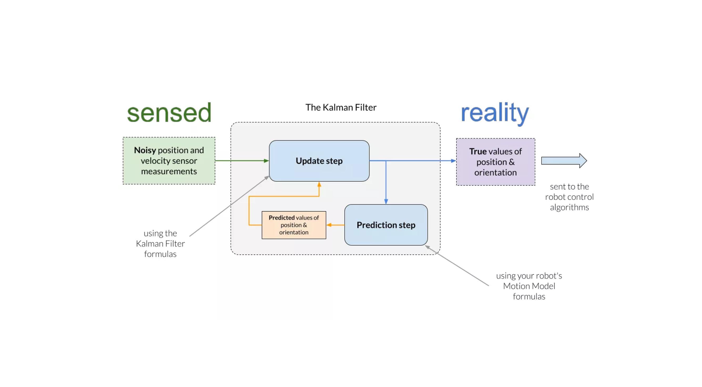
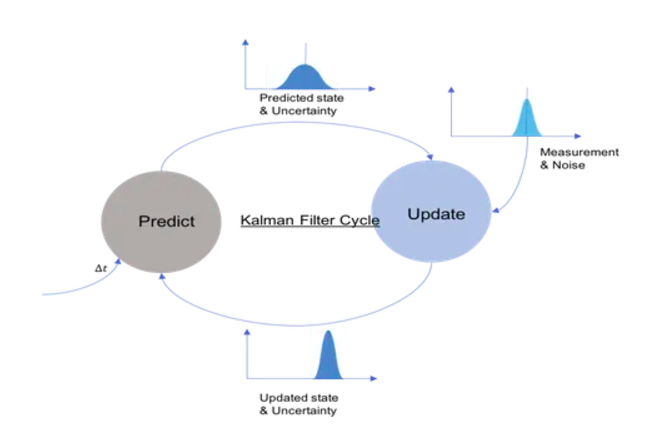
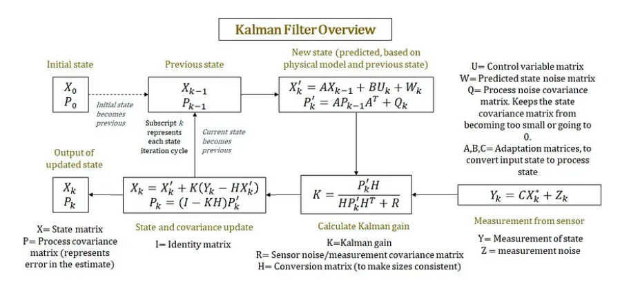

# Kalman Filter

## 1. **Introduction**

Imagine you're trying to track a moving car using a GPS device. However, the GPS readings are not perfect—they have errors and noise. Additionally, you might know that the car generally moves at a steady speed but occasionally accelerates or slows down unpredictably.

How can you combine these noisy GPS measurements with your understanding of the car's motion to estimate its true position and speed accurately?

The **Kalman Filter** is a mathematical tool that helps solve this problem. It provides a way to optimally estimate the true state (like position and velocity) of a dynamic system by combining measurements and a model, even when both are imperfect.

<p align="center">
  
</p>

## 2. **Fundamental Concepts**

Before diving into the Kalman Filter, let's revisit some key statistical concepts that are foundational to understanding how it works.

### **2.1. Mean $(\mu)$ and Expected Value $( E[X] )$**

- **Mean $(\mu )$**: The average of a set of numbers, calculated by summing all the values and dividing by the number of values.
- **Expected Value $(E[X])$**: The theoretical mean of a random variable's probability distribution, representing the average outcome if an experiment is repeated infinitely many times.

**Example**:

Suppose you have five coins: two worth 5 cents and three worth 10 cents.

$$
\mu = \frac{1}{N} \sum _ {n=1}^{N}V _{n}=\frac{5 + 5 + 10 + 10 + 10}{5} = \frac{40}{5} = 8 \text{ cents}
$$

Now, imagine you measure a person's weight five times due to slight variations in the scale:

- 79.8 kg
- 80.0 kg
- 80.1 kg
- 79.8 kg
- 80.2 kg

The estimated true weight is:

$$
E[w] =\frac{1}{N} \sum _ {n=1}^{N}W _{n}= \frac{79.8 + 80.0 + 80.1 + 79.8 + 80.2}{5} = 79.98 \text{ kg}
$$

### **2.2. Variance $( \sigma^2)$ and Standard Deviation $(\sigma )$**

- **Variance $(\sigma^2 )$**: Measures how much the values in a dataset spread out from the mean.
- **Standard Deviation $(\sigma)$**: The square root of the variance, representing the average amount by which each value differs from the mean.

**Example**:

Consider the heights of players on two basketball teams:

**Team A**:

- Heights $(m)$: 1.89, 2.10, 1.75, 1.98, 1.85
- Mean height $(\mu )$: 1.914 m

**Team B**:

- Heights $(m)$: 1.94, 1.90, 1.97, 1.89, 1.87
- Mean height $(\mu)$: 1.914 m

Both teams have the same mean height, but Team A has a higher variance, indicating more diversity in player heights.

**Calculating Variance for Team A**:

1. Subtract the mean from each height and square the result.
2. Sum these squared differences.
3. Divide by the number of players.

$$
\sigma_{A}^2 = \frac{1}{N} \sum _ {n=1}^{N} \left( x _{A_n}-  \mu  \right) ^{2}= \frac{(1.89 - 1.914)^2 + \dots + (1.85 - 1.914)^2}{5}=0.014m^{2}
$$

**Variance for Team B**:

$$
\sigma_{B}^2 = \frac{1}{N} \sum _ {n=1}^{N} \left( x _{B_n}-  \mu  \right) ^{2}= \frac{(1.94 - 1.914)^2 + \dots + (1.87 - 1.914)^2}{5}=0.0013m^{2}
$$

**Calculating the standard deviation for Team A**:

1. take the square root of the variance

$$
\sigma_{A} =\sqrt{\frac{1}{N} \sum _ {n=1}^{N} \left( x _{A_n}-  \mu  \right) ^{2}}=\sqrt{0.014}=0.12m
$$

**Standard deviation for Team B**:

$$
\sigma_{B} =\sqrt{\frac{1}{N} \sum _ {n=1}^{N} \left( x_ {B_n}-  \mu  \right) ^{2}}=\sqrt{0.0013}=0.036m
$$

### **2.3. Normal Distribution (Gaussian Distribution)**

A normal distribution is a bell-shaped curve that is symmetric about the mean. It's defined by its mean $(\mu )$ and variance $( \sigma^2)$.

**Probability Density Function**:

$$
f(x; \mu, \sigma^2) = \frac{1}{\sqrt{2\pi \sigma^2}} e^{- \frac{(x - \mu)^2}{2\sigma^2}}
$$

**Properties**:

- Approximately 68% of values fall within one standard deviation of the mean.
- Approximately 95% fall within two standard deviations.
- Approximately 99.7% fall within three standard deviations.

  
  

### **2.4. Random Variables**

A random variable represents a numerical outcome of a random process. In our context, measurements and system states are treated as random variables due to inherent uncertainties.

### **2.5. Estimate, Accuracy, and Precision**

- **Estimate**: An approximation of a true value based on observations.
- **Accuracy**: How close an estimate is to the actual true value.
- **Precision**: The consistency of repeated measurements.

**Example**:

- **High Accuracy, High Precision**: Darts are clustered at the bullseye.
- **High Precision, Low Accuracy**: Darts are clustered together but away from the bullseye.
- **Low Precision, High Accuracy**: Darts are spread out but centered around the bullseye.
- **Low Precision, Low Accuracy**: Darts are spread out and away from the bullseye.
  

In summery
----------

A measurement is a **random variable**, described by the **Probability Density Function (PDF)**.

The mean of the measurements is the **Expected Value** of the random variable.

The offset between the mean of the measurements and the true value is the **accuracy of the measurements**, also known as bias or **systematic measurement error**.

The dispersion of the distribution is the measurement **precision, also known as the **measurement noise, random measurement error**, or **measurement uncertainty**.


---

## 3. **Understanding The Kalman Filter**

### **3.1. What is the Kalman Filter?**

The Kalman Filter is an algorithm that optimally estimates the state of a dynamic system by minimizing the mean of the squared errors. It does this by combining predictions from a model with new measurements, updating estimates in a recursive manner.

<!--  -->

<!--  -->

### **3.2. Why Use the Kalman Filter?**

- To **filter out noise** from measurements.
- To **predict future states** based on a model.
- To **estimate** values that are not directly measurable (e.g., velocity from position measurements).

### **3.3. How Does the Kalman Filter Work?**

The Kalman Filter operates in two main steps:

1. **Prediction Step**: Estimates the current state and uncertainty from the previous state.
2. **Update Step**: Corrects the prediction using the new measurement.

These steps are repeated recursively with each new measurement.


## Kalman Filter Overview


The Kalman Filter algorithm will go through the following steps:

* **first measurement**  :
  the filter will receive initial noisy measurements from the sensor.
* **initialize state and covariance matrices** :
  the filter will initialize the robot's position based on the first measurement.
* then the kalman filter will receive another sensor  measurement after a time period Δt.
* **predict** :
  the algorithm will predict where the robot will be after time Δt.
* **update** :
  the filter compares the "predicted" location with what the sensor measurement says. The predicted location and the measured location are combined to give an updated location. The Kalman filter will put more weight on either the predicted location or the measured location depending on the uncertainty of each value.

## Mathematical Overview



## 4. **Mathematical Foundations**

### **4.1. State Representation**

The system's state at any time $ k $ is represented by a vector $\mathbf{X^{'}}_k$

The state vector:

$$
\mathbf{X^{'}}_k = \begin{bmatrix}  p^{'}_k \\ v^{'}_k \end{bmatrix}
$$

- $ p^{'}_k  $: Position at time $ k $.
- $v^{'}_k$: Velocity at time $ k $.

**Example**:

1. 1D motion:
   $\mathbf{X^{'}} = \begin{bmatrix} p^{'}_{x} \\ v^{'}_{x} \end{bmatrix}$
2. 2D motion:
   $\mathbf{X^{'}}=\begin{bmatrix}p^{'}_{x}\\ p^{'}_{y}\\ v^{'}_x \\ v^{'}_y \end{bmatrix}$

### **4.2. Process Model**

Describes how the state evolves over time.

**State Transition Equation**:

$$
\mathbf{X^{'}}_ k = \mathbf{A}\mathbf{X} _{k-1} + \mathbf{B}\mathbf{U}_k + \mathbf{W}_k
$$

- $ \mathbf{A} $: State transition matrix.
- $ \mathbf{B} $: Control input matrix.
- $ \mathbf{U}_k $: Control input at time $ k $.
- $ \mathbf{W}_k $: Process noise (zero-mean Gaussian with covariance $ \mathbf{Q}$).

$$
\mathbf{W}\sim \mathbf{N}(0,\mathbf{Q})
$$

**Example 1 (constant velocity model 1-d motion)**:
*The state Vector :*

$$
\mathbf{X} = \begin{bmatrix} p \\ v \end{bmatrix}
$$

*Linear motion :*

$$
p^{'}=p+v\Delta t\\ v^{'}=0+v
$$

*State Transition matrix :*

$$
\mathbf{X^{'}}=\begin{bmatrix}p^{'}\\ v^{'}\end{bmatrix}=\begin{bmatrix}1&\Delta t\\0&1\end{bmatrix}\begin{bmatrix}p\\ v\end{bmatrix}
$$

**Example 2 (constant velocity model 2-d Linear motion):**


$$
\mathbf{X^{'}}=\mathbf{A}\mathbf{x} + \mathbf{B}\mathbf{U}_k + \mathbf{W}_k
$$

$$
p^{'}_{x}=p_{x}+v_{x}\Delta t\\ p^{'}_ {y}=p _ {y}+v _ {y}\Delta t\\ v^{'}_{x}=v_{x}\\ v^{'}_ {y}=v _{y}
$$

*State Transition matrix :*

$$
\mathbf{X^{'}}=\begin{bmatrix}p^{'}_x\\p^{'}_y\\ v^{'}_x\\ v^{'}_y\end{bmatrix}=\begin{bmatrix}1&0&\Delta t &0 \\0&1&0&\Delta t\\0&0&1&0\\0&0&0&1\end{bmatrix}\begin{bmatrix}p_x\\ p_y\\ v_x\\ v_y\end{bmatrix}
$$

**Example 3 (constant acceleration model 2-d motion)**:

$$
\mathbf{X^{'}}=\mathbf{A}\mathbf{x} + \mathbf{B}\mathbf{U}_k + \mathbf{W}_k
$$

*Linear motion :*

$$
p^{'}_{x}=p_x+v_x\Delta t+\frac{1}{2}a_x\Delta t^{2}\\ ~\\ p^{'}_y=p_y+v_y\Delta t+\frac{1}{2}a_y\Delta t^{2}\\~\\ v^{'}_{x}=v_x+a_x\Delta t\\~\\ v^{'}_{y}=v_y+a_y\Delta t
$$

*State Transition matrix :*

$$
\mathbf{X^{'}}=\begin{bmatrix}p^{'}_x\\ p^{'}_y\\ v^{'}_x\\ v^{'}_y\end{bmatrix}=\begin{bmatrix}1&0&\Delta t &0 \\0&1&0&\Delta t\\0&0&1&0\\0&0&0&1\end{bmatrix}\begin{bmatrix}p_x\\ p_y\\ v_x\\ v_y\end{bmatrix}+
\begin{bmatrix}\frac{1}{2}\Delta t^2 &0\\0&\frac{1}{2}\Delta t^2\\\Delta t & 0\\0&\Delta t\end{bmatrix} \begin{bmatrix}a_x\\ a_y\end{bmatrix}
$$

**Example 4 (constant acceleration model 3-d motion)**:

$$
\mathbf{X^{'}}=\mathbf{A}\mathbf{x} + \mathbf{B}\mathbf{U}_k + \mathbf{W}_k
$$

*Linear motion :*

$$
p^{'}_{x}=p_x+v_x\Delta t+\frac{1}{2}a_x\Delta t^{2}\\ ~\\ p^{'}_y=p_y+v_y\Delta t+\frac{1}{2}a_y\Delta t^{2}\\ ~\\ p^{'}_{z}=p_z+v_z\Delta t+\frac{1}{2}a_z\Delta t^{2}\\ ~\\ v^{'}_{x}=v_x+a_x\Delta t\\~\\ v^{'}_{y}=v_y+a_y\Delta t \\ ~\\ v^{'}_{z}=v_z+a_z\Delta t
$$

*State Transition matrix :*

$$
\mathbf{X^{'}}=\begin{bmatrix}p^{'}_x\\ p^{'}_y\\ p^{'}_z\\ v^{'}_x\\ v^{'}_y\\ v^{'}_z\end{bmatrix}
=\begin{bmatrix}1&0&0&\Delta t &0&0\\0&1&0&0&\Delta t &0\\0&0&1&0&0&\Delta t \\0&0&0&1&0&0\\0&0&0&0&1&0\\0&0&0&0&0&1\end{bmatrix}\begin{bmatrix}p_x\\ p_y\\ p_z\\ v_x\\ v_y\\ v_y\end{bmatrix}+\begin{bmatrix}\frac{1}{2}\Delta t^2 &0&0\\0&\frac{1}{2}\Delta t^2&0\\0&0&\frac{1}{2} \Delta t^2 \\\Delta t &0&0\\0&\Delta t & 0\\0&0&\Delta t \end{bmatrix}\begin{bmatrix}a_{x}\\ a_{y}\\ a_{z}\end{bmatrix}
$$

### **4.3. Measurement Model**

Relates the state to the measurements.

**Measurement Equation**:

$$
\mathbf{Y}_k = \mathbf{C}\mathbf{X^{*}}_k + \mathbf{Z}_k
$$

- $ \mathbf{Y}_k $: Measurement at time $ k $.
- $ \mathbf{C} $: Measurement matrix.
- $ \mathbf{Z}_k $: Measurement noise (zero-mean Gaussian with covariance $ \mathbf{R} $).

$$
\mathbf{Z}\sim \mathbf{N}(0,\mathbf{R})
$$

**Example 1 (1d-motion)**:

$$
\mathbf{Y}_k = \mathbf{C}\mathbf{X^{*}}_k + \mathbf{Z}_k
$$

If we only measure position:

$$
\mathbf{C} = \begin{bmatrix} 1 & 0 \end{bmatrix}
$$

*The measurement function:*

$$
\mathbf{Y}=\begin{bmatrix} 1 & 0 \end{bmatrix}\begin{bmatrix}p^{'}\\ v^{'}\end{bmatrix}
$$

**Example 2 (2d-motion)**:
If we only measure position:

$$
\mathbf{C}=\begin{bmatrix}1 &0&0&0\\0&1&0&0\end{bmatrix}
$$

*The measurement function:*

$$
\mathbf{Y}=\begin{bmatrix}p_x\\ p_y \\ v_x \\ v_y\end{bmatrix}=\begin{bmatrix}1 &0&0&0\\0&1&0&0\end{bmatrix}\begin{bmatrix}p^{'}_x\\ p^{'}_y\\ v^{'}_x\\v^{'}_y\end{bmatrix}
$$

### **4.4. Covariance Matrices**

- **Process Noise Covariance $( \mathbf{Q} )$**: Uncertainty in the process model.
- **Measurement Noise Covariance $( \mathbf{R} )$**: Uncertainty in the measurements.

There is a true state that we want to know the value of but unfortunately we have to measure it with a noisy sensor.


<!-- If we measured the state several times we would see different results from the sensor due to the random noise -->

<!--  -->

- **Error Covariance $( \mathbf{P}_k )$**: Uncertainty in the state estimate.


$$
\mathbf{P^{'}}_{k} = \mathbf{A}\mathbf{P}_{k-1}\mathbf{A}^T + \mathbf{Q}_k
$$

### **4.5. Kalman Gain $(\mathbf{k} )$**

Determines how much the new measurement influences the state estimate.

$$
K= \frac{Variance ~ in ~ Estimate}{Variance~in~Estimate \quad + \quad Variance ~ in ~ Measurement} =\frac{\mathbf{P}_k \mathbf{H}}{\mathbf{H}\mathbf{P^{'}}_k\mathbf{H^T} + \mathbf{R}}
$$

* note : $0< K<1$


---

## 5. **The Kalman Filter Algorithm**

At each time step $ k $, perform the following steps:

### **5.1. Prediction Step**

- **State Prediction**:

  $$
  \mathbf{X^{'}}_k=\mathbf{A}\mathbf{X}_{k-1}+\mathbf{B}\mathbf{U}_k+\mathbf{W}_k
  $$
- **Error Covariance Prediction**:

  $$
  \mathbf{P^{'}}_{k} = \mathbf{A}\mathbf{P}_{k-1}\mathbf{A}^T + \mathbf{Q}_k
  $$

### **5.2. Update Step**

- **Kalman Gain Calculation**:

  $$
  \mathbf{K}_k =\frac{\mathbf{P}_k \mathbf{H}}{\mathbf{H}\mathbf{P^{'}}_k\mathbf{H^T} + \mathbf{R}}
  $$
- **State Update**:

  $$
  \mathbf{X}_k = \mathbf{X^{'}}_k + \mathbf{K}_k (\mathbf{Y}_k - \mathbf{H}\mathbf{X^{'}}_k)
  $$
- **Error Covariance Update**:

  $$
  \mathbf{P}_k = (\mathbf{I} - \mathbf{K}_k \mathbf{H}) \mathbf{P}_{k|k-1}
  $$

  <!--  -->

---

## 6. **Examples**

### **6.1. Simple 1D Example**

**Problem**:

Estimate the temperature of a room using noisy thermometer readings.

- **Initial Estimate**: $\hat{T}_0 = 68^\circ \text{C}$
- **Initial Estimate Variance**:$P_0 = 2^\circ \text{C}^2 $
- **Measurement Variance**: $R = 4^\circ \text{C}^2 $
- **Measurements**: $ Y_1 = 75^\circ \text{C}, Y_2 = 71^\circ \text{C}, Y_3 = 70^\circ \text{C} $

**Solution**:

Assume no process noise $( Q = 0 )$ and no control input $( u = 0 )$.

**Time Step 1**:

- **Prediction**:

  $$
  \hat{T}_{1|0} = \hat{T}_0 = 68^\circ \text{C}\\ ~\\
  P_{1|0} = P_0 = 2^\circ \text{C}
  $$
- **Kalman Gain**:

$$
K_1 = \frac{P_{1|0}}{P_{1|0} + R} = \frac{2}{2 + 4} = 0.33
$$

- **Update**:

  $$
  \hat{T}_{1|1} = \hat{T}_{1|0} + K_1(Y_1 - \hat{T}_{1|0}) = 68 + 0.33 (75-68) = 70.33^\circ \text{C} \\ ~\\
  P_{1|1} = (1 - K_1) P_{1|0} =(1-0.33)(2) = 1.33^\circ \text{C}
  $$

Repeat these steps for $ Y_2 $ and $ Y_3 $.

|  $k$  | $Y_k$ | $R$ | $\hat{T}_k$ | $P_{k-1}$ | $K$    | $P_k$  |
| :-----: | ------- | ----- | ------------- | ----------- | -------- | -------- |
| $t-1$ |         |       | $68$        | $2$       |          |          |
|  $t$  | $75$  | $4$ | $70.33$     |             | $0.33$ | $1.33$ |
| $t+1$ | $71$  | $4$ | $70.50$     |             | $0.25$ | $1.00$ |
| $t+2$ | $70$  | $4$ | $70.40$     |             | $0.20$ | $0.80$ |
| $t+3$ | $74$  | $4$ | $71$        |             | $0.17$ | $0.66$ |


### **6.2. 2D Tracking Example**

**Problem**:

Track an object's position and velocity in 2D space with noisy position measurements.

**Setup**:

- **State Vector**:

  $$
  \mathbf{x} = \begin{bmatrix} x \\ \dot{x} \\ y \\ \dot{y} \end{bmatrix}
  $$
- **State Transition Matrix**:

  $$
  \mathbf{A} = \begin{bmatrix} 1 & \Delta t & 0 & 0 \\ 0 & 1 & 0 & 0 \\ 0 & 0 & 1 & \Delta t \\ 0 & 0 & 0 & 1 \end{bmatrix}
  $$
- **Measurement Matrix**:

  $$
  \mathbf{H} = \begin{bmatrix} 1 & 0 & 0 & 0 \\ 0 & 0 & 1 & 0 \end{bmatrix}
  $$
- **Process Noise Covariance**:

  $$
  \mathbf{Q} = q \times \mathbf{I}_{4 \times 4}
  $$
- **Measurement Noise Covariance**:

  $$
  \mathbf{R} = \sigma^2 \times \mathbf{I}_{2 \times 2}
  $$

**Solution**:

At each time step:

1. **Prediction**:

   $$
   \mathbf{\hat{x}}_{k|k-1} = \mathbf{A}\mathbf{\hat{x}}_{k-1|k-1} \\ ~\\
   \mathbf{P}_{k|k-1} = \mathbf{A}\mathbf{P}_{k-1|k-1}\mathbf{A}^T + \mathbf{Q}
   $$
2. **Update**:

   $$
   \mathbf{K}_k = \mathbf{P}_{k|k-1}\mathbf{H}^T (\mathbf{H}\mathbf{P}_{k|k-1}\mathbf{H}^T + \mathbf{R})^{-1}\\ ~\\
   \mathbf{\hat{x}}_{k|k} = \mathbf{\hat{x}}_{k|k-1} + \mathbf{K}_k (\mathbf{z}_k - \mathbf{H}\mathbf{\hat{x}}_{k|k-1})\\ ~\\
   \mathbf{P}_{k|k} = (\mathbf{I} - \mathbf{K}_k \mathbf{H}) \mathbf{P}_{k|k-1}
   $$

**Interpretation**:

The filter estimates both position and velocity, even though only position is measured.
* Given :

```math
v_{0_{x}}=280 \ m/\sec \ \ \ \ x_{0}=4000 \ m\\
v_{0_{y}}=120 \ m/\sec \ \ \ \ y_{0}=3000 \ m
```

* Observations:

```math
x_{0}=4000 \ m \ \ \ \ v_{0_{x}}=280 \ m/\sec \\
x_{1}=4260 \ m \ \ \ \ v_{1_{x}}=282 \ m/\sec \\
x_{2}=4550 \ m \ \ \ \ v_{2_{x}}=285 \ m/\sec \\
x_{3}=4860 \ m \ \ \ \ v_{3_{x}}=286 \ m/\sec \\
x_{4}=5110 \ m \ \ \ \ v_{4_{x}}=290 \ m/\sec
```

* Initial Conditions :

```math
a_{x}=2\ m/\sec^{2} \ \ \ \ \Delta t = 1 \sec \\
v_{x}=280 m/\sec \ \ \ \ \Delta x = 25 \ m
```

* Process Errors In Process Covariance Matrix

```math
\Delta P_{x} = 20 \ m \ \ \ \ \Delta P_{v_{x}} = 5 \ m/\sec
```

* Observation Errors :

```math
\Delta x = 25 \ m \ \ \ \ \Delta v_{x}=6 \ m/\sec
```

1. The Predicted State

```math
X_{k_{P}}=AX_{k-1}+Bu_{k}+w_{k}\\ ~\\
X_{k_{P}}=\begin{bmatrix}1 & \Delta t \\ 0 & 1\end{bmatrix}\begin{bmatrix}x_{0}\\v_{0_{x}}\end{bmatrix}+\begin{bmatrix}\frac{1}{2}\Delta t^{2}\\\Delta t\end{bmatrix}\begin{bmatrix}a_{x_{0}}\end{bmatrix}+0   \\ ~\\ 
X_{k_{P}}=\begin{bmatrix}1 & 1 \\ 0 &1 \end{bmatrix}\begin{bmatrix}4000\\280 \end{bmatrix} + \begin{bmatrix}\frac{1}{2} \\ 1 \end{bmatrix}\begin{bmatrix} 2 \end{bmatrix}\\ ~\\
X_{k_{P}}=\begin{bmatrix} 4280 \\ 280 \end{bmatrix}+\begin{bmatrix}1 \\ 2 \end{bmatrix}\\ ~\\
X_{k_{P}}=\begin{bmatrix} 4281 \\ 282 \end{bmatrix}
```

2. The Initial Process Covariance Matrix
   given :

```math
\Delta x=20\ m \ \ \ \ \Delta v_{x}=5\ m/\sec
```

then

```math
P_{k-1}=\begin{bmatrix}\Delta x^{2} & \Delta x \Delta v \\ \Delta x \Delta v & \Delta v_{x}^{2} \end{bmatrix}=\begin{bmatrix}400 & 100 \\ 100 & 25 \end{bmatrix} \\~\\
P_{k-1}=\begin{bmatrix}400 & 0 \\ 0 &25 \end{bmatrix}

```

3. The Predicted Process Covariance Matrix

```math
P_{k_{P}}=AP_{k-1}A^{T}+Q_{R} \\ ~\\
P_{k_{P}}=\begin{bmatrix}1 & \Delta t \\ 0 &1 \end{bmatrix} \begin{bmatrix}400 & 0 \\ 0 &25 \end{bmatrix} \begin{bmatrix}1 & 0 \\ \Delta t &1 \end{bmatrix}+0 \\ ~\\
P_{k_{P}}=\begin{bmatrix}1 & 1\\0&1 \end{bmatrix}\begin{bmatrix}400 & 0\\0&25 \end{bmatrix}\begin{bmatrix}1 & 0\\1&1 \end{bmatrix} \\ ~\\
P_{k_{P}}=\begin{bmatrix}400 & 25\\0&25 \end{bmatrix}\begin{bmatrix}1 & 0\\1&1 \end{bmatrix}\\ ~\\
P_{k_{P}}=\begin{bmatrix}425 & 25\\25&25 \end{bmatrix}
```

4. Calculating the Kalman Gain

```math
K_{k} = \dfrac{P_{k_{P}}H^{T}}{HP_{k_{P}}H^{T}+R} \\ ~\\
K_{k} = \dfrac{\begin{bmatrix}425 & 0\\0&25 \end{bmatrix}\begin{bmatrix}1 & 0\\0&1 \end{bmatrix}}{\begin{bmatrix}1 & 0\\0&1 \end{bmatrix}\begin{bmatrix}425 & 0\\0&25 \end{bmatrix}\begin{bmatrix}1 & 0\\0&1 \end{bmatrix}+ \begin{bmatrix}625 & 0\\0&36 \end{bmatrix}} \\ ~\\
K_{k} = \dfrac{\begin{bmatrix}425 & 0\\0&25 \end{bmatrix}}{\begin{bmatrix}425 & 0\\0&25 \end{bmatrix}+\begin{bmatrix}625 & 0\\0&36 \end{bmatrix}} ~ = \dfrac{\begin{bmatrix}425 & 0\\0&25\end{bmatrix}}{\begin{bmatrix}1050 & 0\\0&61 \end{bmatrix}} ~= \begin{bmatrix}0.405 & 0\\0&0.410\end{bmatrix}
```

5.The New Observation

```math
Y_{k} = CY_{k_{m}}+Z_{k} \\ ~\\
Y_{k} = \begin{bmatrix}1 & 0\\0&1 \end{bmatrix}\begin{bmatrix}4260 \\282 \end{bmatrix}+0 \\ ~\\
Y_{k} = \begin{bmatrix}4260 \\282 \end{bmatrix}
```

6. Calculating The Current State

```math
X_{k} = X_{k_{P}}+K_{k}[Y_{k}-HX_{k_{P}}] \\ ~\\
X_{k} = \begin{bmatrix}4281 \\282 \end{bmatrix}+\begin{bmatrix}0.405 & 0\\ 0 & 0.410 \end{bmatrix}\begin{pmatrix} \begin{bmatrix}4260\\ 282 \end{bmatrix} -\begin{bmatrix}1 & 0\\ 0 & 1 \end{bmatrix}\begin{bmatrix}4281\\  282 \end{bmatrix}\end{pmatrix}\\ ~\\
X_{K}=\begin{bmatrix}4281 \\282 \end{bmatrix}+\begin{bmatrix}0.405 & 0 \\0 & 0.410 \end{bmatrix}\begin{bmatrix}-21 \\0 \end{bmatrix} \\ ~\\
X_{k}=\begin{bmatrix}4281 \\282 \end{bmatrix}+\begin{bmatrix}-85\\0 \end{bmatrix} \\ ~\\
X_{K}=\begin{bmatrix}4272.5 \\282 \end{bmatrix}
```

7. Updating The Process Covariance Matrix

```math
P_{k}=(I-KH)P_{k_{P}} \\ ~\\
P_{k}=\begin{bmatrix}\begin{bmatrix}1 & 0\\0&1 \end{bmatrix}-\begin{bmatrix}0.405 & 0\\0&0.410 \end{bmatrix}\begin{bmatrix}1 & 0\\0&1 \end{bmatrix} \end{bmatrix}\begin{bmatrix}425 & 0\\0&25 \end{bmatrix} \\ ~\\
P_{k}=\begin{bmatrix}\begin{bmatrix}1 & 0\\0&1 \end{bmatrix}-\begin{bmatrix}0.405 & 0\\0&0.410 \end{bmatrix}\end{bmatrix}\begin{bmatrix}425 & 0\\0&25 \end{bmatrix} \\ ~\\
P_{k}=\begin{bmatrix}0.595 & 0\\0&0.590 \end{bmatrix}\begin{bmatrix}425 & 0\\0&25 \end{bmatrix}\\ ~\\
P_{k}=\begin{bmatrix}253 & 0\\0&14.8\end{bmatrix}

```

$$
X_{k}=\begin{bmatrix}4272.5 \\282 \end{bmatrix}  \Longrightarrow X_{k-1} \Longrightarrow X_{k_{P}}=AX_{k-1}+Bu_{k}+w_{k}
\\ ~\\
P_{k}=\begin{bmatrix}253 & 0\\0&14.8\end{bmatrix} \Longrightarrow P_{k-1} \Longrightarrow P_{k_{P}}=AP_{k-1}A^{T}+Q_{k}
$$

second Round

```math
X_{k_{P}}=AX_{k-1}+Bu_{k}+w_{k}\\ ~\\
X_{k_{P}}=\begin{bmatrix}1 & \Delta t\\0&1\end{bmatrix}\begin{bmatrix}4272.5\\282\end{bmatrix}+\begin{bmatrix}\frac{1}{2}\Delta t^t \\ \Delta t\end{bmatrix}\begin{bmatrix}2\end{bmatrix}+0 \\ ~\\
X_{K_{P}}=\begin{bmatrix}1 & 1 \\ 0 & 1\end{bmatrix}\begin{bmatrix}4272.5\\282\end{bmatrix}+\begin{bmatrix}\frac{1}{2}\\1\end{bmatrix}\begin{bmatrix}2\end{bmatrix}+0 \\ ~\\
X_{K_{P}}=\begin{bmatrix}4554.5\\282\end{bmatrix}+\begin{bmatrix}1\\2\end{bmatrix} = \begin{bmatrix}4555.5\\284\end{bmatrix}
```

```math
P_{k_{P}}=AP_{k-1}A^{T}+Q_{K} \\ ~\\
P_{k_{P}}=\begin{bmatrix}1&1\\0&1\end{bmatrix}\begin{bmatrix}253&0\\0&14.8\end{bmatrix}\begin{bmatrix}1&0\\1&1\end{bmatrix}+0 \\~\\
P_{k_{P}}=\begin{bmatrix}253&14.8\\0&14.8\end{bmatrix}\begin{bmatrix}1 & 0 \\ 1 & 1\end{bmatrix}\\ ~\\
P_{k_{P}}=\begin{bmatrix}267.6 & 14.8\\14.8&14.8\end{bmatrix}=\begin{bmatrix}257.8 & 0 \\ 0 & 14.8\end{bmatrix}
```

4. Kalman Gain

```math
K = \dfrac {P_{k_{P}}H^{T}}{HP_{k_{P}}H^{T}+R} \\ ~\\
K = \dfrac {\begin{bmatrix}257.8 & 0 \\ 0 &14.8\end{bmatrix}\begin{bmatrix}1 & 0 \\ 0 & 1\end{bmatrix}}{\begin{bmatrix}1 & 0 \\ 0 & 1\end{bmatrix}\begin{bmatrix}267.8 & 0 \\ 0 & 14.8\end{bmatrix}\begin{bmatrix}1 & 0 \\ 0 & 1\end{bmatrix}+\begin{bmatrix}625 & 0 \\ 0 & 36\end{bmatrix}}\\ ~\\
K=\dfrac{\begin{bmatrix}267.8 & 0 \\ 0 & 14.8\end{bmatrix}}{\begin{bmatrix}892.8 & 0 \\ 0 & 50.8\end{bmatrix}}=\begin{bmatrix}0.300 & 0 \\ 0 & 0.291\end{bmatrix}
```

5. Current Observation

```math
Y_{k} = CY_{K}+Z_{K}=\begin{bmatrix}1 & 0 \\ 0 &1\end{bmatrix}\begin{bmatrix}4550\\ 285\end{bmatrix}+0=\begin{bmatrix}4550\\285\end{bmatrix}
```

6. Current State Matrix

```math
X_{k} = X_{k_{P}}+K_{k}[Y_{k}-HX_{P_{K}}] \\ ~\\
X_{k} = \begin{bmatrix}4555.5\\284\end{bmatrix}+\begin{bmatrix}0.300 & 0 \\ 0 &0.291\end{bmatrix}\begin{bmatrix}\begin{bmatrix}4550 \\ 285\end{bmatrix}-\begin{bmatrix}1 & 0 \\ 0 &1\end{bmatrix}\begin{bmatrix}4555.5 \\ 284\end{bmatrix}\end{bmatrix}\\ ~\\
X_{k}=\begin{bmatrix}4555.5\\284\end{bmatrix}+\begin{bmatrix}0.300 & 0 \\ 0 &0.291\end{bmatrix}\begin{bmatrix}-5.5 \\ 1\end{bmatrix}\\ ~\\
X_{k}=\begin{bmatrix}4555.5\\284\end{bmatrix}+\begin{bmatrix}-1.7 \\ 0.3\end{bmatrix}\\ ~\\
X_{k}=\begin{bmatrix}4553.8\\284.3\end{bmatrix} \Longrightarrow X_{k-1}
```

7. Current Process Covariance Matrix

```math
P_{k}=(I-KH)P_{k_{P}} \\ ~\\
P_{k}=\begin{bmatrix}\begin{bmatrix}1 & 0 \\ 0 &1\end{bmatrix}-\begin{bmatrix}0.300 & 0 \\ 0 &0.291\end{bmatrix}\end{bmatrix}\begin{bmatrix}267.8 & 0 \\ 0 &14.8\end{bmatrix}\\ ~\\
P_{k}=\begin{bmatrix}0.7 & 0 \\ 0 &0.709\end{bmatrix}\begin{bmatrix}267.8 & 0 \\ 0 &14.8\end{bmatrix}\\ ~\\
P_{k}=\begin{bmatrix}187.06 & 0 \\ 0 &10.5\end{bmatrix} \Longrightarrow P_{k-1}
```

third Round

```math
X_{k_{p}}=AX_{k-1}+Bu_{k}+w_{k}\\ ~\\
X_{k_{p}}=\begin{bmatrix}1 &1\\0&1\end{bmatrix}\begin{bmatrix}4553.8 \\284.3\end{bmatrix}+\begin{bmatrix}\frac{1}{2}\\2\end{bmatrix}\begin{bmatrix}2\end{bmatrix}+0 \\ ~\\
X_{k_{p}}=\begin{bmatrix}4838.1 \\ 284.3\end{bmatrix}+\begin{bmatrix}1\\2\end{bmatrix}=\begin{bmatrix}4839.1\\286.3\end{bmatrix}
```

```math
P_{k_{p}}=AP_{k-1}A^{T}+Q_{k}\\ ~\\
P_{k_{p}}=\begin{bmatrix}1 & 1 \\ 0 &1\end{bmatrix}\begin{bmatrix}187.5 &0\\0&10.5\end{bmatrix}\begin{bmatrix}1 &0\\1&1\end{bmatrix}+0 \\ ~\\
P_{k_{p}}=\begin{bmatrix}187.5 & 10.5\\0&10.5\end{bmatrix}\begin{bmatrix}1 &0\\1&1\end{bmatrix}=\begin{bmatrix}187.5 &10.5\\10.5&10.5\end{bmatrix}=\begin{bmatrix}187.5 &0\\0&10.5\end{bmatrix}
```

```math
K = \dfrac {P_{k_{p}}H^{T}}{HP_{k_{p}}H^{T}+R}=\dfrac{\begin{bmatrix}187.5 &0\\0&10.5\end{bmatrix}}{\begin{bmatrix}187.5 &0\\0&10.5\end{bmatrix}+\begin{bmatrix}625 &0\\0&36\end{bmatrix}}=\dfrac{\begin{bmatrix}187.5 &0\\0&10.5\end{bmatrix}}{\begin{bmatrix}812.5 &0\\0&46.5\end{bmatrix}}\\ ~\\
K=\begin{bmatrix}0.231 & 0 \\ 0 & 0.226\end{bmatrix}
```

```math
Y_{k}=\begin{bmatrix}4860\\286\end{bmatrix}
```

```math
X_{k}=X_{k_{p}}+K[Y_{k}-HX_{k_{p}}]\\ ~\\
X_{k}=\begin{bmatrix}4839.1\\286.3\end{bmatrix}+\begin{bmatrix}0.231 &0\\0&0.226\end{bmatrix}\begin{bmatrix}\begin{bmatrix}4860\\286\end{bmatrix}-\begin{bmatrix}1 &0\\0&1\end{bmatrix}\begin{bmatrix}4839.1\\286.3\end{bmatrix}\end{bmatrix} \\ ~\\
X_{k}=\begin{bmatrix}4839.1\\286.3\end{bmatrix}+\begin{bmatrix}0.231 &0\\0&0.226\end{bmatrix}\begin{bmatrix}20.9\\-0.3\end{bmatrix}\\ ~\\
X_{k}=\begin{bmatrix}4839.1\\286.3\end{bmatrix}+\begin{bmatrix}4.8\\-0.1\end{bmatrix}=\begin{bmatrix}4843.9\\286.2\end{bmatrix}
```

```math
P_{k}=(I-KH)P_{k_{p}}=\begin{bmatrix}\begin{bmatrix}1 &0\\0&1\end{bmatrix}-\begin{bmatrix}0.231 &0\\0&0.226\end{bmatrix}\begin{bmatrix}1 &0\\0&1\end{bmatrix}\end{bmatrix}\begin{bmatrix}187.5 &0\\0&10.5\end{bmatrix}\\ ~\\
P_{k}=\begin{bmatrix}0.769 &0\\0&0.774\end{bmatrix}\begin{bmatrix}187.5 &0\\0&10.5\end{bmatrix}=\begin{bmatrix}144.2 &0\\0&8.1\end{bmatrix}
```

---

## 7. **Comparison with Other Filters**

### **7.1. Kalman Filter vs. Particle Filter**

- **Kalman Filter**:

  - Assumes linearity and Gaussian noise.
  - Uses mean and covariance to represent the state.
  - Computationally efficient.
- **Particle Filter**:

  - Handles non-linearities and non-Gaussian noise.
  - Represents the state with a set of particles.
  - Computationally intensive.

### **7.2. Advantages of the Kalman Filter**

- **Optimality**: Provides the best estimate under certain conditions.
- **Efficiency**: Suitable for real-time applications.
- **Simplicity**: Easier to implement for linear systems.

### **7.3. Limitations**

- **Linearity**: Assumes system is linear.
- **Gaussian Noise**: Assumes process and measurement noise are Gaussian.
- **Model Accuracy**: Requires accurate system models.

---

## 8. **Applications**

- **Navigation**: GPS and inertial navigation systems.
- **Robotics**: Localization and sensor fusion.
- **Economics**: Filtering and predicting economic indicators.
- **Signal Processing**: Noise reduction and tracking.
- **Control Systems**: Estimating states for feedback control.

---

## **References and Further Reading**

- **Books**:

  - *"Kalman Filtering: Theory and Practice"* by Mohinder S. Grewal and Angus P. Andrews.
  - *"Optimal State Estimation"* by Dan Simon.
- **Tutorials**:

  - *"An Introduction to the Kalman Filter"* by Greg Welch and Gary Bishop.
- **Online Resources**:

  - *"How a Kalman Filter Works, in Pictures"* by Matt B. (For intuitive understanding).

---
