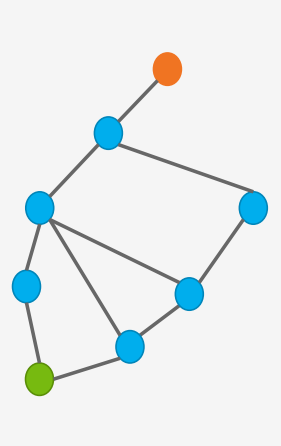

# Mapping 

Author:MO3TAZ

Review :

## Understand Mapping problem?

### imaging with me you are a **pirate**

### and your goal is **treasure**

### What would you need to get to the treasure?

**answer is map**

**this is same problem that robot face**
**He need a map to able to know where he is `(localization)` and where he will go**

Mapping in mobile robotics refers to the process of creating  representation of the environment in which a robot operates. It's a crucial component of robot navigation and interaction with the world.

### Robots without Map:

becouse of that we need Map for our enviroment our world to allow robots knows his location on this map.

brain of the robot is computer and the computer can't understand the environment as it is, we need to convert this environment to something that computer can understand like `0 or 1`, this is a map it is `digital representation` for environment.

**image for map**

## Types of Mapping

There are several types of mapping techniques used in mobile robotics:
1. **Topological Mapping**: Represents the environment as a graph of connected locations(stations).

scale here doesn't need to be accurate becouse of that this representation is lightweight
but as you can see there is no much details to allow you to go to from green station to red station 
becouse of that there is useful representation is **metric representation**

2. **Metric Mapping**: this representation use precise coordinates like longitude and latitude coordinates but becouse this representation is precise it's pretty sensitive to noise 

## Occupancy Grid Maps

Occupancy grid maps are a popular type of metric map used in mobile robotics. They divide the environment into a grid of cells, where each cell represents the probability of that space being occupied by an obstacle.

features of occupancy grid maps:

- **Probabilistic Representation**: Each cell contains a probability value.
- **Regular Grid Structure**: The environment is divided into equally sized cells.
- **Updateable**: The map can be easily updated as the robot gathers new sensor data.
- **Computationally Efficient**: Grid structure allows for fast computations.

**img**

## Problems in Mapping

While mapping is crucial for mobile robotics, it comes with several challenges:

1. **Sensor Uncertainty**: Robot sensors are not perfect and introduce errors into measurements.
2. **Dynamic Environments**: Real-world environments change over time, which can make maps outdated.
3. **Computational Complexity**: Creating and updating maps in real-time can be computationally expensive.

**gif for mapping problem**

In conclusion, mapping is a fundamental aspect of mobile robotics that enables robots to understand and interact with their environment. While it presents several challenges, ongoing research continues to improve mapping techniques, making robots more capable and reliable in various applications.

**gif for creating map**

# [Next Topic Link]

# References:

### [&lt;-Back to main](../README.md)
