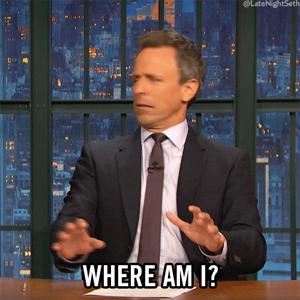
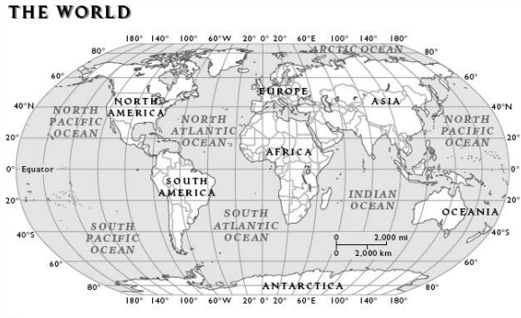

# Mapping

Author: mo3taz , Eng Wafaa

## Understanding the Mapping Problem

### Imagine you are a pirate

### And your goal is to find treasure

### What would you need to get to the treasure?

The answer is a **map**.

This is the same problem that a robot faces. It needs a map to know where it is (localization) and where it will go.

### Robots Without a Map

Because of this, we need a map of our environment to allow robots to know their location on this map.

The robot's "brain" is a computer, and the computer can't understand the environment as it is. We need to convert this environment into something that the computer can understand, like `0` or `1`. This is a map - a digital representation of the environment.

## Types of Mapping

There are several types of mapping techniques used in mobile robotics:

1. **Topological Mapping**: Represents the environment as a graph of connected locations (stations).

   

   The scale here doesn't need to be accurate, so this representation is lightweight. However, as you can see, there is not much detail to allow the robot to go from the green station to the red station. Because of this, a more useful representation is **Metric Mapping**.

2. **Metric Mapping**: This representation uses precise coordinates, like longitude and latitude coordinates. But because this representation is precise, it's pretty sensitive to noise.

   

## Occupancy Grid Maps

Occupancy grid maps are a popular type of metric map used in mobile robotics. They divide the environment into a grid of cells, where each cell represents the probability of that space being occupied by an obstacle.

Occupancy grid mapping is an approach to create a map. It implements the binary Bayes filter to estimate the occupancy value of each cell.

So, it's working as follows: each cell will have an occupancy variable:

- **m(x,y) = {free, occupied} -> {0, 1}**
  - **m(x,y)**: This is the state of the grid cell at position (x, y). It can take two values:
    - **Black Color** `m(x,y) = 1`: The grid cell is believed to be occupied (there is an obstacle).
    - **White Color** `m(x,y) = 0`: The grid cell is believed to be free (there is no obstacle).

### Probability

**Posterior: p(m(x,y)|z)**
- Probability that a cell (x,y) is occupied given the sensor measurement z
- This is what we want to calculate for each cell in the grid map

**Likelihood: p(z|m(x,y))**
- Probability of getting the sensor measurement z if the cell (x,y) is occupied
- Models the sensor's behavior and accuracy

**Prior: p(m(x,y))**
- Initial belief about the occupancy of cell (x,y) before considering the sensor data
- For example, 0.5 for occupied and 0.5 for free

**Evidence: p(z)**
- Probability of getting the sensor measurement z regardless of the cell's state

### Measurement Model p(z|m(x,y))

In an occupancy grid map, we are trying to estimate whether a grid cell is **occupied** or **free** based on sensor measurements. Here's what each term means:

- **z**: This is the sensor measurement (the reading from a sensor like LiDAR, sonar, or depth camera). It can take two values:
  - `z = 1`: The sensor detects that the space is occupied (e.g., the sensor has "hit" an obstacle).
  - `z = 0`: The sensor detects that the space is free (e.g., the sensor has not detected an obstacle).

#### True Occupied Measurement: p(z = 1 | m(x,y) = 1)

This is the probability that the sensor measurement **z** detects an obstacle (`z = 1`) given that the grid cell at `(x, y)` is actually occupied (`m(x,y) = 1`).

- **True occupied measurement**: This happens when both the sensor reading and the actual state of the grid cell indicate occupancy (i.e., `z = 1` and `m(x,y) = 1`).
  - This probability is typically high, meaning if the grid cell is truly occupied, the sensor is very likely to detect it as occupied.

1. **p(z = 1 | m(x,y) = 1)**
   - This is a **True occupied** measurement: It represents the probability that the sensor measurement **z** indicates the space is occupied (`z = 1`) given that the grid cell at position `(x, y)` is actually occupied (`m(x,y) = 1`).
   - This probability is typically high, meaning the sensor is likely to correctly detect an obstacle when the grid cell is truly occupied.

2. **p(z = 0 | m(x,y) = 1)**
   - This is a **False free** measurement: It represents the probability that the sensor measurement **z** indicates the space is free (`z = 0`) even though the grid cell at position `(x, y)` is actually occupied (`m(x,y) = 1`).
   - This probability is typically low, as it's an error case where the sensor fails to detect an obstacle in an occupied cell.

3. **p(z = 1 | m(x,y) = 0)**
   - This is a **False occupied** measurement: It represents the probability that the sensor measurement **z** indicates the space is occupied (`z = 1`) even though the grid cell at position `(x, y)` is actually free (`m(x,y) = 0`).
   - This probability is typically low, as it's an error case where the sensor falsely detects an obstacle in a free space.

4. **p(z = 0 | m(x,y) = 0)**
   - This is a **True free** measurement: It represents the probability that the sensor measurement **z** indicates the space is free (`z = 0`) given that the grid cell at position `(x, y)` is actually free (`m(x,y) = 0`).
   - This probability is typically high, as the sensor correctly identifies that the space is unoccupied.

### Mapping look like: 

## Next Topic Link

## References:

[Back to main](../README.md)