# Mapping

Author: Eng mo3taz ,Eng Wafaa , Eng Youssef
Review: KG

## What is Mapping

- In localization, our goal was to estimate the robot's pose in a known environment. We achieved this by assuming a map is known. However, if a map is unavailable and the robot needs to navigate in an unexplored area, like another planet, our goal shifts from estimating the robot's pose to creating the map itself. This task of generating a map in an unknown environment is called *mapping*.

> In practice, mapping often assumes that we know the robot's trajectory. However, this trajectory is not always directly given. It can be estimated through odometry, external tracking systems, or as part of a **Simultaneous Localization and Mapping (SLAM)** process, where both the robot’s pose and the map are estimated together.

## Mapping vs Localization

### **Localization**

* **Assumption** : The robot operates in a **known map** of the environment.
* **Estimation** : The goal is to estimate the **robot's trajectory** or pose (position and orientation) within this known map.

Localization answers the question: *“Where is the robot within this map?”*

As discussed in the localization sessions that this process requires a pre-existing, accurate map of the environment. Localization algorithms typically use probabilistic methods like the  **Kalman Filter**  or **Monte Carlo Localization** to estimate the robot's position .

### **Mapping**

* **Assumption** : The **robot's trajectory** or path is known
* **Estimation** : The goal is to create or update a **map** of the environment.

Mapping answers the question: *“What does the environment look like?”*

In mapping, the robot explores the environment to build a representation With a known trajectory, the mapping process focuses on compiling sensor data over time to accurately depict obstacles, free spaces, or key landmarks. Mapping typically uses data from LiDAR or cameras and fuses it with motion data to ensure the generated map is coherent and up-to-date.

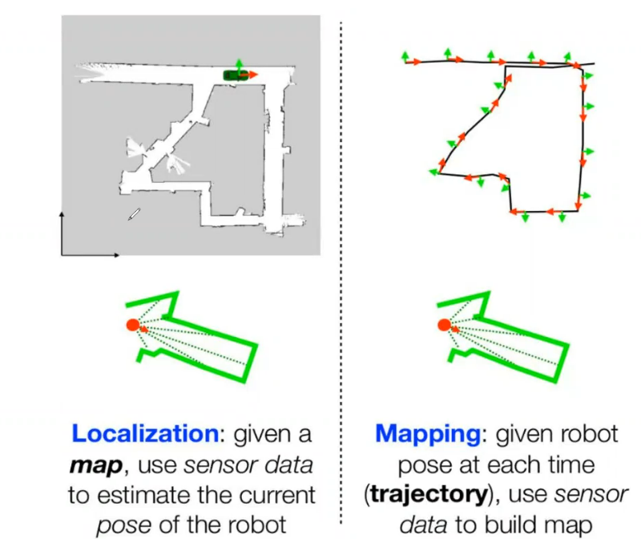

## Importance of Mapping

Mapping is essential for mobile robots, as it provides a foundational understanding of the environment, enabling safe navigation, obstacle avoidance, and path planning. With a map, robot can localize itself, efficiently plan routes, and make informed decisions based on the surroundings. In dynamic environments, mapping allows the robot to update his knowledge, adapting to changes and avoiding obstacles.

For example, if the robot is asked to move something from Room A to Room B, and the map is static and accurate, the task is straightforward.

If there is a change in the environment that the map does not reflect, the robot might not know about the new obstacle and could get stuck.

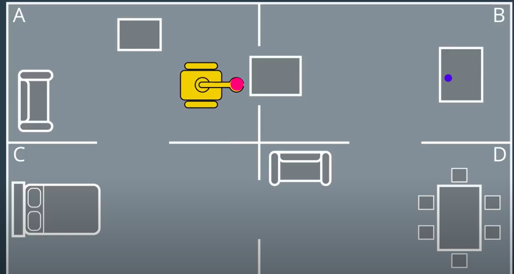

## Types of Mapping

There are several types of mapping techniques used in mobile robotics:

1. **Topological Mapping**: Represents the environment as a graph of connected locations (stations).

   

   The scale here doesn't need to be accurate, so this representation is lightweight. However, as you can see, there is not much detail to allow the robot to go from the green station to the red station. Because of this, a more useful representation is **Metric Mapping**.
2. **Metric Mapping**: This representation uses precise coordinates, like longitude and latitude coordinates. But because this representation is precise, it's pretty sensitive to noise.

   
3. **Feature-Based mapping:** This technique focuses on representing the environment as a set of distinctive features or landmarks (e.g., points, lines, corners), which can then be used for localization and navigation.

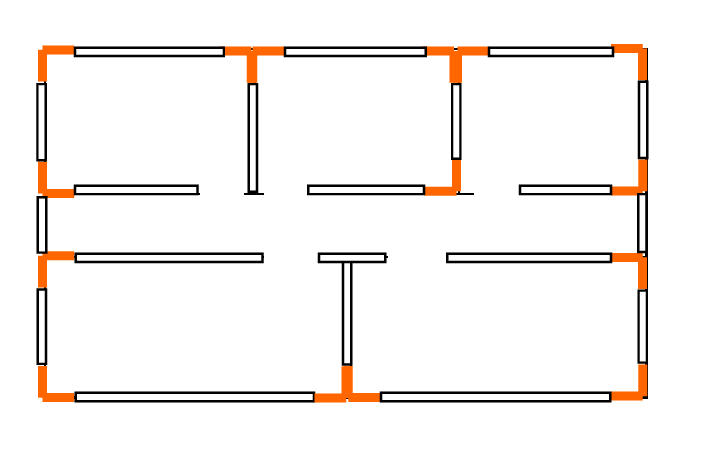

4. **Occupancy Grid Mapping:** This divides the environment into a grid of cells, with each cell representing whether it's occupied, free, or unknown.

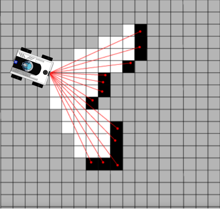

> **Each mapping method has its pros, cons, and use cases. We will focus on one of the most common and foundational mapping approaches in robotics: occupancy grid mapping.**

## Occupancy Grid Maps

Occupancy grid maps are a popular type of metric map used in mobile robotics. They divide the environment into a grid of cells, where each cell represents the probability of that space being occupied by an obstacle.

Occupancy grid mapping uses the binary Bayes filter to estimate the occupancy of each cell. By incorporating sensor measurements over time, each cell's probability of being occupied or free is updated.

Each cell has an occupancy variable:

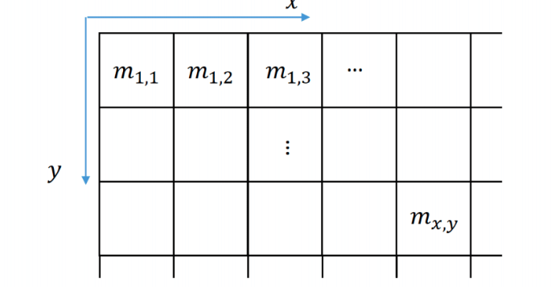

- **m(x,y) = {free, occupied} -> {0, 1}**
  - **m(x,y)**: This is the state of the grid cell at position (x, y). It can take two values:
    - **Black Color** `m(x,y) = 1`: The grid cell is believed to be occupied (there is an obstacle).
    - **White Color** `m(x,y) = 0`: The grid cell is believed to be free (there is no obstacle).

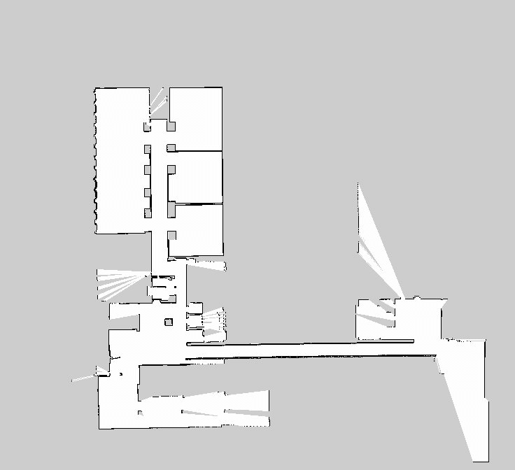

The robot will move across this map and collect measurements

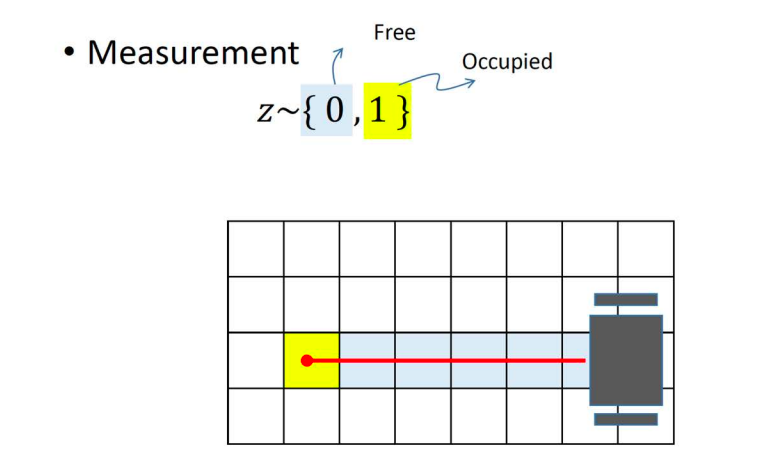

### Measurement Model p(z|m(x,y))

In an occupancy grid map, we are trying to estimate whether a grid cell is **occupied** or **free** based on sensor measurements.

- **z**: This is the sensor measurement (the reading from a sensor like LiDAR, sonar, or depth camera). It can take two values:
  - `z = 1`: The sensor detects that the space is occupied (e.g., the sensor has "hit" an obstacle).
  - `z = 0`: The sensor detects that the space is free (e.g., the sensor has not detected an obstacle).

> In reality, sensors (e.g., LiDAR, sonar, depth cameras) often provide range or intensity readings rather than simple binary "occupied/free" measurements. The measurement model can be more complex, translating these range readings into probabilities of occupancy. The basic model here is for conceptual understanding.

#### Defining Measurement Probabilities

1. **p(z = 1 | m(x,y) = 1)**

   - This is a **True occupied** measurement: It represents the probability that the sensor measurement **z** indicates the space is occupied (`z = 1`) given that the grid cell at position `(x, y)` is actually occupied (`m(x,y) = 1`).
   - This probability is typically high, meaning the sensor is likely to correctly detect an obstacle when the grid cell is truly occupied.
2. **p(z = 0 | m(x,y) = 1)**

   - This is a **False free** measurement: It represents the probability that the sensor measurement **z** indicates the space is free (`z = 0`) even though the grid cell at position `(x, y)` is actually occupied (`m(x,y) = 1`).
   - This probability is typically low, as it's an error case where the sensor fails to detect an obstacle in an occupied cell.
3. **p(z = 1 | m(x,y) = 0)**

   - This is a **False occupied** measurement: It represents the probability that the sensor measurement **z** indicates the space is occupied (`z = 1`) even though the grid cell at position `(x, y)` is actually free (`m(x,y) = 0`).
   - This probability is typically low, as it's an error case where the sensor falsely detects an obstacle in a free space.
4. **p(z = 0 | m(x,y) = 0)**

   - This is a **True free** measurement: It represents the probability that the sensor measurement **z** indicates the space is free (`z = 0`) given that the grid cell at position `(x, y)` is actually free (`m(x,y) = 0`).
   - This probability is typically high, as the sensor correctly identifies that the space is unoccupied.

### Probability and Bayes' Rule

**Posterior: p(m(x,y)|z)**

- Probability that a cell (x,y) is occupied given the sensor measurement z
- This is what we want to calculate for each cell in the grid map

**Likelihood: p(z|m(x,y))**

- Probability of getting the sensor measurement z if the cell (x,y) is occupied
- Models the sensor's behavior and accuracy

**Prior: p(m(x,y))**

- Initial belief about the occupancy of cell (x,y) before considering the sensor data
- For example, 0.5 for occupied and 0.5 for free

**Evidence: p(z)**

- Probability of getting the sensor measurement z regardless of the cell's state

Because direct application of Bayes’ rule for each cell can be computationally expensive, we often use **log-odds** to simplify repeated updates.

- **Log-odds:** A way to represent probabilities to make Bayesian updates simpler. Instead of dealing with probabilities directly, we deal with their log-odds, and updating them becomes additive rather than multiplicative.

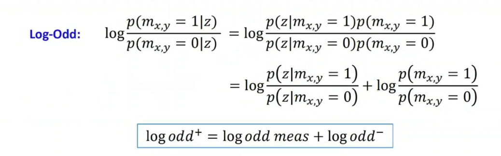

**what is odd ?**

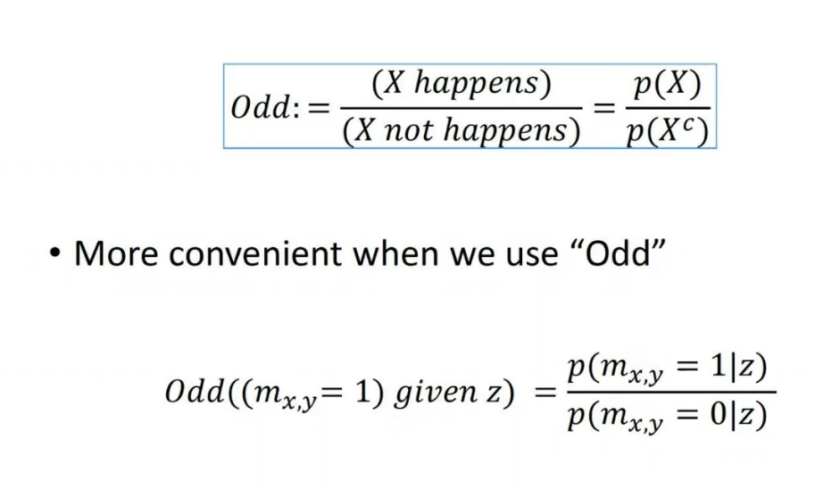

So, the new log odds after incorporating a measurement equals the old log odds plus the contribution from the measurement.
**Odd posterior with Bayes Rule**

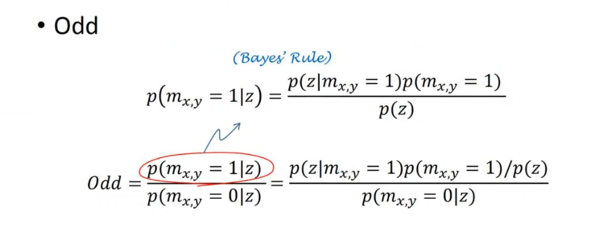

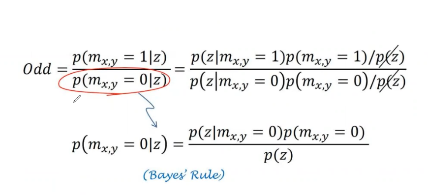

**Result**

So the new log odd will equal the measurements + the old log odd

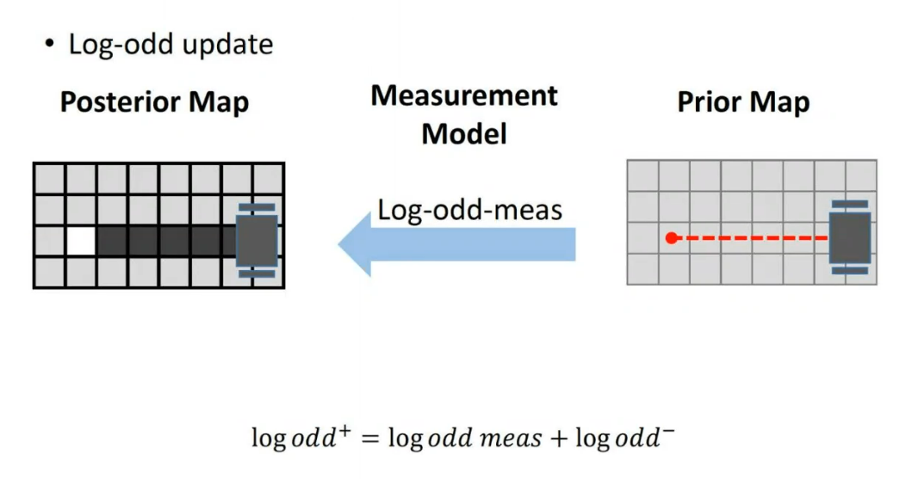

### The  Measurements Model in log-odd form

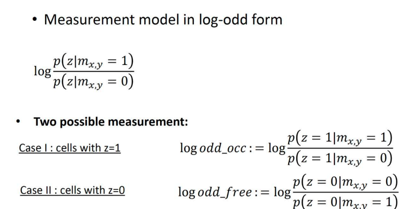

## Occupancy Grid Map Algorithm

The algorithm implements a binary Bayes filter to estimate the occupancy value of each cell:

The steps are as follows:

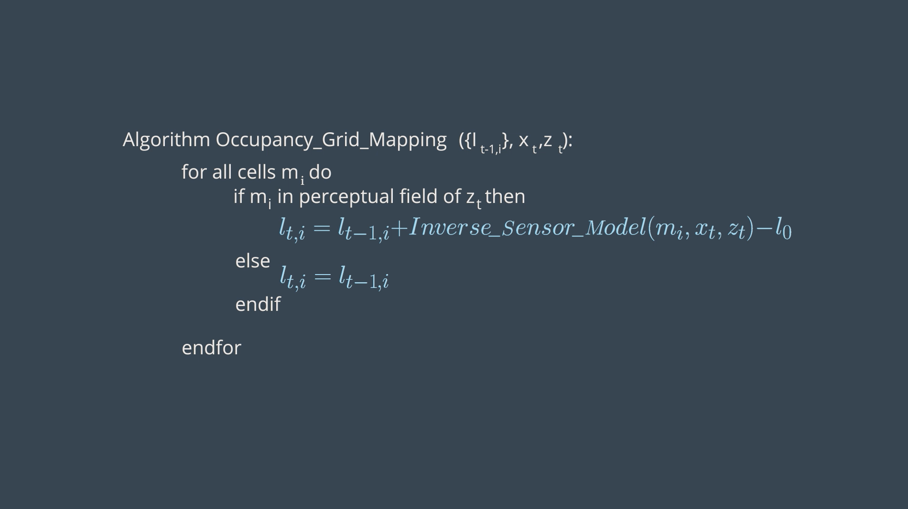

## Occupancy Grid Mapping Algorithm

#### Inputs

- **Previous occupancy probabilities** \(l_{t-1,i}\): The probabilities of occupancy from the previous timestep.
- **Robot's position** \(x_t\): The current position of the robot.
- **Sensor reading** \(z_t\): The latest sensor measurement.

#### Process

For each cell \(m_i\) in the map:

1. **If** \(m_i\) is within the sensor's range:

   - Update the occupancy probability using the **Inverse Sensor Model** and log-odds.
   - To update the log-odds probability ( l_{t,i} ) for a cell using the Inverse Sensor Model, the following formula is used:

   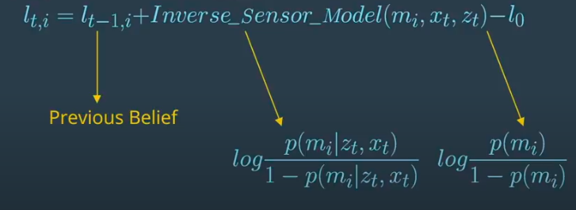

> The inverse sensor model converts a sensor measurement (e.g., a range reading) into a probability that a particular cell is occupied. This mapping depends on the sensor’s characteristics and how measurements relate to occupancy.

2. **If** \(m_i\) is **not** in the sensor's range:
   - Keep its previous probability.

#### Result

An updated map that shows occupied and free cells based on the latest sensor data, allowing the robot to better understand its environment.

## Example

**Note** : In this example, black cells represent obstacles (occupied) and white cells represent free space.

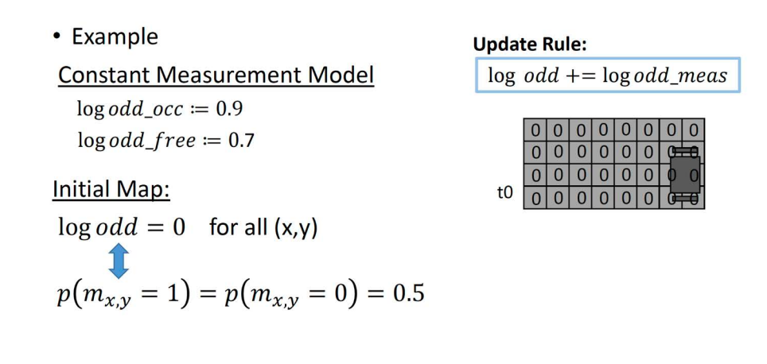

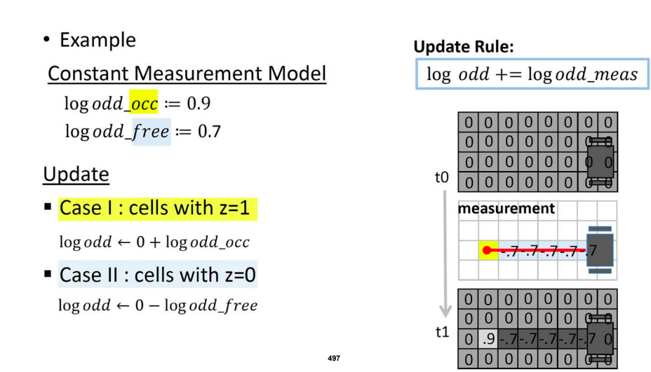

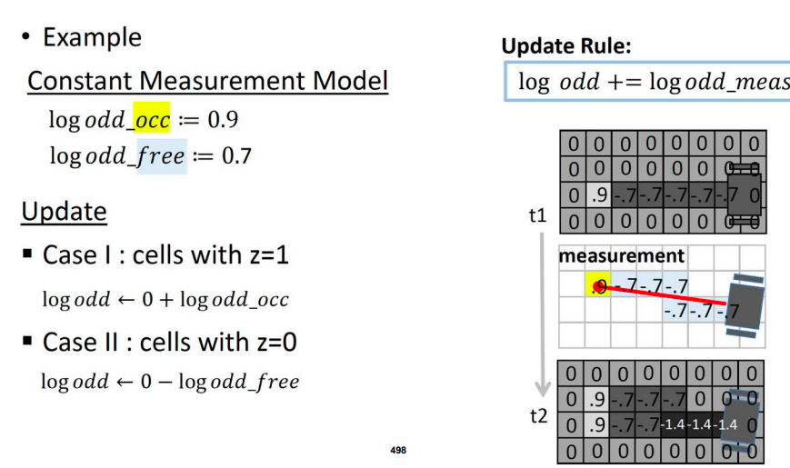

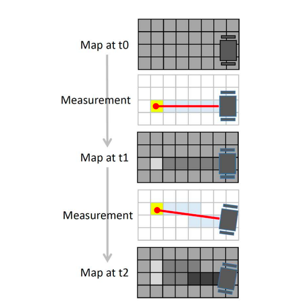

### How Mapping Looks in Action

**Resolution**

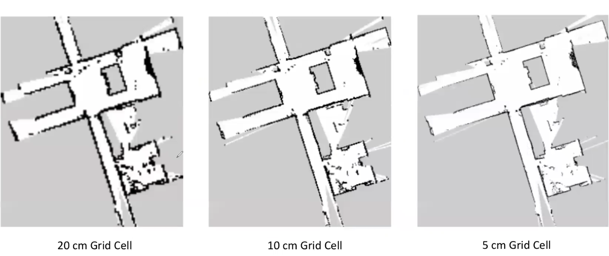

## Limitation

One noticable limitation for occupancy grid maps which is computational power specially in large environment and if we want to get a high resolution map.

### Computational power v.s. accuracy

let's assume that we have a robot that has a start point and goal point which the robot can reach and we will devide our map into relativly small grids to get a good enough accuracy.

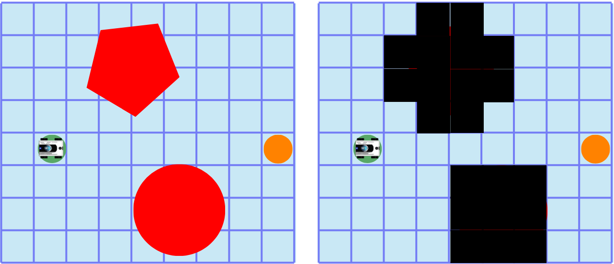

In the previous image we notice that the robot can reach the goal point after the mapping process but we devided our map to 72 cells which consumes a lot of computational resources.

---

Let's double the size of our grids now we are using just 20 grids for the whole map. we greatly reduced the computational power but we got low accuracy causing our obstacle to block the robot path.

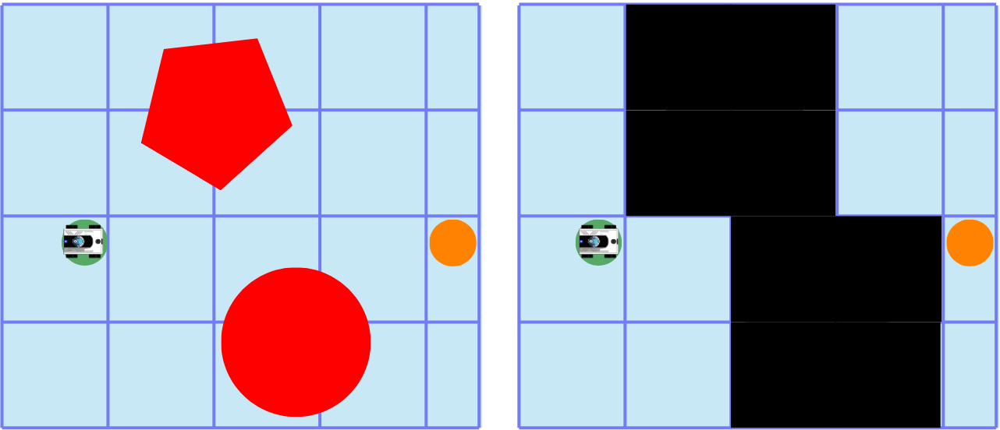

---

One approach to solve this problem is using grids with different sizes notice here we started with 20 grids to reduce the computational power as much as possible but we know that it won't give us the accuracy that we desire so we devide the occupied grids only into smaller cells since it doesn't have a meaning to devide the empty cells. and we recalculate the values of the divided cells and so on until we reach the accuracy that we need.

we notice here that we reached the same accuracy as the first image with only 44 cells instead of 72. So we reached a good accuracy with low computational power.

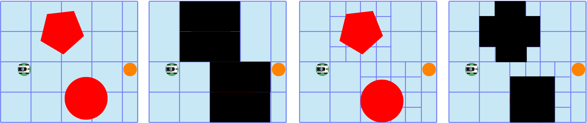

# References:

https://ras.papercept.net/images/temp/IROS/files/3776.pdf

https://www.cs.uml.edu/~holly/teaching/4510and5490/fall2017/Lecture-Occupancy-Grid-Mapping.pdf

https://www.youtube.com/watch?v=x_Ah685BFEQ

https://www.udacity.com/course/robotics-software-engineer--nd209

### [&lt;-Back to main](../README.md)
