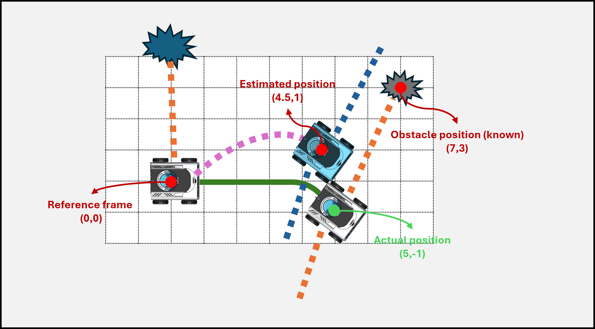
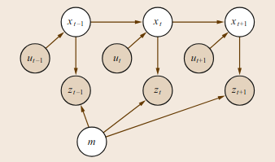
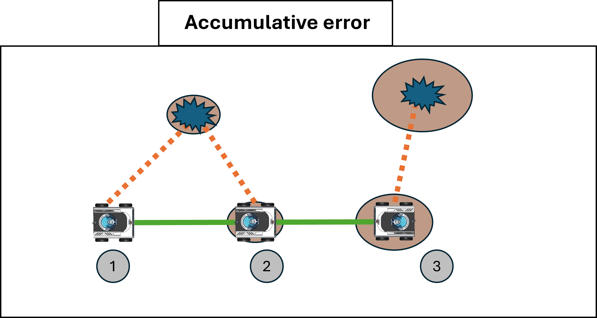
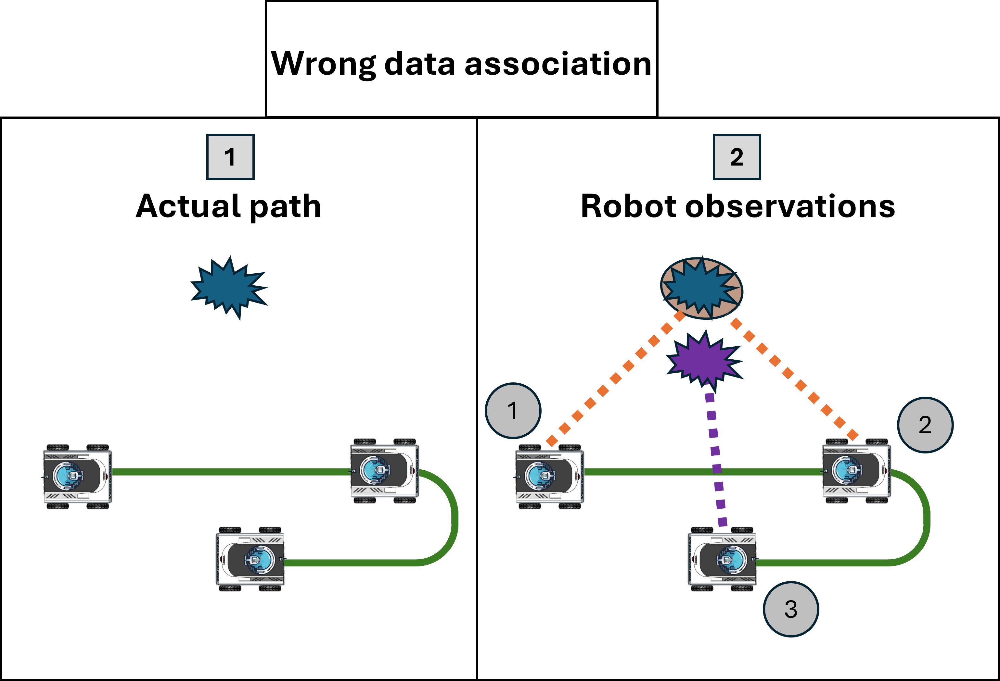
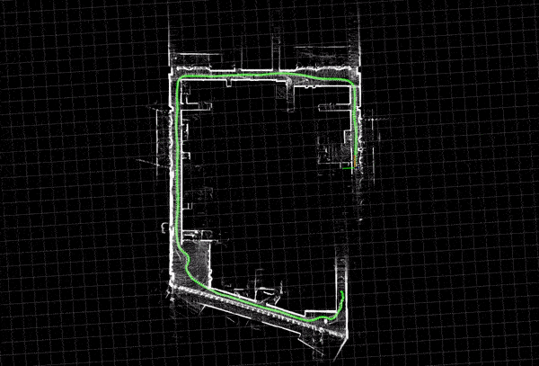
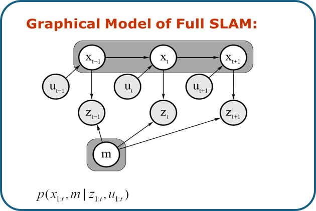

# SLAM Introduction

## What is SLAM?

**Simultaneous localization and mapping** (**SLAM**) is the computational problem of constructing or updating a map of an unknown environment while simultaneously keeping track of the robot's **pose**—its position and orientation—within it.

Imagine a robot moving in a room full of obstacles the robot doesn't know its initial pose (starting point). As it's moves, it gathers data from its mounted sensors, but this data is **noisy** due to sensor inaccuracies and environmental factors. The SLAM problem involves using this uncertain data to build a map of the environment and determine the robot's location within that map.

SLAM is inherently a **probabilistic problem** because of the uncertainties  in sensor measurements and robot motion. Approaches to solving it often use probability and statistical techniques to manage and reduce this uncertainty.

SLAM is a diffucult problem as it doesn't only deal with **static**, and **structured** objects but it also addresses **dynamic** objects, and **large-scale** environments.

SLAM is considered a **chicken-or-egg problem** because:

* We need a map for localization.
* we need to know where the robot is to construct a map.

The SLAM concept first appeared in **Smith, Self** and **Cheeseman** work in 1986 **[1]**. Later **Hugh Durrant-Whyte and John J. Leonard** further developed the concept in 1991 **[2]** originally referring to it as **Simultaneous Mapping and Localization** (**SMAL**). The term **SLAM** itself was first used by Durrant-Whyte in 1995 during the International Symposium on Robotics Research the term SLAM itself first appeared in 1996 in ISR **[3]**.

## Localization vs. Mapping vs. SLAM

SLAM is simultaneously performs **localizaion** and **mapping** Understanding why these problems  need to be solved together requires examining how they depend on each other.

* **Localization**: Determining the robot's pose within a known map.
* **Mapping**: Building a map of the environment from sensor data.

### Interdependency

* To **localize**, the robot needs a map.
* To **map** accurately, the robot needs to know its precise location.

### Example Scenario

Consider a robot navigating an environment with obstacles, equipped with:

* **Wheel Encoders**: Provide odometry data (movement estimation based on wheel rotations).
* **LIDAR**: Provides accurate laser scans of the environment.

#### Ideal Case

Assuming both odometry and laser scans are 100% accurate with zero uncertainty:

* The robot knows its exact pose at all times.
* The obstacles are mapped precisely.

*However, this is unrealistic due to sensor noise and environmental factors.*

#### Localization Only

Assuming:

* **Odometry data** has errors (noise).
* **Laser scans** are 100% accurate.
* The **map is known**.

In this case:

* The robot's estimated pose from odometry drifts over time.
* Using laser scans and the known map, the robot can correct its pose by matching observed obstacles with the map.

##### Correction step

At each time step:

1. **Prediction**: The robot predicts its new pose based on odometry data.
2. **Observation**: It takes measurements using sensors (e.g., LIDAR).
3. **Correction**: It compares observations with the known map to correct its pose estimation.

Here the robot starts the movement at the reference frame (0,0) and as we see after the first time step the robot location is (5,-1) but our robot doesn't know this instead he thinks he is at (4.5,1) the laser data is accurate as we said and we have a map of the environment so we know that the obstacle is at (7,3). so when the robot gets the laser measurements it finds that it

This process reduces the error in the robot's estimated pose despite noisy odometry.

#### Mapping

Opposite to the previous situation here we assume that the robot has a 100% accuracy in the odom data but there are some uncertainity in the laser measurements and we also doesn't have the map . actually that's our task to build a map of the environment. as we can see from the two sections in the following image the path of the robot didn't change but since its laser data isn't accurate it located the obstacles in the wrong locations, hence creating a wrong and inaccurate map. maybe you think that these errors are not a big deal it's just a small misplacement but in compact and feature-packed environments this leads to a completely different map that we can't rely on.

#### SLAM

And finally the SLAM problem here we assume that the robot doesn't have any prior information about the map and its location and also the sensors of the robot are not 100% accurate but the odom and laser measurements have uncertainities in them. So what happens then let's take the same senario that we did before in the first time step before the robot starts moving it takes a laser scan of the environment but since there is some error in the laser data the robot is not sure where the obstacle is so it indicates the probabilty of its position with this beige oval around the obstacle saying that the obstacle cold be anywhere in this oval. After the robot starts moving in the second time step we notice that the position of the robot also has a probability because the odom data has errors in it and also the probability distribtion for the second obstacle increases significantly because of the uncertainity of the robot location so the errors accumilate over time. finally in the third time step we notice that the uncertainity in the robot location increases but that of the obstacle stays the same and this is because we already seen this obstacle in the previous time step so we already know where it could be.

---

### Definintion of SLAM problem

First let's define what is the output we need from SLAM. We mainly need to do two things:

#### **Outputs of SLAM**

* **Robot Poses**: The sequence of robot poses over time, denoted as \( x_{0:T} \).
* **Map of the Environment**: Denoted as \( m \).

#### Inputs to SLAM

* **Observations (\( z_{1:T} \))**: Sensor measurements from devices like LIDAR, cameras, etc.
* **Controls (\( u_{1:T} \))**: Robot's motion commands or odometry data between time steps.

After we defined the given parameters and the desired output that we want we can write the formula for the SLAM problem as follows:

> this equation reads as follows: **the probability distribution of the robot poses at discrete point of time and map given the observation and controls**

### SLAM Mathematical Formulation

The SLAM problem can be expressed probabilistically as:

\[
p(x_{0:T}, m \mid z_{1:T}, u_{1:T})
\]

This reads as:

- **\( p(\cdot) \)**: The probability distribution.
- **\( x_{0:T} \)**: The sequence of robot poses from time 0 to T.
- **\( m \)**: The map of the environment.
- **\( z_{1:T} \)**: Observations from time 1 to T.
- **\( u_{1:T} \)**: Control inputs from time 1 to T.

### Graphical Representation

- **White Circles**: Variables to estimate (robot poses \( x_t \) and map \( m \)).
- **Shaded Circles**: Known variables (controls \( u_t \) and observations \( z_t \)).
- **Arrows**: Dependencies between variables.

### Why is SLAM a hard problem

SLAM is considered a hard problem because of two main reasons which are:

#### 1. Error Accumulation

* **Sensor Noise**: All sensors have inherent noise and errors.
* **Drift**: Small errors accumulate over time, leading to significant deviations.
  

As we see here the in **Time Step 1** the robot is sure of its position as this is the reference frame. the robot takes an observation and it's not sure of the exact position of the obstacle so it gives it a probability distribution represnted by the ellipse behind the obstacle.

In **Time Step 2** we notice that the robot also isn't sure of its position so it gives it a probability distribution. the robot also observes the same obstacle but since the robot already estimated where this obstacle was so it doesn't change the raduis of the ellipse.

However in **Time Step 3** we can see that our uncertainty in the robot's pose only grows larger. also when the robot observed another obstacle we add the uncertainity of the observation data to the error in the pose of the robot.

> **Time Step 1**: Robot has minimal uncertainty.
> **Time Step 2**: Uncertainty increases due to motion and measurement noise.
> **Time Step 3**: Uncertainty grows further, affecting both pose and map estimates.

**Mitigation Strategies**

* **Filters**: Use of **Extended Kalman Filters (EKF)** or **Particle Filters** to reduce uncertainty.
* **Sensor Fusion**: Combining data from multiple sensors to compensate for individual weaknesses.
* **Loop Closure**: Recognizing previously visited locations to correct accumulated errors.

#### 2. Wrong Data Association

The second critical problem in SLAM is associating data to wrong objects as this is considerd a fatal mistake and is extremely hard to contain after it happens. to understand this problem let's look at this picture.

In **section 1** of the picture we see the path that our robot took and the obstacle in the map that it should observes.

In **section 2** we notice that in **time step 1** and **time step 2** the robot observes the obstacle successfully and assign a probability distribution to it but something different happens at time step 3 we see that the robot have an error while observing the same object and didn't identify it correctly so the robot decided that this is another object and add it to the mab. this resulted in creating a map that is completely different from the actual map and this happened with only one object on the map so imagine the robot navigating in an environment full of obstacles.

this problem is minimized by adding some constraints when defining an object and relating this observation to previous observations.

As we said the wrong association of objects is a hard problem because for our example the robot created a whole new obstacle in the map and we want it to discover that this obstacle is a mistake and it should be deleted. so it's really important to prevent this from happening in the first place.

we will also mention this problem in the loop closure section.

#### Loop closure

Loop closure as we said is a key ascpect in SLAM and as the name suggests it means that whenever we find a loop after gathering some data we close this loop. To fully understand the loop closure approach we will explain it in a graph-based SLAM manner which we will encounter ahead in this course but we will just give a quick explanation now.

So let's assume our robot is moving in a hospital and while it's moving around it's building a map of this hospital and it's recording it's poses along the route it took and suddenly the robot came back to the starting position or passed by a point that it has visited before but it noticed something wrong the robot is getting the same laser data from before so he knows he has been here before but the estimated position in the map is not the same as before. this happens because the robot may have slipped along the way or the odometry data is not that accurate but these inaccurate data will result in the wrong map so when the robot reach a point that it has seen before he closes the loop and corrects the wrong route thereby correcting the map.

you may not fully understand the concept of loop closure now but it's ok. as we said we will get in details regarding this subject in the graph-based SLAM session.

You can watch this video [here](https://youtu.be/saVZtgPyyJQ?si=XSB4b50qpWb3dS48) that explain the loop closure concept simply.

---

### Full SLAM vs online SLAM

#### Full SLAM

Full SLAM computes the complete set of poses over discrete time-steps from start until the current timestamp, along with the map of the environment. It is very computationally expensive (both in memory use and time) as it re-computes the complete sequence of robot poses.

In Online SLAM, the goal is to estimate only the current pose x(t) and the map m, without keeping track of the entire trajectory. This is done by solving the recursive problem:

#### Online SLAM

Online SLAM is a subset of the above and only computes the current robot pose. All computations are done recursively and several algorithms  are used to update previous measurements due to loop-closure or other significant events.

In Online SLAM, the goal is to estimate only the current pose xtx_t**x**t and the map mm**m**, without keeping track of the entire trajectory. This is done by solving the recursive problem:

Here's a table comparing **Full SLAM** and  **Online SLAM** :

| **Aspect**               | **Full SLAM**                               | **Online SLAM**                              |
| ------------------------------ | ------------------------------------------------- | -------------------------------------------------- |
| **Main focus**           | Entire robot trajectory and map optimization      | Current robot pose and map update in real-time     |
| **Data used**            | All past data from sensors                        | Only recent data                                   |
| **Computational demand** | High, due to large-scale optimization             | Lower, designed for real-time performance          |
| **Accuracy**             | High accuracy, as all data is considered          | Lower accuracy, prioritizing real-time speed       |
| **Use case**             | Offline processing, post-mission mapping          | Real-time applications, autonomous navigation      |
| **Best suited for**      | Scenarios where precision is crucial              | Dynamic environments requiring immediate decisions |
| **Memory usage**         | Large, as it stores and optimizes full trajectory | Limited, only processes recent data                |

> Both Full SLAM and Online SLAM are modeled using  **Bayesian filtering** , but the scope and formulation differ.

### Different approaches of SLAM

##### Filter Based SLAM

Filter based SLAM treats the SLAM problem as a state-estimation problem, where
 the state encompasses information about the current position and map.
The state is recursively updated by a filter, which estimates the
current position and map based on actions and measurements. As more data
 is collected, the estimate is augmented and refined.

##### Graph Based SLAM

Graph
 based SLAM treats the SLAM problem as a graph problem, where position
information is represented by the nodes and the map is derived with the
edges. In the robotics space, it’s common to use pose-graph
optimization. In a pose graph, the nodes represent poses and landmarks
and the edges represent constraints between them. New nodes are added as
 new poses and landmarks are detected, and constraints connect
sequential nodes with information about the movement. For example,
moving from one point to another would be represented with two nodes,
each containing information about the pose and landmarks measured,
connected by an edge, containing information about the motion and other
observations. In constructing the pose graph, we can also add edges
between nodes if they are similar enough, indicating a return to some
previous poses and landmarks. When two nodes are very similar, it
provides information to update the pose graph and potentially add new
edges indicating their closeness

##### Deep Learning Based SLAM

Deep
 learning based SLAM attempts to solve the SLAM problem using neural
networks and deep learning. As of writing this article, deep learning
based SLAM is nascent, however there’s a lot of promise given the
success of deep learning for other tasks and computer vision objectives
(e.g., [neural networks achieve state of the art performance in object classification](https://proceedings.neurips.cc/paper_files/paper/2012/file/c399862d3b9d6b76c8436e924a68c45b-Paper.pdf)).
 Deep learning can be used throughout the SLAM problem, from describing
features to aligning different measurements to making estimates.
