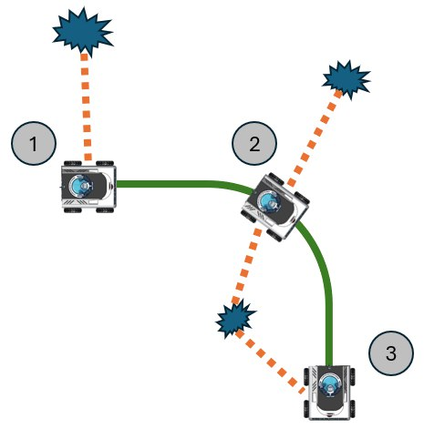
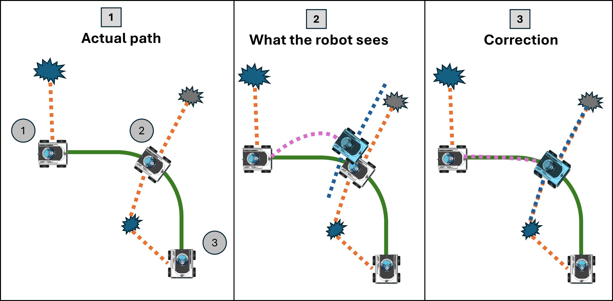
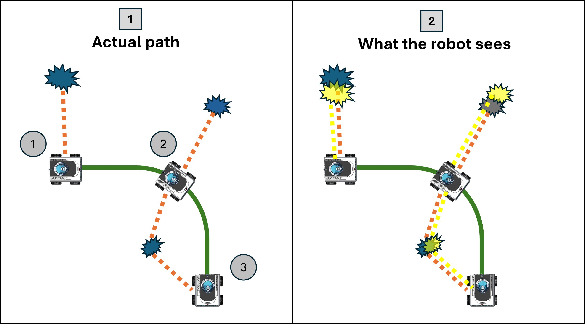
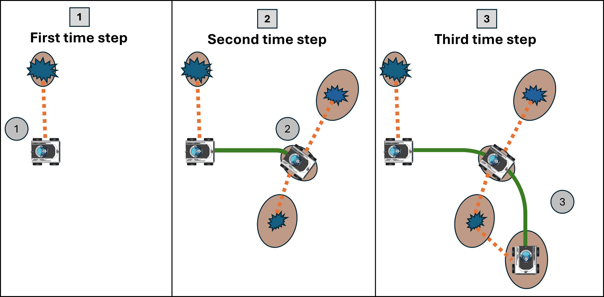

# SLAM Introduction

### What is SLAM?

**Simultaneous localization and mapping** ( **SLAM** ) is the problem of constructing a map of an unknown environment while simultaneously keeping track of the robot's pose within it.

To put it in simple terms imagine a robot moving in a room full of obstacles the robot doesn't know its initial pose (start point) as the robot moves it gathers data from the sensors mounted on it but these data are noisy here comes the SLAM problem as we need to construct a map and know where is our robot in it depending on an unknown starting point and some noisy data from sensors.

SLAM is presented as a probabilistic problem as there is uncertainty in the path we take and the objects we see so our approaches of solving it often uses probability techniques.

SLAM is a diffucult problem as it doesn't only deal with static, and structured objects but it also addresses dynamic objects, and large scale environments.

SLAM is considered a chicken or egg problem as:

* We need a map for localization
* we need to know where the robot is in order to construct a map

The SLAM concept first appeared in Smith, Self and Cheeseman work in 1986 **[1]**. After this comes Hugh Durrant-Whyte and John J. Leonard in 1991 **[2]** to define the SLAM problem in their work which they called SMAL(Simultaneous mapping and localization) originally. the term SLAM itself first appeared in 1996 in ISR **[3]**.

### Localization vs Mapping vs SLAM

SLAM algorithms estimate sequential movement, which includes some margin
 of error. The error accumulates over time, causing substantial
deviation from actual values. It can also cause map data to collapse or
distort, making subsequent searches difficult. Let’s take an example of
driving around a square-shaped passage. As the error accumulates, the
robot’s starting and ending points no longer match up. This is called a
loop closure problem. Pose estimation errors like these are unavoidable.
 It is important to detect loop closures and determine how to correct or
 cancel out the accumulated error.

Computing cost is a problem when implementing SLAM algorithms on vehicle
 hardware. Computation is usually performed on compact and low-energy
embedded microprocessors that have limited processing power. To achieve
accurate localization, it is essential to execute image processing
 and point cloud matching at high frequency. In addition, optimization
calculations such as loop closure are high computation processes. The
challenge is how to execute such computationally expensive processing on
 embedded microcomputers.

### Definintion of SLAM problem

Given a series of controls  and sensor observations  over discrete time steps , the SLAM problem is to compute an estimate of the agent's state  and a map of the environment  . All quantities are usually probabilistic, so the objective is to compute

Like many inference problems, the solutions to inferring the two
variables together can be found, to a local optimum solution, by
alternating updates of the two beliefs in a form of an [expectation–maximization algorithm](https://en.wikipedia.org/wiki/Expectation%E2%80%93maximization_algorithm "Expectation–maximization algorithm").

The SLAM problem is defined as follows: A mobile
robot roams an unknown environment, starting at an
initial location x0 . Its motion is uncertain, making it
gradually more difficult to determine its current pose in
global coordinates. As it roams, the robot can sense its
environment with a noisy sensor. The SLAM problem
is the problem of building a map of the environment
while simultaneously determining the robot’s position
relative to this map given noisy data.

### Why is SLAM a hard problem

applied to the
online SLAM problem. The robot’s
path is a dotted line, and its estimates
of its own position are shaded ellipses.
Eight distinguishable landmarks of
unknown location are shown as small
dots, and their location estimates are
shown as white ellipses. In (a–c)
the robot’s positional uncertainty is
increasing, as is its uncertainty about
the landmarks it encounters. In (d) the
robot senses the first landmark again,
and the uncertainty of all landmarks
decreases, as does the uncertainty
of its current pose

### Full SLAM vs online SLAM

Full SLAM computes the complete set of poses over discrete time-steps
 from start until the current timestamp, along with the map of the
environment. It is very computationally expensive (both in memory use
and time) as it re-computes the complete sequence of robot poses i.e.,
the path.

Online SLAM is a subset of the above and only computes the current
robot pose. All computations are done recursively and several algorithms
 are used to update previous measurements due to loop-closure or other
significant events.

### Different approaches of SLAM

##### Filter Based SLAM

Filter based SLAM treats the SLAM problem as a state-estimation problem, where
 the state encompasses information about the current position and map.
The state is recursively updated by a filter, which estimates the
current position and map based on actions and measurements. As more data
 is collected, the estimate is augmented and refined.

##### Graph Based SLAM

Graph
 based SLAM treats the SLAM problem as a graph problem, where position
information is represented by the nodes and the map is derived with the
edges. In the robotics space, it’s common to use pose-graph
optimization. In a pose graph, the nodes represent poses and landmarks
and the edges represent constraints between them. New nodes are added as
 new poses and landmarks are detected, and constraints connect
sequential nodes with information about the movement. For example,
moving from one point to another would be represented with two nodes,
each containing information about the pose and landmarks measured,
connected by an edge, containing information about the motion and other
observations. In constructing the pose graph, we can also add edges
between nodes if they are similar enough, indicating a return to some
previous poses and landmarks. When two nodes are very similar, it
provides information to update the pose graph and potentially add new
edges indicating their closeness (this is also sometimes called
detecting a loop closure).

##### Deep Learning Based SLAM

Deep
 learning based SLAM attempts to solve the SLAM problem using neural
networks and deep learning. As of writing this article, deep learning
based SLAM is nascent, however there’s a lot of promise given the
success of deep learning for other tasks and computer vision objectives
(e.g., [neural networks achieve state of the art performance in object classification](https://proceedings.neurips.cc/paper_files/paper/2012/file/c399862d3b9d6b76c8436e924a68c45b-Paper.pdf)).
 Deep learning can be used throughout the SLAM problem, from describing
features to aligning different measurements to making estimates.
