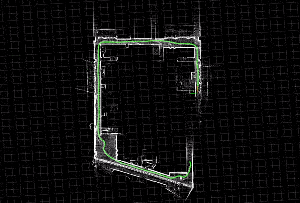
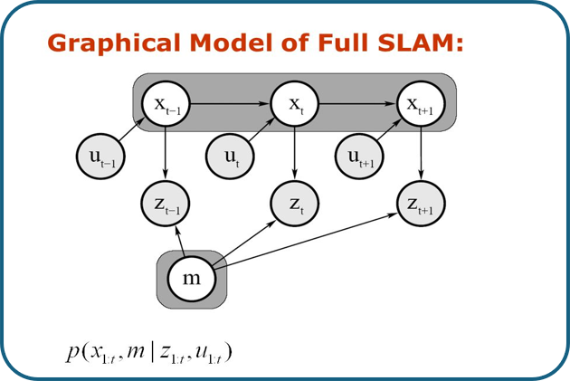

Author: Joe
Review: KG

# SLAM Introduction

## What is SLAM?

**Simultaneous localization and mapping** (**SLAM**) is the computational problem of constructing or updating a map of an unknown environment while simultaneously keeping track of the robot's **pose**—its position and orientation—within it.

Imagine a robot moving in a room full of obstacles the robot doesn't know its initial pose (starting point). As it's moves, it gathers data from its mounted sensors, but this data is **noisy** due to sensor inaccuracies and environmental factors. The SLAM problem involves using this uncertain data to build a map of the environment and determine the robot's location within that map.

SLAM is inherently a **probabilistic problem** because of the uncertainties  in sensor measurements and robot motion. Approaches to solving it often use probability and statistical techniques to manage and reduce this uncertainty.

SLAM is a diffucult problem as it doesn't only deal with **static**, and **structured** objects but it also addresses **dynamic** objects, and **large-scale** environments.

SLAM is considered a **chicken-or-egg problem** because:

* We need a map for localization.
* we need to know where the robot is to construct a map.

The SLAM concept first appeared in **Smith, Self** and **Cheeseman** work in 1986 **[1]**. Later **Hugh Durrant-Whyte and John J. Leonard** further developed the concept in 1991 **[2]** originally referring to it as **Simultaneous Mapping and Localization** (**SMAL**). The term **SLAM** itself was first used by Durrant-Whyte in 1995 during the International Symposium on Robotics Research the term SLAM itself first appeared in 1996 in ISR **[3]**.

## Localization vs. Mapping vs. SLAM

SLAM is simultaneously performs **localizaion** and **mapping** Understanding why these problems  need to be solved together requires examining how they depend on each other.

* **Localization**: Determining the robot's pose within a known map.
* **Mapping**: Building a map of the environment from sensor data.

### Interdependency

* To **localize**, the robot needs a map.
* To **map** accurately, the robot needs to know its precise location.

### Example Scenario

Consider a robot navigating an environment with obstacles, equipped with:

* **Wheel Encoders**: Provide odometry data (movement estimation based on wheel rotations).
* **LIDAR**: Provides accurate laser scans of the environment.

#### Ideal Case

Assuming both odometry and laser scans are 100% accurate with zero uncertainty:

* The robot knows its exact pose at all times.
* The obstacles are mapped precisely.

*However, this is unrealistic due to sensor noise and environmental factors.*

#### Localization Only

Assuming:

* **Odometry data** has errors (noise).
* **Laser scans** are 100% accurate.
* The **map is known**.

In this case:

* The robot's estimated pose from odometry drifts over time.
* Using laser scans and the known map, the robot can correct its pose by matching observed obstacles with the map.

#### Correction step

At each time step:

1. **Prediction**: The robot predicts its new pose based on odometry data.
2. **Observation**: It takes measurements using sensors (e.g., LIDAR).
3. **Correction**: It compares observations with the known map to correct its pose estimation.

Here the robot starts the movement at the reference frame (0,0) and as we see after the first time step the robot location is (5,-1) but our robot doesn't know this instead he thinks he is at (4.5,1) the laser data is accurate as we said and we have a map of the environment so we know that the obstacle is at (7,3). so when the robot gets the laser measurements it finds that it

This process reduces the error in the robot's estimated pose despite noisy odometry.

#### Mapping

Conversely, let's assume that the robot has 100% accurate odometry data but there is uncertainty in the laser measurements, and the map is unknown (our task is to build it). As we can see in the following image, the robot's path is accurate, but since the laser data is noisy, the obstacles are incorrectly placed on the map, resulting in an inaccurate map. In complex environments, these small errors can accumulate, leading to a map that cannot be relied upon.

#### SLAM

Finally, in the SLAM problem, we assume that the robot has no prior information about the map or its location, and the sensors (both odometry and laser) have uncertainties. In this scenario, the robot must simultaneously build the map and localize itself within it, dealing with uncertainties in both motion and observations.

At the first time step, before moving, the robot takes a laser scan of the environment. Due to sensor noise, the robot is uncertain about the exact position of the observed obstacle, represented by an ellipse indicating the probability distribution. As the robot moves, uncertainty in both its pose and the map increases due to accumulated errors from motion and sensor noise.

---

### Definintion of SLAM problem

First, let's define the outputs we need from SLAM:

#### **Outputs of SLAM**

* **Robot Poses**: The sequence of robot poses over time, denoted as \( x_{0:T} \).
* **Map of the Environment**: Denoted as \( m \).

#### Inputs to SLAM

* **Observations (\( z_{1:T} \))**: Sensor measurements from devices like LIDAR, cameras, etc.
* **Controls (\( u_{1:T} \))**: Robot's motion commands or odometry data between time steps.

After we defined the given parameters and the desired output that we want we can write the formula for the SLAM problem as follows:

> This reads as: **The probability distribution of the robot's trajectory \( x_{0:T} \) and the map \( m \) given the observations \( z_{1:T} \) and controls \( u_{1:T} \).**

### SLAM Mathematical Formulation

The SLAM problem can be expressed probabilistically as:

\[
p(x_{0:T}, m \mid z_{1:T}, u_{1:T})
\]

This reads as:

- **\( p(\cdot) \)**: The probability distribution.
- **\( x_{0:T} \)**: The sequence of robot poses from time 0 to T.
- **\( m \)**: The map of the environment.
- **\( z_{1:T} \)**: Observations from time 1 to T.
- **\( u_{1:T} \)**: Control inputs from time 1 to T.

### Graphical Representation

- **White Circles**: Variables to estimate (robot poses \( x_t \) and map \( m \)).
- **Shaded Circles**: Known variables (controls \( u_t \) and observations \( z_t \)).
- **Arrows**: Dependencies between variables.

### Why is SLAM a hard problem

SLAM is considered a hard problem due to two main challenges:

#### 1. Error Accumulation

* **Sensor Noise**: All sensors have inherent noise and errors.
* **Drift**: Small errors accumulate over time, leading to significant deviations.
  

In **Time Step 1**, the robot has minimal uncertainty. It observes an obstacle but is uncertain about its exact position, represented by the ellipse.

In **Time Step 2**, the robot moves, and uncertainty in its pose increases due to motion noise. It observes the same obstacle again, which helps to limit the uncertainty about the obstacle's position.

In **Time Step 3**, the robot's pose uncertainty grows further. Observing a new obstacle adds uncertainty to the map.

> **Time Step 1**: Robot has minimal uncertainty.
> **Time Step 2**: Uncertainty increases due to motion and measurement noise.
> **Time Step 3**: Uncertainty grows further, affecting both pose and map estimates.

**Mitigation Strategies**

* **Filters**: Use of **Extended Kalman Filters (EKF)** or **Particle Filters** to reduce uncertainty.
* **Sensor Fusion**: Combining data from multiple sensors to compensate for individual weaknesses.
* **Loop Closure**: Recognizing previously visited locations to correct accumulated errors.

#### 2. Wrong Data Association

Another critical problem in SLAM is incorrect data association, where observations are incorrectly associated with map features. This can lead to significant errors in the map and pose estimation.

In **Section 1**, we see the robot's path and the obstacle it should observe.

In **Section 2**, during **Time Steps 1 and 2**, the robot observes the obstacle correctly. However, in **Time Step 3**, due to an error, the robot misidentifies the obstacle as a new one and adds it to the map, resulting in an incorrect map.

**Mitigation Strategies**

- **Robust Data Association Techniques**: Implementing methods to correctly associate observations with map features.
- **Outlier Rejection**: Discarding measurements that do not fit expected models.
- **Loop Closure**: Helps to correct wrong data associations by recognizing previously visited places.

#### Loop closure

Loop closure is a key aspect in SLAM. It involves recognizing a previously visited location, which allows the robot to correct accumulated errors in both its pose and the map.

For example, suppose a robot navigates through a building and returns to a location it visited earlier. If the robot's current estimated position doesn't match the previous one due to drift, recognizing the place allows it to adjust its trajectory and update the map accordingly.

This process is crucial for maintaining an accurate map over long distances or in complex environments.

You can watch this video [here](https://youtu.be/saVZtgPyyJQ?si=XSB4b50qpWb3dS48) that explain the loop closure concept simply.

---

### Full SLAM vs online SLAM

#### Full SLAM

**Full SLAM** computes the complete sequence of robot poses over time, \( x_{0:T} \), along with the map \( m \), given all observations and controls. It is computationally intensive because it maintains and optimizes the entire trajectory and map.

Mathematically, it involves computing:

\[
p(x_{0:T}, m \mid z_{1:T}, u_{1:T})
\]

#### Online SLAM

**Online SLAM** focuses on estimating only the current pose \( x_t \) and the map \( m \) without keeping track of the entire trajectory. It updates the estimate recursively as new data arrives, which is more suitable for real-time applications.

Mathematically, it involves computing:

\[
p(x_t, m \mid z_{1:t}, u_{1:t})
\]

Here's a table comparing **Full SLAM** and  **Online SLAM** :

| **Aspect**               | **Full SLAM**                               | **Online SLAM**                              |
| ------------------------------ | ------------------------------------------------- | -------------------------------------------------- |
| **Main focus**           | Entire robot trajectory and map optimization      | Current robot pose and map update in real-time     |
| **Data used**            | All past data from sensors                        | Only recent data                                   |
| **Computational demand** | High, due to large-scale optimization             | Lower, designed for real-time performance          |
| **Accuracy**             | High accuracy, as all data is considered          | Lower accuracy, prioritizing real-time speed       |
| **Use case**             | Offline processing, post-mission mapping          | Real-time applications, autonomous navigation      |
| **Best suited for**      | Scenarios where precision is crucial              | Dynamic environments requiring immediate decisions |
| **Memory usage**         | Large, as it stores and optimizes full trajectory | Limited, only processes recent data                |

> Both Full SLAM and Online SLAM are modeled using  **Bayesian filtering** , but the scope and formulation differ.

### Different approaches of SLAM

The key categories of SLAM approaches include filter-based SLAM, graph-based SLAM, and modern deep learning-based methods, each with distinct characteristics and use cases.

##### Filter-Based SLAM

Filter based SLAM treats the SLAM problem as a state-estimation problem, where the state includes the robot's pose and the map. The state is recursively updated using filters like the **Extended Kalman Filter (EKF)** or **Particle Filters**, which estimate the current state based on previous estimates and new measurements.

These methods are suitable for small-scale environments but face challenges when scaling to larger spaces due to computational complexity.

Examples of filter-based SLAM implementations:

[EKF-SLAM](https://github.com/cra-ros-pkg/robot_localization) (robot localization)

[MRPT-SLAM](https://github.com/MRPT/mrpt)

[VINS-Mono](https://github.com/HKUST-Aerial-Robotics/VINS-Mono)

[Open Karto](https://github.com/ros-perception/slam_karto)

---

##### Graph-Based SLAM

Graph-based SLAM represents the SLAM problem as a graph, where nodes represent robot poses and landmarks, and edges represent spatial constraints or measurements between them. The goal is to optimize the graph to find the most consistent set of poses and map features.

Graph-based SLAM is efficient for large-scale environments, especially in handling loop closures and global consistency.

Examples of graph-based SLAM implementations:

You can check these packages from these links:

[Cartographer](https://github.com/cartographer-project/cartographer)

[ORB-SLAM3](https://github.com/UZ-SLAMLab/ORB_SLAM3)

[RTAB-Map](https://github.com/introlab/rtabmap)

[Hector SLAM](https://github.com/tu-darmstadt-ros-pkg/hector_slam?tab=readme-ov-file)

---

##### Deep Learning-Based SLAM

In recent years, deep learning and AI-based SLAM approaches have emerged, integrating data-driven methods for feature extraction, visual odometry, and place recognition.

These techniques aim to improve SLAM performance in dynamic environments and under challenging conditions where traditional methods may struggle, such as low-texture areas, dynamic objects, or changes in lighting.

Examples of deep learning-based SLAM implementations:

[DeepFactors](https://github.com/jczarnowski/DeepFactors)

[CodeSLAM](https://github.com/silviutroscot/CodeSLAM)

[DeepTAM](https://github.com/lmb-freiburg/deeptam)

[DynaSLAM](https://github.com/BertaBescos/DynaSLAM)

---

### References

1. **Smith, R. C., Self, M., & Cheeseman, P.** (1986). "Estimating uncertain spatial relationships in robotics." *Proceedings of the Second Annual Conference on Uncertainty in Artificial Intelligence*, pp. 435–461.
2. **Durrant-Whyte, H., & Leonard, J. J.** (1991). "Mobile robot localization by tracking geometric beacons." *IEEE Transactions on Robotics and Automation*, 7(3), 376–382.
3. **Durrant-Whyte, H. F.** (1996). "SLAM: The Concurrent Mapping and Localization Problem." *International Symposium on Robotics Research*.
