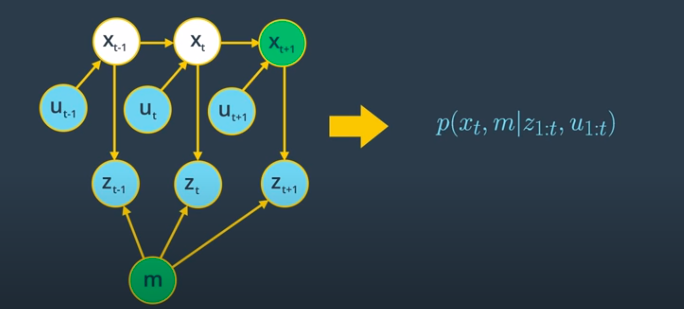
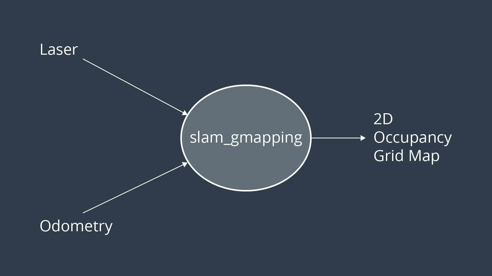
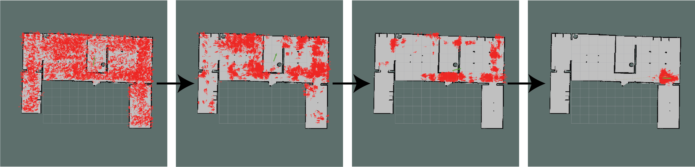
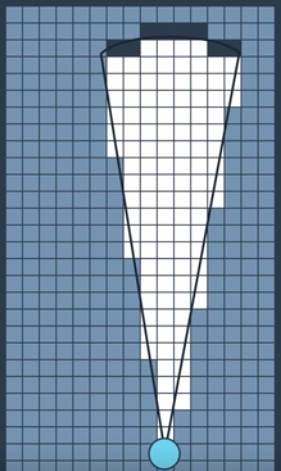
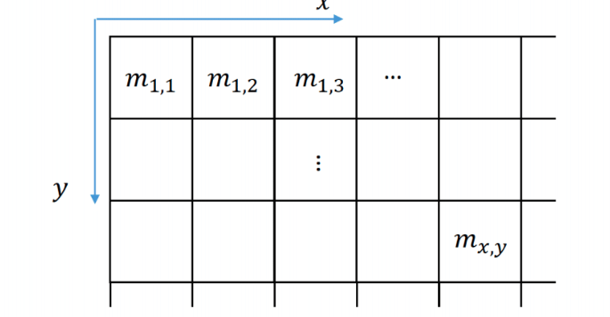
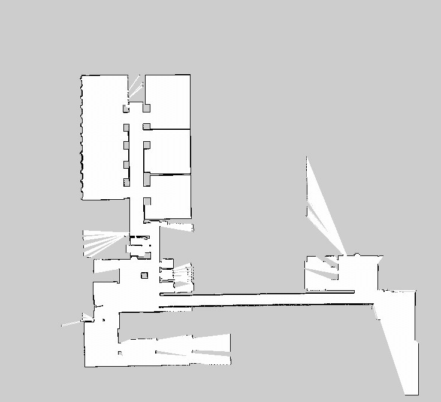
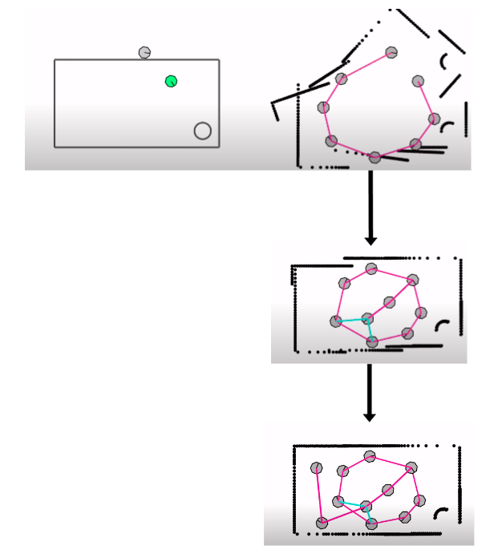

# Grid-Based FastSLAM(Gmapping)

Author: Wafaa Mohamed

Review : KG

# 1. SLAM

## what is SLAM

**Simultaneous Localization and Mapping (SLAM)** is the problem of constructing a map of an unknown environment while simultaneously localizing the robot within that map. This problem is more challenging than either localization or mapping alone, since neither the map nor the robot's poses are provided.

**Localization:**

* *Assumption* : Known Map
* *Estimation* : Robot's Pose (position and orientation)

**Mapping:**

* *Assumption* : Known Robot's Poses (Trajectory)
* *Estimation* : Map of the Environment

**SLAM:**

* *Assumption* : Sensor Data
* *Estimation* : Map and Robot's Poses (Trajectory)
  
### SLAM Algorithms

SLAM algorithms can be categorized into several types, each with its own approach to solving the SLAM problem. Examples include:

* Extended Kalman Filter (EKF)
* GraphSLAM
* FastSLAM

In this session we will be talking about **FastSLAM** which uses a particle feature approach along with the low dimentional extended kalman filter to solve the SLAM problem efficiently.

## Localization

Localization is the problem of determining a robot's position and orientation within a given map of the environment.

Common algorithms used for localization include:

* **Extended Kalman Filter (EKF)**
* **Monte Carlo Localization (MCL):**

  * MCL uses a particle filter to maintain a set of particles, each representing a possible pose of the robot.

  * The robot updates these particles based on motion commands and sensor measurements.
  * Particles that are inconsistent with sensor data are given low weights and are less likely to be propagated.
  * Over time, the particles converge to represent the most probable pose of the robot.

The estimated pose is represented probabilistically as \( P(x_t | z_{1:t}, u_{1:t-1}) \), where \( x_t \) is the robot's pose at time \( t \), \( z_{1:t} \) are the sensor measurements up to time \( t \), and \( u_{1:t-1} \) are the control inputs up to time \( t-1 \).

## Mapping

Mapping is the task of creating a map of an unknown environment. the robot uses sensor measurements and algorithms such as occupancy grid mapping to build the map.

The map estimation is represented as \( P(m | x_{1:t}, z_{1:t}) \), where \( m \) is the map, \( x_{1:t} \) are the robot's poses, and \( z_{1:t} \) are the sensor measurements.

**Now we will use SLAM to map the environment given measurements and localize the robot relative to this map when both the map and the robot's trajectory are unknown.**

## Forms of SLAM

SLam comes into two forms:

1. **Online SLAM**
2. **Full SLAM**

### Online SLAM

In **Online SLAM**, the robot estimates its current pose and the map using all measurements and controls up to the current time. It focuses on the current state without retaining the entire trajectory history.

### Full SLAM

In **Full SLAM**, the robot estimates its entire trajectory and the map using all measurements and controls collected over time. It retains and estimates all past poses, leading to a higher computational complexity.

### Graphical Representation of SLAM Problems

#### Online SLAM Problem

In Online SLAM, the robot estimates its current pose and the map using all past measurements and controls up to the current time.

This problem can be modeled with the probability equation:

\[
P(x_t, m | z_{1:t}, u_{1:t}) = P(x_t | x_{t-1}, u_t) \cdot P(m | x_t, z_t)
\]

#### Full SLAM Problem

In Full SLAM, the robot estimates its entire trajectory and the map using all measurements and controls.

This problem can be modeled with the probability equation:

\[
P(x_{0:t}, m | z_{1:t}, u_{1:t})
\]

Where:

* \( x_{0:t} \) is the sequence of robot poses from time 0 to \( t \).
* \( m \) is the map of the environment.
* \( z_{1:t} \) are the measurements from time 1 to \( t \).
* \( u_{1:t} \) are the control inputs from time 1 to \( t \).

## 2. What is Gmapping?

The **Gmapping** ROS package is an implementation of a SLAM algorithm called **Grid-Based FastSLAM**. It allows us to create a 2D map using laser and odometry data that the robot provides while moving around an environment.

Let's explore **Grid-Based FastSLAM** in more detail.

# 3. FastSLAM Algorithm

**Grid-Based FastSLAM** is an extension of the FastSLAM algorithm. It solves the **Full SLAM** problem by estimating the robot's entire trajectory and the map using all measurements and controls.

It achieves this using a **Rao-Blackwellized particle filter** approach and occupancy grid mapping.

## 3.1. FastSLAM Overview

FastSLAM decomposes the SLAM problem into two parts:

1. **Robot Pose Estimation**: Uses a particle filter to estimate the robot's trajectory.
2. **Mapping**: Each particle maintains its own map, which is updated using observations and the particle's estimated trajectory.

In landmark-based FastSLAM, each landmark is estimated independently using EKFs.

## 3.2. Particle Filter

- A particle filter is used to estimate the robot's pose.
- It initializes a set of particles, each representing a possible robot pose (x, y, θ).
- At each time step, particles are propagated based on the motion model, reweighted based on sensor measurements, and resampled.
- Each particle represents a hypothesis of the robot's trajectory and map.

## 3.3. Occupancy Grid Mapping Algorithm

- In **Grid-Based FastSLAM**, instead of landmarks, we use an occupancy grid map.
- Each particle maintains its own occupancy grid map, which is updated using the particle's estimated trajectory and sensor measurements.
- Occupancy grid mapping uses a binary Bayes filter to estimate the occupancy probability of each cell.

Each cell in the map has an occupancy value representing the probability that the cell is occupied.

- **Occupied**: \( p(m_{x,y}) = 1 \)
- **Free**: \( p(m_{x,y}) = 0 \)

**Black Color**: Cell is occupied (\( p(m_{x,y}) = 1 \)).

**White Color**: Cell is free (\( p(m_{x,y}) = 0 \)).

### Measurement Model \( p(z_t | x_t, m) \)

The measurement model defines the probability of receiving a measurement \( z_t \) given the robot's pose \( x_t \) and the map \( m \).

In occupancy grid mapping, we use an inverse sensor model to update the occupancy probabilities based on measurements.

### Probability Update Using Bayes' Rule

We update the occupancy probability for each cell using Bayes' rule:

\[
p(m_{x,y} | z_{1:t}, x_{1:t}) = \frac{p(z_t | x_t, m_{x,y}) \cdot p(m_{x,y} | z_{1:t-1}, x_{1:t-1})}{p(z_t | z_{1:t-1}, x_{1:t})}
\]

## 3.4. FastSLAM Variants

FastSLAM has multiple variants:

- **FastSLAM 1.0**: Simple to implement but requires a large number of particles for accuracy.
- **FastSLAM 2.0**: More efficient than FastSLAM 1.0, using fewer particles by incorporating improved proposal distributions.
- Both FastSLAM 1.0 and 2.0 are **Landmark-Based** algorithms, assuming known landmark positions.

**Grid-Based FastSLAM** extends FastSLAM to work with occupancy grid maps, allowing us to model arbitrary environments without predefined landmarks.

# 4. Grid-Based FastSLAM Algorithm

By extending the FastSLAM algorithm to occupancy grid maps, we can solve the SLAM problem in arbitrary environments.

The **Rao-Blackwellized particle filter** is used to estimate both the robot's trajectory and the map.

The joint posterior over robot poses and maps is factorized as:

\[
p(x_{0:t}, m | z_{1:t}, u_{1:t}) = p(m | x_{0:t}, z_{1:t}) \cdot p(x_{0:t} | z_{1:t}, u_{1:t})
\]

### Robot Trajectory

- Estimated using a particle filter.
- Each particle represents a possible robot trajectory \( x_{0:t}^{[k]} \).

### Map

- For each particle, the map is estimated using the occupancy grid mapping algorithm, given the particle's trajectory and the sensor measurements.

## The Algorithm

The Grid-Based FastSLAM algorithm involves three main steps for each particle \( k \):

1. **Sampling Motion Model**: Sample the new pose \( x_t^{[k]} \) based on the previous pose \( x_{t-1}^{[k]} \) and control input \( u_t \).
   \[
   x_t^{[k]} \sim p(x_t | x_{t-1}^{[k]}, u_t)
   \]
2. **Importance Weighting**: Compute the importance weight \( w_t^{[k]} \) based on the likelihood of the measurement \( z_t \) given the new pose and map.
   \[
   w_t^{[k]} = p(z_t | x_t^{[k]}, m^{[k]})
   \]
3. **Map Update**: Update the map \( m^{[k]} \) using the new pose and measurement.
   \[
   m^{[k]} = \text{update\_map}(m^{[k]}, x_t^{[k]}, z_t)
   \]

### Algorithm Steps

1. **Initialization**: Generate \( M \) particles with initial poses and maps.

2. **For each time step \( t \)**:
   - **For each particle \( k \)**:
     - **Motion Update**: Sample new pose \( x_t^{[k]} \) from the motion model.
     - **Measurement Update**:
       - Compute importance weight \( w_t^{[k]} \) based on measurement likelihood.
     - **Map Update**:
       - Update the map \( m^{[k]} \) using the occupancy grid mapping algorithm.
   - **Resampling**:
     - Normalize the weights \( w_t^{[k]} \).
     - Resample particles based on their weights to form a new particle set.

3. **Output**: The estimated map and the most probable robot trajectory.

### Resampling Step

- Particles with higher weights (better agreement with measurements) are more likely to be selected.
- Resampling helps to focus computational resources on the most promising hypotheses.

# 5. More About Gmapping

- The **gmapping** package contains a ROS node called **slam_gmapping** that reads data from the laser scanner and the robot's odometry (or transforms) to create an occupancy grid map in real-time.
- It subscribes to two topics:
  - **/scan**: For laser scanner data.
  - **/tf**: For transform messages providing the robot's position and orientation.
- By analyzing laser data and robot poses, it calculates the distance to nearby obstacles and updates the occupancy grid map.
- The generated map is published on the **/map** topic using the **nav_msgs/OccupancyGrid** message type, making it available for other components in the system.
- **Gmapping** supports **loop closure**, which is critical for correcting errors in the robot's trajectory by recognizing previously visited locations.
  - It achieves loop closure using **scan matching**, comparing current laser scans with past data to identify similarities.
  - When a loop closure is detected, Gmapping adjusts the robot's estimated trajectory and updates the map to improve accuracy.

### [&lt;-Back to main](../../README.md)
