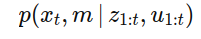
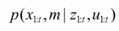
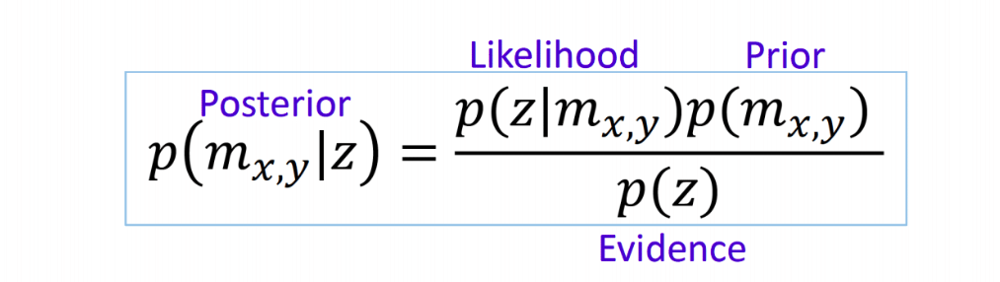
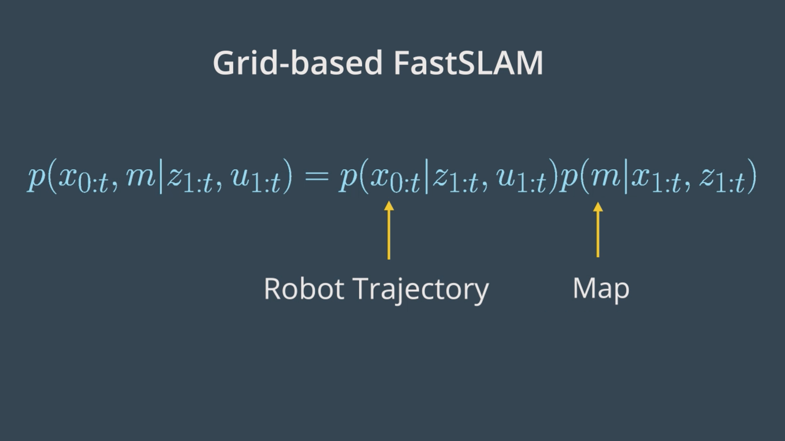
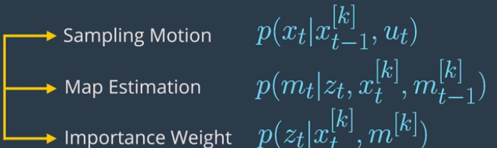
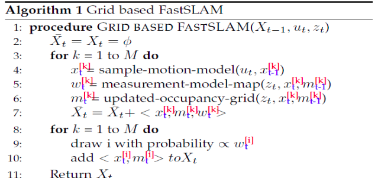

# Grid-Based FastSLAM(Gmapping)

Author: Wafaa Mohamed

Review :

# 1. SLAM

### what is SLAM :

Simultaneous Localization and Mapping is the problem of making the robot constructs a map of the environment, while simultaneously localizing itself relative to this map. This problem is more challenging than localization and mapping, since neither the map nor the robot's poses are provided.

**Localization:**

* *Assumption* : Known Map
* *Estimation* : Robot's Trajectory

**Mapping:**

* *Assumption* : Robot's Trajectory
* *Estimation* : Map

**SLAM:**

* *Assumption* : Sensor Dara
* *Estimation* : Map and Robot's Trajectory

### SLAM Algorithms

SLAM algorithms can be categorized into several types, each with its own approach to solving the SLAM problem for example :

* Extended Kalman Filter (EKF)
* GraphSLAM
* FastSLAM
  In this session we will be talking about FastSLAM which uses a particle feature approach along with the low dimentional extended kalman filter to solve the SLAM problem

### Localization :

It is the problem of determining a robot's position and orientation within a givin map for an environment environment.

so as mentioned the robot estimates its position as(x,y,theta) given the map it's doing this with specific algorithms , the most common algoritms are :

* **Extended Kalman Filter (EKF)**
* **Monte Carlo Localization (MCL):**
  Particle filter localization maintains a set of particles, each representing a possible pose of the robot.

  The robot generates many random guesses as to where it is going to move next. These guesses are known as particles. Each particle contains a full description of a possible future pose. When the robot observes the environment it's in (via sensor readings), it discards particles that don't match with these readings, and generates more particles close to those that look more probable. This way, in the end, most of the particles will converge in the most probable pose that the robot is in. So the more robot moves, the more data it will get from sensors, hence the localization will be more precise.

  The estimated pose will be determined with : P(xt|zt,ut)

### Mapping:

It is the task of creating a map of an unknown environment. so the robot will use sensor measurements and with aid of certain algorithm to reate a map for a place for example the ocuupancy grid map we have mentioned before.

The map will be determined with : P(m∣zt,xt)

**Now we will use SLAM to map the environment given measurements and localize the robot relative to this map.**

### SLAM Forms:

SLam comes into two forms :

1. Online SLAM
2. Full SLAM

### Graphical Representation for the online Slam Problem

Robot estimates its current pose and the map using current measurements and controls.So it solves instantenous poses independently from previous measurements and controls

- At time t-1, the robot will estimate its current pose and  (X t-1), and the map (m), giving its current easurements (Zt-1) and controls (Ut-1).
- Then, at time t, the robot will estimate its new pose (Xt) and the map (m), given only its current measurements (Zt), and controls (Ut),  the previous measurements and controls are not taken into consideration when computing the new estimate of the pose and the map.
- And at time, t+1, the robot will estimate its current pose (Xt+1) and the map (m) ,given the measurements (Zt+1) and controls (Ut+1).
- This problem can be modeled with the probability equation:

### Graphical Representation for the Full Slam Problem

Robot estimates its entire trajectory and the map using all the measurements and controls.

- At time t-1, the robot will estimate the robot pose xt-1 and map m, given the measurements zt-1 and controls ut-1.
- At time t, the robot will estimate the entire path (Xt-1:t) and map m, given all the measurements (Zt-1:t) and controls (Ut-1:t).
- At time t+1, the robot will estimate the entire path (Xt-1:t+1) and map m, given all the measurements (Zt-1:t+1) and controls (Ut-1:t+1).
- This problem can be modeled with the probability equation
- Thus, with full SLAM problem we estimate all the variables that occur throughout the robot travel time.

# 2. What is Gmapping?:

The gmapping ROS package is an implementation of a  SLAM algorithm called Grid-Based FastSLAM that allows us to create a 2D map using the laser and pose data that the robot is providing while moving around an environment.

- Let's speak  about  Grid-Based FastSLAM

# 3. FastSLAM Algorithm

Grid-Based FastSLAM is an instance/extension of FastSLAM, itis an algorithm to solve the **full SLAM** problem (Robot estimates its entire trajectory and the map using all the measurements and controls.)

It does this using Paricle filter and occupancy grid mapping algorithm

### 3.2. Particle Filter :

- it's used to estimate the robot pose, it first initializes a set of particles in random locations and orientations within the map and then iterates some steps until the particles have converged to the position of the robot we are going to talk about Particle filter in more in details in localization sessions
- It's important to know thar each particle is representing a hypothesized pose and map of the environment.

#### 3.3. Occupancy Grid Mapping Algorithm:

- In addition, each particle maintains its own map. The grid-based FastSLAM algorithm will update each particle by solving the mapping with known poses problem using the occupancy grid mapping algorithm.
- occupancy grid mapping is an approach to create map it implements the binary bayes filter to estimate the occupancy value of each cell.

**So it's working as following each cell will have occupancy variable :**

**m(x,y) = {free , occupied} -> {0,1}**

**Black Color : Cell is occupied:p(mx,y) = 1.**

**White Color : Cell is not occupied p(mx,y) = 0.**

#### Measurement Model p(z|m_xy)

1. **p(z = 1 , m =1 )**

* This is a **True occupied** measurement: This refers to the probability of state z being occupied (z = 1) given a measurement m_x,y of 1.

2. **p(z = 0 , m =1 )**

* This is a **False free** measurement: This signifies the probability of state z being unoccupied (z = 0) given a measurement m_x,y of 1.

3. **p(z = 1 , m =0 )**

* This is a **False occupied** measurement: This denotes the probability of state z being occupied (z = 1) given a measurement m_x,y of 0.

4. **p(z = 0 , m =0 )**

* This is a **True free** measurement: This refers to the probability of state z being unoccupied (z = 0) given a measurement m_x,y of 0.

#### Probability

### 3.4. FastSLAM Instances:

- FastSLAM has Multiple instances FastSLAM 1.0 , FastSLAM 2.0 and grid-based FastSLAM
- **FastSLAM 1.0:** it is simple and easy to implement,it is known to be inefficient  and uses a lrge number of particle.
- **FastSLAM 2.0:** overcomes the inefficiency of FastSLAM 1.0 and uses low number of particles.
- Both of FastSLAM 1.0 and FastSLAM 2.0 are Landmark-Based algorithms which means it must always assume that there are known landmark positions, and thus with FastSLAM we are not able to model an arbitrary environment.
- **Grid-Based FastSLAM:**  it's an extension of fast slam except that it's a non Landmark-Based algorithm so we an model the environment using grid maps without predefining any landmark position.

# 4. Grid-Based FastSLAM Algorithm

- So by extending the FastSLAM algorithm to occupancy grid maps, you can now solve the SLAM problem in an arbitrary environment
- **Rao-Blackwellized particle filter approach is used to estimate the robot's trajectory (path) and the map of the environment.**

#### Robot Trajectory:

uses particle filter to estimate the robot trajectory, so each particle holds a guess of the robot trajectory.

#### Map:

In addition, each particle maintains its own map. The grid-based FastSLAM algorithm will update each particle by solving the mapping with known poses problem using the occupancy grid mapping algorithm.

## The Algorithm:

In this algorithm there are three different techniques needed :

1. **Sampling Motion-`$$p(x_{t} | x_{t-1}^{[k]} , u_{t})$$`:** Estimates the current pose given the k-th particle previous pose and the current controls u.
2. **Map Estimation-`$$p(m_{t} | z_{t}, x_{t}^{[k]} , m_{t-1}^{[k]})$$`:** Estimates the current map given the current measurements, the current k-th particle pose, and the previous k-th particle map
3. **Importance Weight-`$$p(z_{t} | x_{t}^{[k]} , m^{[k]})$$`:** Estimates the current likelihood of the measurement given the current k-th particle pose and the current k-th particle map.

### The Algorithm will be as following :

It's composed of two sections with two for loops :

1. first section includes motion , sensor and map update steps
2. second section includes the re-sampling process

* At each iteration the algorithm takes the previous pose , control and measurement as inputs

#### First section of the algorithm:

* Initially, the hypothetical belief is obtained by randomly generating M particles.
* Then, in the first section,each particle implements the three techniques to estimate the k particles  current pose, likelihood of the measurement, and the map.
* Each particle begins by implementing the sampling technique in the sample motion model to estimate the current pose of the k particle. xt
* Next, in the measurement update step,each particle implements the importance weight technique in the measurement model map function to estimate the current likelihood of the k particle measurement. *wt*
* Moving on to the map update step, each particle will implement the map estimation technique into updated occupancy grid map function to estimate the current k particle map. *mt*
* This map estimation problem will be solved under the occupancy grid mapping algorithm.
* So, the newly estimated k particle pose map and likelihood of the measurements are all added to the hypothetical belief.

#### Second section of the algorithm:

* re-sampling process happen through re-sampling wheel.
* the particles with measurement values close to the robot's measurement value survive and are redrawn in the next iteration,while the others die.
* The surviving particles poses end map are added to the system belief.
* Finally, the algorithm outputs the new belief and another cycle of iterations starts implementing the newly completed belief,the next motion and the new sensor measurements.

# 5. More About Gmapping :

- The gmapping package contains a ROS Node called slam_gmapping that basically reads data from the laser and the transforms of the robot, and turns it into an occupancy grid map (OGM).
- so it subscribes to two topics: the /scan topic for laser scanner data and the /tf messages for position information relative to a starting point. By analyzing laser data and robot positions, it calculates the distance to nearby obstacles. This data is then used to create a simple map indicating occupied and free areas, which it shares on the /map topic using the nav_msgs/OccupancyGrid message type, making it available for other components of the system to utilize..
- It creates the map real-time that means we can visualize the map while it's being built
- Also Gmapping supports **loop closure,** a critical process for correcting errors in the robot's trajectory by recognizing previously visited locations. It achieves loop closure using scan matching, comparing current laser scans with past data to identify similarities. When a loop closure is detected, GMapping adjusts the robot's estimated trajectory and updates the map to improve accuracy.

### [&lt;-Back to main](../../README.md)
