# Pose Graph Optimizations

In SLAM, achieving accurate localization and mapping is essential for automate the robots navigation in unknown environments. As robots move, they rely on sensor data to estimate their trajectory and build a map. However, errors such as odometry drift and sensor noise accumulate over time, leading to distortions in both the trajectory and the map.

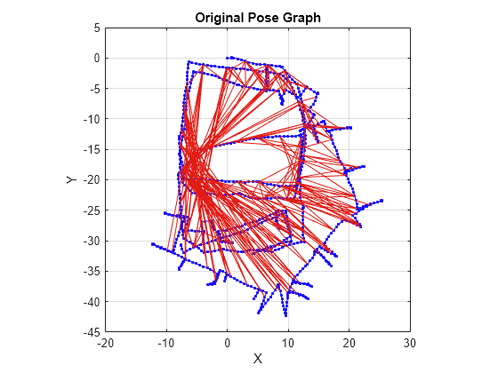

**Pose graph optimization** directly addresses these challenges by refining the robot's pose estimates and correcting errors that arise during navigation. The motivation for this technique lies in its ability to improve the overall accuracy of both the map and the robot's trajectory, ensuring global consistency even in complex, large-scale environments. This optimization is crucial for enabling autonomous robots to operate reliably, especially when they revisit previously mapped areas or need to correct significant drift in their estimated positions.

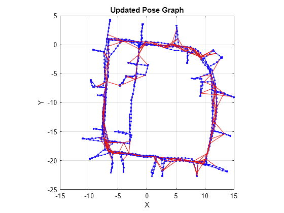

## Graph Theory

Graph theory is a branch of mathematics and computer science that studies graphs, which are mathematical structures used to model pairwise relationships between objects. In the context of SLAM (Simultaneous Localization and Mapping) and pose graph optimization, graph theory provides the foundational framework that allows us to represent and solve complex problems involving spatial relationships and constraints.

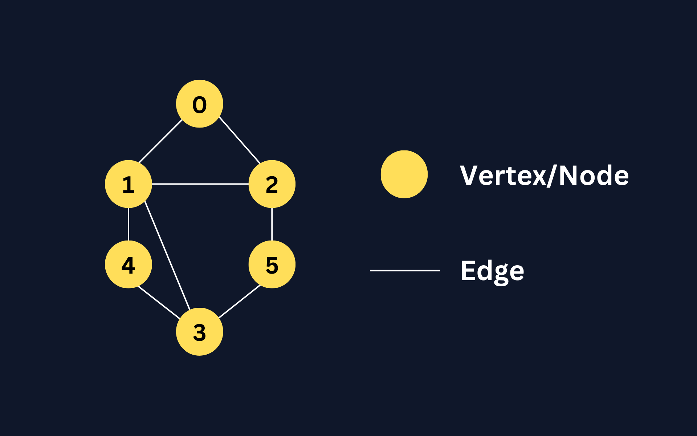

### Nodes (Vertices)

A  **node** , also known as a  **vertex** , is a fundamental unit in a graph that represents an entity or a point. In various applications, nodes can symbolize different elements:

* **In computer networks** : Nodes represent computers or devices connected within a network.
* **In social networks** : Nodes stand for individuals or organizations.
* **In robotics and SLAM** : Nodes correspond to the robot's poses at different points in time.

Each node in a graph can contain additional information or attributes. In pose graph optimization, a node typically includes:

* **Position (x, y, z coordinates)** : The estimated location of the robot in space.
* **Orientation (roll, pitch, yaw angles)** : The robot's facing direction.
* **Sensor Data** : Associated measurements taken at that pose, such as LiDAR scans or camera images.

### Edges (Links)

An **edge** is a connection between two nodes that represents a relationship or interaction between them. Edges can have various properties:

* **Directed vs. Undirected** : Directed edges have a direction, indicating a one-way relationship, while undirected edges represent bidirectional relationships.
* **Weighted vs. Unweighted** : Weighted edges carry a value (weight) that quantifies the strength or cost of the connection.

Graph theory, through the concepts of nodes and edges, provides essential tools for modeling and solving problems involving relationships and constraints. In SLAM and pose graph optimization, these concepts allow for the effective representation and optimization of a robot's trajectory and its understanding of the environment.

## Importance of Pose Graph Optimization

In any SLAM system, sensor inaccuracies such as odometry drift and measurement noise cause errors to accumulate over time. These small, incremental errors can result in significant deviations between the robot's estimated and actual positions, which, in turn, distort the map being built.

**Pose graph optimization** plays a crucial role in addressing this issue. It works by refining the robot's pose estimates and aligning them with sensor-derived constraints, ensuring that the map remains accurate and globally consistent. This process involves constructing a graph where nodes represent the robot's poses at different times, and edges represent the constraints between these poses.

Through optimization, the robot's entire trajectory is adjusted to minimize the accumulated errors, especially during  **loop closures** , when the robot revisits a previously mapped area. This refinement is key to maintaining both local and global accuracy in the map, which is vital for the robot's ability to navigate and interact with the environment

## Pose Graph Structure

A **Pose Graph** provides an intuitive way to model the robot's trajectory in SLAM systems. The graph consists of:

* **Nodes** :

  1. **Position (x, y, z coordinates)** : The estimated location of the robot in space.
  2. **Orientation (roll, pitch, yaw angles)** : The robot's facing direction.
  3. **Sensor Data** : Associated measurements taken at that pose, such as LiDAR scans or camera images.
* **Edges**:

  1. **Odometry Constraints** : Derived from the robot's motion sensors (like wheel encoders or IMUs), indicating how the robot moved from one pose to the next.
  2. **Loop Closure Constraints** : Established when the robot recognizes that it has returned to a previously visited location, based on sensor observations.
  3. **Measurement Constraints** : Based on observations of the environment, such as landmarks or features detected by sensors.

  The weight of an edge often reflects the confidence or uncertainty in the measurement or constraint. A higher weight implies a stronger confidence in the accuracy of the constraint.

As the robot moves through the environment, each new pose is added as a node in the graph. The edges between nodes encode the spatial relationships or transformations between poses based on sensor data. When the robot revisits an area, additional edges are added to represent  **loop closures** , which link the current pose to a past pose. These constraints are critical for correcting accumulated errors and ensuring that the robot's trajectory remains consistent across the map.

Pose graph optimization adjusts the positions of the nodes to minimize discrepancies between these constraints and the robot's estimated poses. This results in a more accurate representation of the robot's path and a consistent map of the environment

## Error Accumulation

Even with robust SLAM systems, **error accumulation** remains a significant challenge. Over time, as the robot moves, various sources of error can degrade the accuracy of the robot's pose estimates:

* **Odometry Drift** : Small inaccuracies in incremental motion estimates (from wheel encoders or inertial sensors) lead to gradual drift in the robot's position.

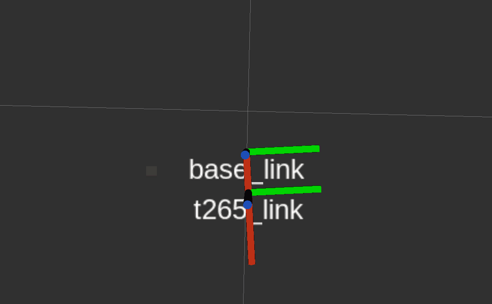

* **Sensor Noise** : Environmental factors such as lighting, reflections, or dynamic obstacles introduce noise into sensor measurements, causing further deviations between the robot's estimated and actual poses.

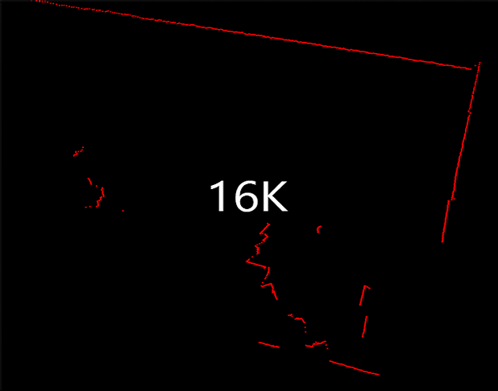

These accumulated errors distort the trajectory, which in turn results in a distorted map of the environment. Without correction, this drift can significantly impact the robot's ability to localize itself accurately. **Pose graph optimization** mitigates these effects by adjusting the robot's pose estimates to better fit the observed constraints, thereby improving the overall accuracy of both the trajectory and the map

## Pose Graph Optmization Steps

Let's set up a problem. We have a robo that has the ability to move through an environment. We've given it LiDAR to sense the distances and angles to nearby obstacles, and we've given it a way to dead reckon its relative position over time using odometry. In this case, it uses wheel encoders to count the number of rotations each wheel makes as it drives, and from that, it estimates how far it's gone and how it's turned since its last known position. Let's place the robot in a rectangular room with an obstacles in the corners.

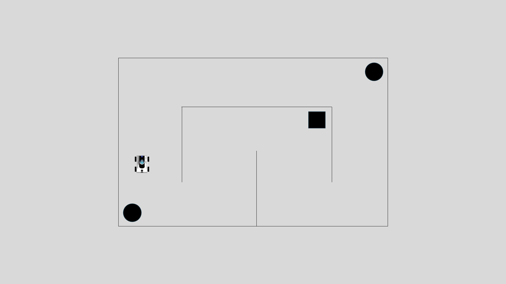

### Ideal Situation

Let's start with the ideal situation, one in which there is no uncertainty or errors in the LiDAR or odometry measurements; they're just perfect. In this situation, developing a map of the environment is relatively trivial. The robot could take a LiDAR measurement, and we have confidence that what it measured is the real obstacle location. It could save that off in a global map and then continue on. After driving some distance it takes another measurement. And in this way, we can just keep driving all around the environment and create a perfect map, all while knowing exactly where we are at all times. Of course, this scenario isn't realistic. There's error in both the LiDAR measurement and in the odometry, so there's some uncertainty in the estimated robot pose and in the distances to the measured objects.

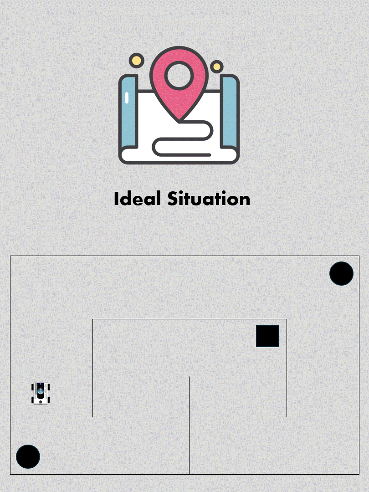

### The Impact of Uncertainty

Let's try to map this room one more time, but this time we'll say that the LiDAR is still pretty accurate, but there is a large uncertainty in the odometry measurements, maybe one of the wheels keeps slipping, so the robot thinks it's moving in a different direction than it actually is. So let's see how this works out for our robot. We get an initial LiDAR measurement, and we assume that there's an obstacle there, just like before.

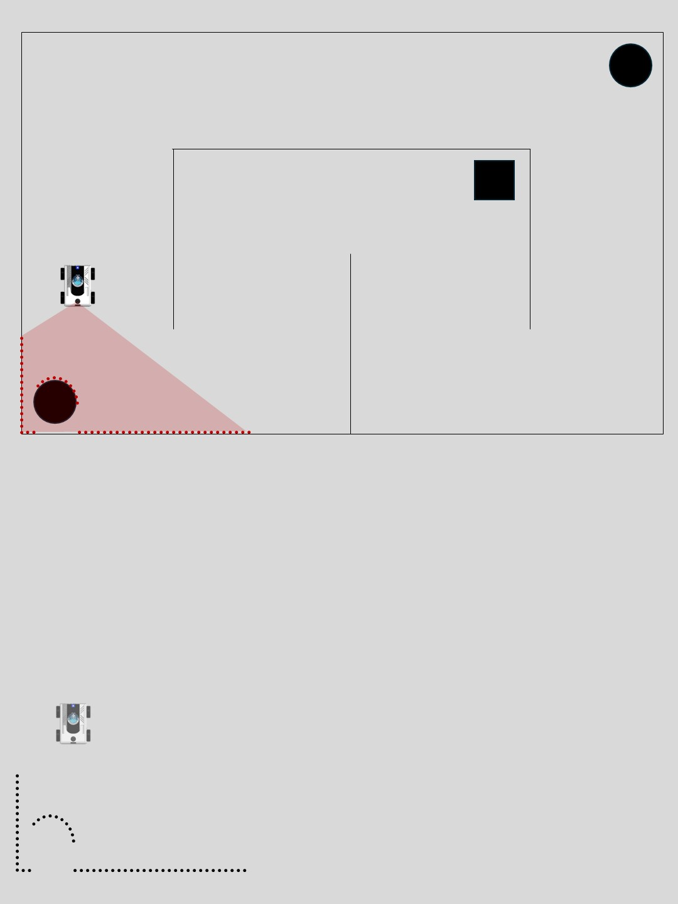

And then we drive a little bit, except this time the estimated pose is different than the real pose. So the LiDAR returns some relative distances to the wall that the real robot sees, but we can only assume that it's relative to the estimated robot pose since that's all we know. This places the two measured obstacles in different frames and not a global environment frame, and so they don't line up.

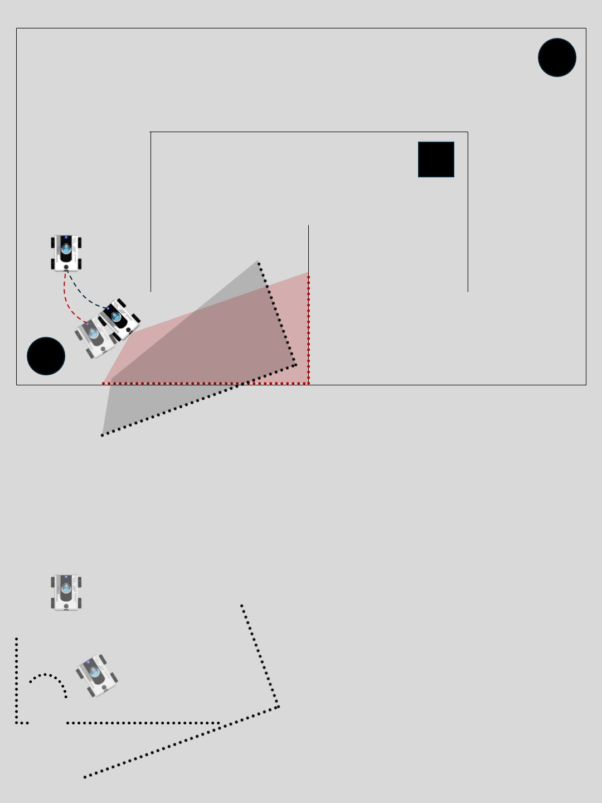

If we continue this process as we drive the robot around the room, the error in odometry causes our estimated pose to deviate more from the real pose, and what we're left with in the end is this map of obstacles that doesn't resemble the real environment.

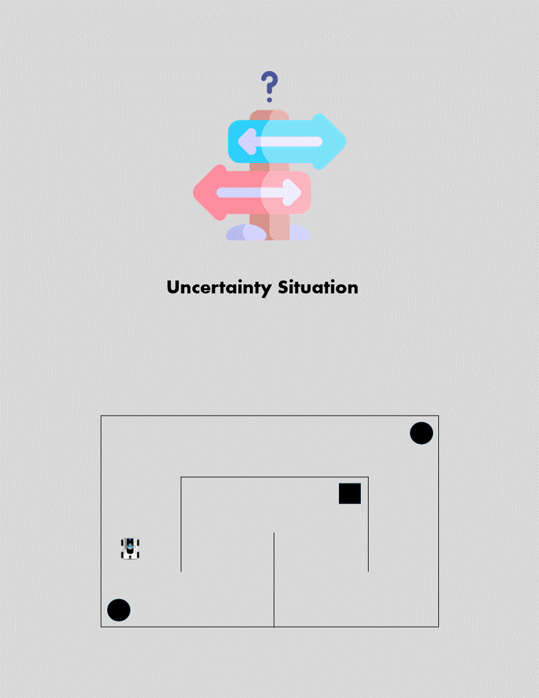

So this is one of the reasons why we can't just take measurements of the environment and stick the results into a map. Uncertainty in our system is going to mess it up. But this is where PoseGraph Optmization algorithms can help us.

### Visualizing Constraints

To visualize a constraint, it's helpful to imagine a rubber bar connecting the two poses. The nominal length of the bar is how far apart we estimate them to be, and with no external forces on these poses, the bar will just keep them at this fixed distance. However, if I hold one pose fixed and move the other pose closer to or further from it, it will compress or stretch the rubber bar, and there will be a force that wants to restore the poses back to their nominal distance. And the strength of the rubber bar depends on how confident we are in the distance estimate. If we have more confidence, or we have a really good odometry process, then this is a really strong bar that makes it difficult to change this nominal distance. If we have almost no confidence, then this rubber bar is very weak and provides almost no restoring force.

In pose graph terminology, the poses are the graph nodes, and the constraint "the rubber bar" is an edge. Of course, this constraint acts in all three pose dimensions (x, y, rotation) always trying to bring the pose back to its estimated distance.

We can't do with two nodes and one edge, so the robot keeps driving along and measuring the environment, and after a measurement, we can take the estimated pose along with its measurement of the local obstacles place it in our pose graph, and add a constraint. We can continue this, filling out our pose graph one pose at a time, until we have something that looks like that incorrect map same as we built earlier with the exception that there are these constraints connecting all of the poses.

We still can't do much with this information because you can imagine that all of these rubber bars are at their nominal length, and everything wants to stay right where it is. However, we're at a point where something interesting can happen: **Our first pose and the current pose are both observing the same feature in the environment**. This means that we can build a new constraint between these two nodes. We just need to understand how these two features align to figure out where the two poses have to be relative to each other. And they would have to be in the same location.

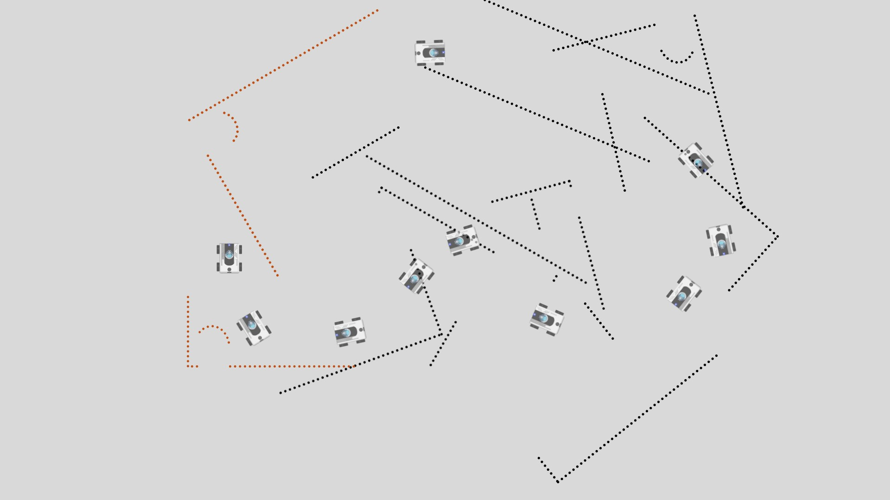

### Loop Closure

Loop closures are crucial for correcting accumulated errors that arise during the robot's movement. As the robot explores and maps an environment, small inaccuracies in odometry and sensor readings lead to drift, causing deviations between the robot’s estimated trajectory and its actual path. When a loop closure is detected, it provides an opportunity to realign the robot's current position with an earlier known location, thereby reducing this accumulated drift.

After we can add a new constraint, one that connects the first and last poses and closes the loop, this bar has a nominal length of zero since these two poses want to be right on top of each other, and the strength of this rubber bar depends on how confident you are in your external measurements and your ability to associate the two sets of data as the same feature. If you're confident, this bar is extremely strong; it wants to pull these two poses together. First start to see a loop closure, therefore it's the thing that makes all of this work. Without a closure, all of the constraints were just happily being met. But with a loop closure, we have a way to inject tension into this graph. The green bar wants to pull those two nodes together, and the orange bars all want to keep the relative distances the way that they are. So, allowing this graph to balance all of the forces is the optimization part of pose graph optimization.

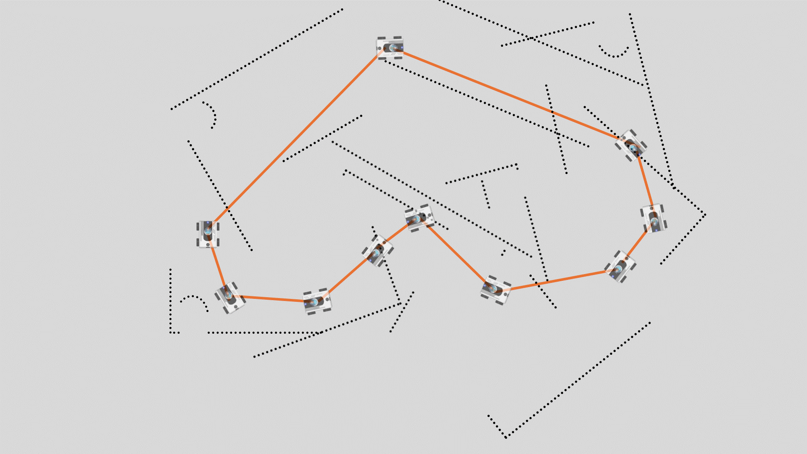

What's cool about this is that by optimizing the pose graph, not only do we have a better estimate of the current pose and a better model of the environment, but we also have a better estimate of where the robot was in the past since all of the past poses were updated as well. So we got a lot of value from this one loop closure. Of course, you can see that we don't have a perfect model of the environment or the robot poses, but that's okay because we can continue to improve our estimate by making more loop closures. The robot can continue to drive, adding new poses from odometry and new loop closures wherever it's able to determine a relationship using external data.

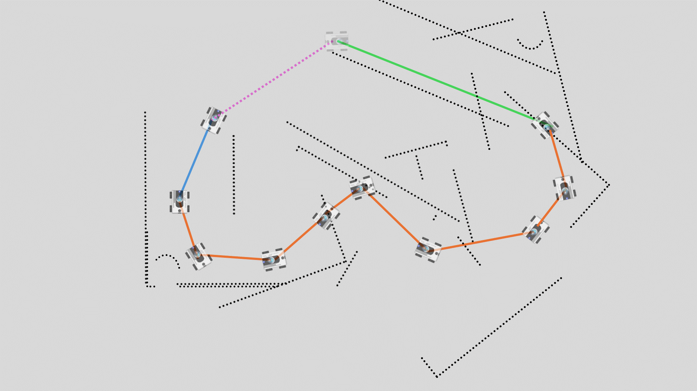

It's important to note that a loop closure requires an absolute measurement of the environment, like we got with LiDAR, or you could get it with a visible camera. You can't close the loop using a relative sensor like an IMU or wheel encoder because there's no way to relate that information to an older pose. You may think you're near a past node, but without checking the environment, you can't know for sure.

### Final Step

So there we have it: SLAM using pose graph optimization. Hopefully, now you can see how a map of the environment and the pose of the robot can be determined simultaneously with this method. Now that we have an occupancy grid map, we can start the process of planning a future trajectory through this environment. The robot no longer has to wander around aimlessly but can use this map to plan where it wants to go. There's a recap for all processes as we see in this gif:

## Conclusion

Pose graph optimization offers a powerful framework for simultaneous localization and mapping in robotics. By representing poses and constraints in a graph structure and optimizing it, robots can effectively navigate and understand complex environments despite sensor uncertainties.

With accurate map and pose estimates, robots can move beyond aimless exploration and begin planning optimal trajectories to achieve specific goals. This paves the way for advanced applications in autonomous navigation, robotics, and beyond.
