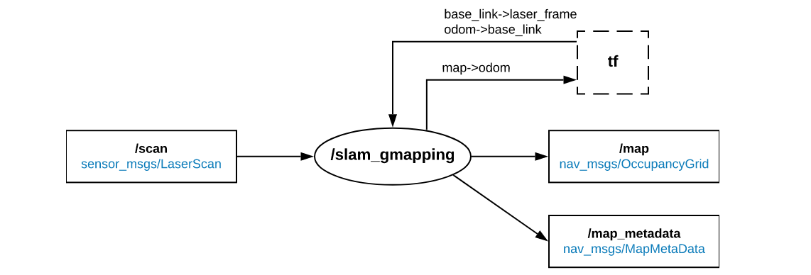
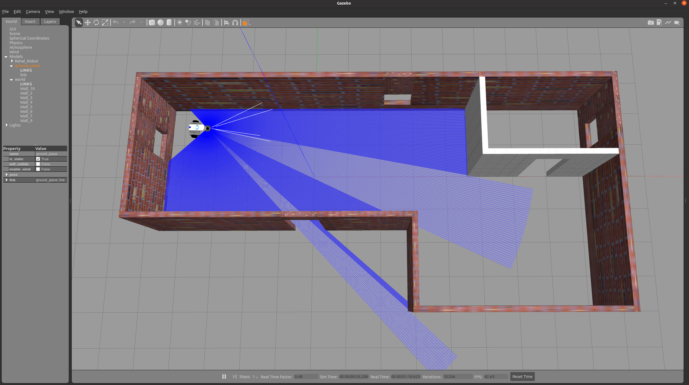
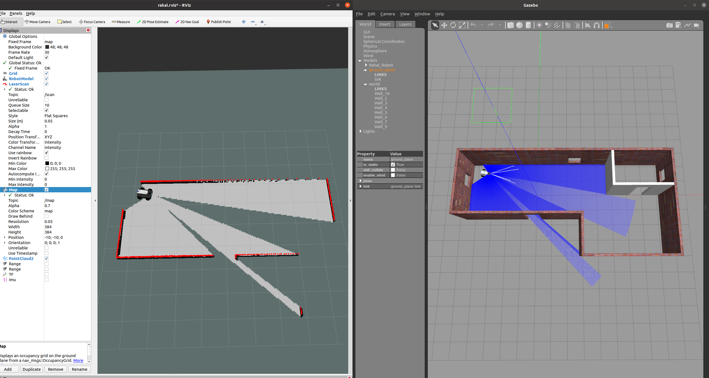
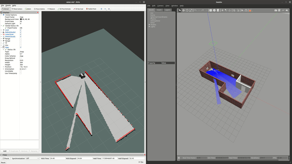
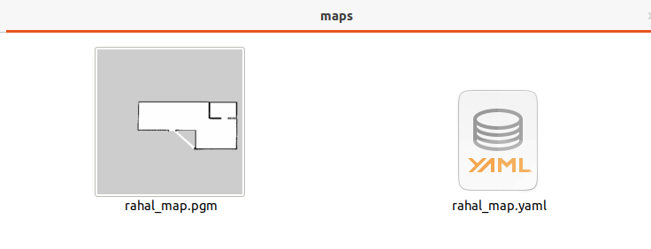
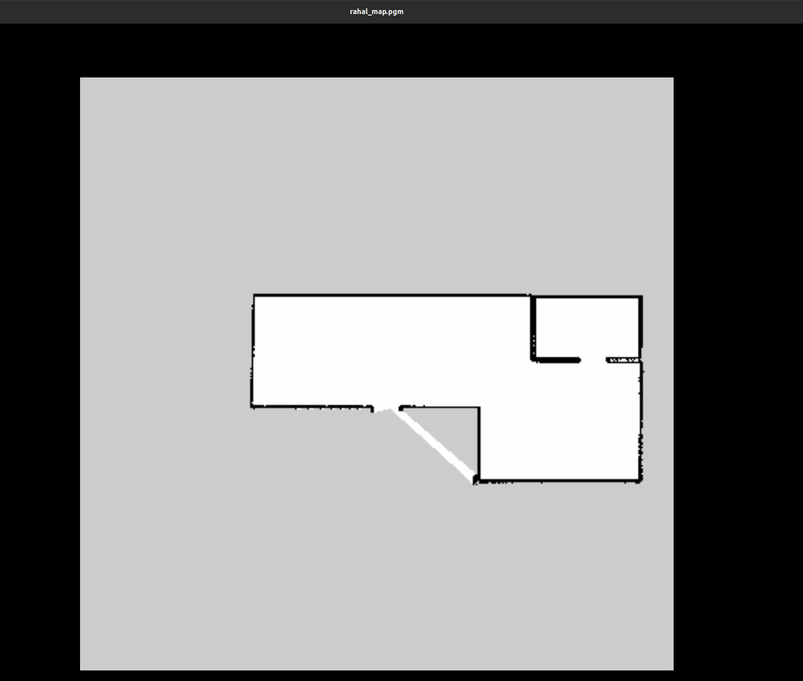

# SLAM integration with ROS

Author: Toka Essam , Wafaa

Review :

## ROS Integration with GMapping SLAM

The purpose of this document: to provide a step-by-step guide on integrating gmapping with ROS.

### 1-Introduction

[GMapping](http://wiki.ros.org/gmapping), can be used to perform SLAM with the laser range data (LiDAR scans) and a local odometry source.

The *`/slam_gmapping`* node takes as the input

* Laser scan data obtained from the LiDAR sensor is subscribed to via the `/scan` topic.
* Required transformations to establish relationships between frames such as laser, odometry (odom), and robot base (base_link) are managed through the `/tf` topic.

As the output, it returns

* an occupancy grid map of the terrain (*`/map`* and `/map_metadata` topics),
* current odometry drift based on the estimated position of the robot within the map , is conveyed through the transformations broadcasted on the `/tf` topic.



### **2- Installation:**

#### 1. Binary Installation (Recommended)

To install gmapping using the ROS package manager, use the following command

```
sudo apt-get install ros-noetic-gmapping
```

This method automatically handles dependencies and ensures a smooth installation process.

#### 2. Source Installation

Alternatively, you can install GMapping by cloning the repository directly into your ROS workspace. Follow these steps

1. Navigate to your ROS workspace directory.
2. Clone the gmapping repository from GitHub using `git clone`

```bash
cd catkin_ws/src
git clone https://github.com/ros-perception/slam_gmapping.git
```

Before building, ensure to install ROS development tools and other required dependencies

```bash
sudo apt-get install python-rosdep python-catkin-tools
sudo apt-get install ros-noetic-tf ros-noetic-tf-conversions ros-noetic-tf2-geometry-msgs ros-noetic-angles
```

**Initialize ROS dependencies for the `slam_gmapping` package using `rosdep`**

```bash
cd ..
rosdep install --from-paths src --ignore-src -r -y
```

 **Build the Workspace**

* Once dependencies are installed, build your ROS workspace:

  ```bash
  catkin_make
  source devel/setup.bash
  ```

## **3- Usage Instructions**

### Step 1 – Prepare the environment

First thing, we will use launch Rahal Robot in the last world we have created .`br`

1. clone rahal_discription_pkg into your catkin_ws by following the instructions in this** *[Link](https://github.com/arab-meet/Rahal_Robot/tree/master)***
2. launch the gazebo world that includes Rahal Robot

 `	roslaunch rahal_description_pkg rahal_gazebo_world.launch  `



### Step 2 – Configuring GMapping launch file

**1. Create ROS package for GMapping**

> For Binary Installation

```bash
cd catkin_ws/src
catkin_create_pkg workshop_gmapping
cd workshop_gmapping
```

**2. Create a Launch File for GMapping**

Within your newly created package directory, create a `launch` directory and a launch file named `gmapping.launch`.

```bash
mkdir launch
cd launch
nano gmapping.launch
```

Add the necessary contents to `gmapping.launch` to launch the GMapping node with appropriate parameters and tunning this parameter.

for Parameter explaination check it [here](Gmapping_Parametes.md).

```xml
<launch>
    <param name="use_sim_time" value="true"/>
    <node pkg="gmapping" type="slam_gmapping" name="slam_gmapping" output="screen">
        <remap from="scan" to="/scan"/>
        <param name="base_frame" value="base_footprint"/>
        <param name="odom_frame" value="odom"/>
        <param name="map_frame" value="map"/>
        <param name="map_update_interval" value="2.0"/>
        <param name="maxUrange" value="50.0"/>
        <param name="sigma" value="0.05"/>
        <param name="kernelSize" value="1"/>
        <param name="lstep" value="0.15"/>
        <param name="astep" value="0.15"/>
        <param name="iterations" value="5"/>
        <param name="lsigma" value="0.075"/>
        <param name="ogain" value="3.0"/>
        <param name="lskip" value="0"/>
        <param name="minimumScore" value="0.0"/>
        <param name="srr" value="0.1"/>
        <param name="srt" value="0.2"/>
        <param name="str" value="0.1"/>
        <param name="stt" value="0.2"/>
        <param name="linearUpdate" value="0.1"/>
        <param name="angularUpdate" value="0.1"/>
        <param name="temporalUpdate" value="1.0"/>
        <param name="resampleThreshold" value="0.5"/>
        <param name="particles" value="100"/>
        <param name="xmin" value="-10.0"/>
        <param name="ymin" value="-10.0"/>
        <param name="xmax" value="10.0"/>
        <param name="ymax" value="10.0"/>
        <param name="delta" value="0.05"/>
        <param name="llsamplerange" value="0.01"/>
        <param name="llsamplestep" value="0.01"/>
        <param name="lasamplerange" value="0.005"/>
        <param name="lasamplestep" value="0.005"/>
    </node>
   
    </launch>
```

* **Tuning parameters**

  * `base_frame`: Specifies the name of the coordinate frame representing the base of the robot (`base_footprint`).
  * `odom_frame`: Specifies the name of the coordinate frame representing the odometry of the robot (`odom`).
  * `map_frame`: Specifies the name of the coordinate frame representing the map (`map`).
  * `xmin`: Sets the minimum x-coordinate (left boundary) of the map to -8.0 meters.
  * `ymin`: Sets the minimum y-coordinate (bottom boundary) of the map to -8.0 meters.
  * `xmax`: Sets the maximum x-coordinate (right boundary) of the map to 8.0 meters.
  * `ymax`: Sets the maximum y-coordinate (top boundary) of the map to 8.0 meters.
  * `particles`**:** Defines the number of particles used in the particle filter , I set it to 100.
  * `map_update_interval`: Interval (in seconds) at which the map should be updated is set to `2.0` seconds.
  * `maxUrange`: Maximum usable range of the sensor is set to `50.0` meters.

### Step 3 – Building the Map

After configuring the GMapping launch file, you're ready to build the map using your robot in the simulated environment.

#### **1. Launch gmapping launch file**

open new tab in your terminal to launch your gmapping launch file :

```bash
catkin_make
source devel/setup.bash
roslaunch workshop_gmapping gmapping.launch
```

1. Choose `Fixed Frame` --> map
2. Add map and LaserScan
3. Choose the topics for:

   * `LaserSCan --> /scan  `
   * `Map` --> /`map`



As shown in this picture, the color representation of the map is used to indicate different states of the environment:

* **Black** : Represents obstacles detected by the robot. Areas marked in black indicate regions where the robot has identified obstacles.
* **Gray** : Represents free space or areas that are clear of obstacles. The gray color indicates open areas where the robot can move freely.
* **The other color**: Represents areas that have not yet been explored or discovered by the robot. These regions are unknown to the mapping process .

#### **2. Move the Robot**

To control the robot and generate movement commands for mapping, you can use the `teleop_twist_keyboard` node.

First, ensure that `teleop_twist_keyboard` is installed in your ROS environment. If it's not installed, you can install it using the following command

```bash
sudo apt update
sudo apt install ros-noetic-teleop-twist-keyboard
```

Once installed, open a new terminal tab and run the `teleop_twist_keyboard` node

```bash
source devel/setup.bash
rosrun teleop_twist_keyboard teleop_twist_keyboard.py
```

This will launch the teleop_twist_keyboard node, allowing you to control the robot using keyboard commands to move it around and build the map effectively.

> Refer to the [ROS Wiki](http://wiki.ros.org/teleop_twist_keyboard) for more information on `teleop_twist_keyboard` and its usage.

**Now we are ready to build Map:**




### Step 4 -Save The Map:

After completing the mapping process, it's essential to save the generated map for further use and navigation within ROS. To accomplish this, we'll use the **map_server** package.

##### Installation of map_server

If you haven't installed the **map_server** package yet, you can do so using the following commands in your terminal:

```bash
sudo apt update
sudo apt install ros-noetic-map-server
```

#### Running map_server

To save the generated map, follow these steps:

1. Open a new terminal tab.
2. Source your Catkin workspace setup script (if not already sourced):

```bash
source devel/setup.bash
```

3. Launch the **map_server** node, specifying the path to your generated map file:

```bash
rosrun map_server map_saver -f /path/to/save/map_name
```

Replace `/path/to/save/map_name` with the desired path and filename where you want to save the map. For example:

```bash
cd src
mkdir maps
rosrun map_server map_saver -f maps/rahal_map
```

After running the map server to save the map, the map is typically saved in two files:



1. **PGM File (.pgm)** : This file contains the occupancy grid map data represented in grayscale, where each pixel value indicates the probability of an obstacle's presence. The PGM file stores the visual representation of the map.The image describes the occupancy state of each cell of the world in the color of the corresponding pixel. In the standard configuration, whiter pixels are free, blacker pixels are occupied, and pixels in between are unknown. Color images are accepted, but the color values are averaged to a gray value.



**2. YAML File (.yaml)** : This file contains metadata associated with the map, including information about the map resolution, origin (position of the map in the world frame), and other relevant parameters. The YAML file provides essential details for correctly interpreting and using the map data.

```yaml
image: maps/rahal_map.pgm
resolution: 0.050000
origin: [-10.000000, -10.000000, 0.000000]
negate: 0
occupied_thresh: 0.65
free_thresh: 0.196

```

Required fields:

* **`image`** : Path to the image file containing the occupancy data; can be absolute, or relative to the location of the YAML file
* **`resolution`** : Resolution of the map, meters / pixel
* **`origin`**: The 2-D pose of the lower-left pixel in the map, as (x, y, yaw), with yaw as counterclockwise rotation (yaw=0 means no rotation).  Many parts of the system currently ignore yaw.
* **`occupied_thresh`** : Pixels with occupancy probability greater than this threshold are considered completely occupied.
* **`free_thresh`** : Pixels with occupancy probability less than this threshold are considered completely free.
* **`negate`** : Whether the white/black free/occupied semantics should be reversed (interpretation of thresholds is unaffected)

> For more information of map server Please click [here](http://wiki.ros.org/map_server).

## [GMapping Launch File Explaination](Gmapping_Parametes.md)

## References:
