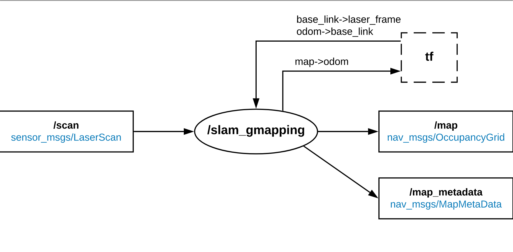
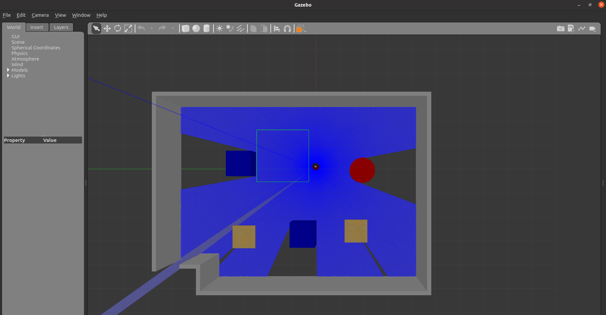
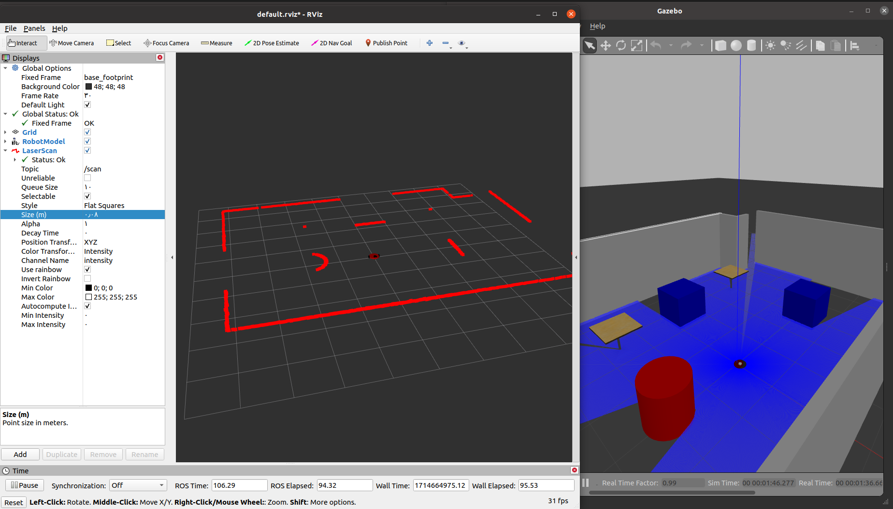
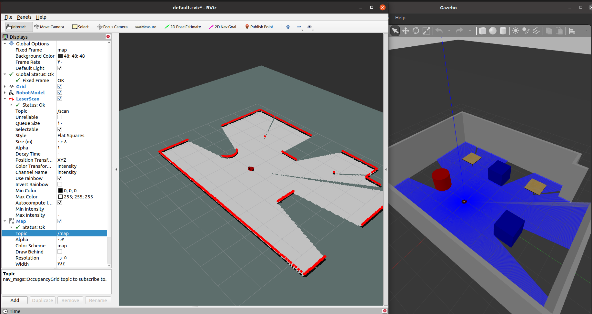
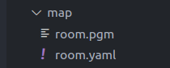

# SLAM integration with ROS

Author: Toka Essam

Review :

## ROS Integration with GMapping SLAM

The purpose of this document: to provide a step-by-step guide on integrating GMapping with ROS.

### 1-Introduction

The *`/slam_gmapping`* node takes as the input:

* laser scan data from the LiDAR sensor (*/scan* topic),
* position of the laser reference frame (*base_link->laser_frame* transform),
* current position of the robot from the odometry (*odom->base_link* transform).

As the output, it returns:

* an occupancy grid map of the terrain (*/map* and */map_metadata* topics),
* current odometry drift based on the estimated position of the robot within the map  (*map->odom* transform).



### **2- Installation:**

#### Binary Installation (Recommended):

To install GMapping using the ROS package manager, use the following command, replacing `<distro>` with your ROS distribution name (e.g., noetic, melodic):

```
sudo apt-get install ros-<distro>-gmapping  # Replace <distro> with your ROS distribution name (e.g., noetic, melodic)
```

This method automatically handles dependencies and ensures a smooth installation process.

#### Source Installation:

Alternatively, you can install GMapping by cloning the repository directly into your ROS workspace. Follow these steps:

1. Navigate to your ROS workspace directory.
2. Clone the GMapping repository from GitHub using `git clone`:

```bash
cd /path/to/your/catkin_workspace/src
git clone https://github.com/ros-perception/slam_gmapping.git
```

Before building, ensure to install ROS development tools and other required dependencies:

```bash
sudo apt-get install python-rosdep python-catkin-tools
sudo apt-get install ros-noetic-tf ros-noetic-tf-conversions ros-noetic-tf2-geometry-msgs ros-noetic-angles
```

**Initialize ROS dependencies for the `slam_gmapping` package using `rosdep`:**

```bash
rosdep install --from-paths src --ignore-src -r -y
```

 **Build the Workspace** :

* Once dependencies are installed, build your ROS workspace:

  ```bash
  cd /path/to/your/catkin_workspace
  catkin_make
  source devel/setup.bash
  ```

## **3- Usage Instructions:**


### Step 1 – Prepare the environment

First thing, we will use the same urdf of the robot in the last world we have worked .

Launch the world we created :

```bash
cd /path/to/your/catkin_workspace
catkin_make
source devel/setup.bash
roslaunch workshop_diffrobot arabian_gazebo.launch
```

For visuallization open rviz in another Tab in your terminal :

```bash
source devel/setup.bash
rviz
```






### Step 2 – Configuring GMapping launch file

**1. Create ROS package for GMapping  :**

```bash
cd /path/to/your/catkin_workspace/src
catkin_create_pkg workshop_gmapping
cd workshop_gmapping
```

**2. Create a Launch File for GMapping:**

Within your newly created package directory, create a `launch` directory and a launch file named `gmapping.launch`.

```bash
mkdir launch
cd launch
nano Gmapping.launch
```

Add the necessary contents to `gmapping.launch` to launch the GMapping node with appropriate parameters and tunning this parameter.

for Parameter explaination check it below.

```xml
<launch>
    <param name="use_sim_time" value="true"/>
    <node pkg="gmapping" type="slam_gmapping" name="slam_gmapping" output="screen">
        <remap from="scan" to="/scan"/>
        <param name="base_frame" value="base_footprint"/>
        <param name="odom_frame" value="odom"/>
        <param name="map_frame" value="map"/>
        <param name="map_update_interval" value="2.0"/>
        <param name="maxUrange" value="50.0"/>
        <param name="sigma" value="0.05"/>
        <param name="kernelSize" value="1"/>
        <param name="lstep" value="0.15"/>
        <param name="astep" value="0.15"/>
        <param name="iterations" value="5"/>
        <param name="lsigma" value="0.075"/>
        <param name="ogain" value="3.0"/>
        <param name="lskip" value="0"/>
        <param name="minimumScore" value="0.0"/>
        <param name="srr" value="0.1"/>
        <param name="srt" value="0.2"/>
        <param name="str" value="0.1"/>
        <param name="stt" value="0.2"/>
        <param name="linearUpdate" value="0.1"/>
        <param name="angularUpdate" value="0.1"/>
        <param name="temporalUpdate" value="1.0"/>
        <param name="resampleThreshold" value="0.5"/>
        <param name="particles" value="100"/>
        <param name="xmin" value="-10.0"/>
        <param name="ymin" value="-10.0"/>
        <param name="xmax" value="10.0"/>
        <param name="ymax" value="10.0"/>
        <param name="delta" value="0.05"/>
        <param name="llsamplerange" value="0.01"/>
        <param name="llsamplestep" value="0.01"/>
        <param name="lasamplerange" value="0.005"/>
        <param name="lasamplestep" value="0.005"/>
    </node>
   
    </launch>
```

Tuning parameters:

* `base_frame`: Specifies the name of the coordinate frame representing the base of the robot (`base_footprint`).
* `odom_frame`: Specifies the name of the coordinate frame representing the odometry of the robot (`odom`).
* `map_frame`: Specifies the name of the coordinate frame representing the map (`map`).
* `xmin`: Sets the minimum x-coordinate (left boundary) of the map to -8.0 meters.
* `ymin`: Sets the minimum y-coordinate (bottom boundary) of the map to -8.0 meters.
* `xmax`: Sets the maximum x-coordinate (right boundary) of the map to 8.0 meters.
* `ymax`: Sets the maximum y-coordinate (top boundary) of the map to 8.0 meters.
* **`particles`:** Defines the number of particles used in the particle filter , I set it to 100.
* `map_update_interval`: Interval (in seconds) at which the map should be updated is set to `2.0` seconds.
* `maxUrange`: Maximum usable range of the sensor is set to `50.0` meters.


> Choose the topics for `Fixed Frame` , `LaserSCan `and `Map`:



### Step 3 – Building the Map

After configuring the GMapping launch file, you're ready to build the map using your robot in the simulated environment.

#### **1. Launch GMapping launch file:**

open new tab in your terminal to launch your gmapping launch file :

```bash
cd /path/to/your/catkin_workspace/
catkin_make
source devel/setup.bash
roslaunch workshop_gmapping Gmapping.launch
```


#### **2. Move the Robot :**

To control the robot and generate movement commands for mapping, you can use the `teleop_twist_keyboard` node.

First, ensure that `teleop_twist_keyboard` is installed in your ROS environment. If it's not installed, you can install it using the following command:sudo apt update

```bash
sudo apt update
sudo apt install ros-noetic-teleop-twist-keyboard
```

Once installed, open a new terminal tab and run the `teleop_twist_keyboard` node:

```bash
cd /path/to/your/catkin_workspace/
source devel/setup.bash
rosrun teleop_twist_keyboard teleop_twist_keyboard.py
```

This will launch the teleop_twist_keyboard node, allowing you to control the robot using keyboard commands to move it around and build the map effectively.


* Refer to the [ROS Wiki](http://wiki.ros.org/teleop_twist_keyboard) for more information on `teleop_twist_keyboard` and its usage.


Now we are ready to build Map:


As shown in the video, the color representation of the map is used to indicate different states of the environment:

* **Black** : Represents obstacles detected by the robot. Areas marked in black indicate regions where the robot has identified obstacles.
* **Gray** : Represents free space or areas that are \ clear of obstacles. The gray color indicates open areas where the robot can move freely.
* **Mint green** : Represents areas that have not yet been explored or discovered by the robot. These regions are unknown to the mapping process and appear in green or mint green color.


### Step 4 -Save The Map:

After completing the mapping process, it's essential to save the generated map for further use and navigation within ROS. To accomplish this, we'll use the **map_server** package.

##### Installation of map_server

If you haven't installed the **map_server** package yet, you can do so using the following commands in your terminal:


```bash
sudo apt update
sudo apt install ros-noetic-map-server
```


#### Running map_server

To save the generated map, follow these steps:

1. Open a new terminal tab.
2. Source your Catkin workspace setup script (if not already sourced):

```bash
source devel/setup.bash
```

3. Launch the **map_server** node, specifying the path to your generated map file:

```bash
rosrun map_server map_saver -f /path/to/save/map_name
```

Replace `/path/to/save/map_name` with the desired path and filename where you want to save the map. For example:

```bash
rosrun map_server map_saver -f ~/workshop_ws/src/workshop_gmapping/map/room
```

After running the map server to save the map, the map is typically saved in two files:




1. **PGM File (.pgm)** : This file contains the occupancy grid map data represented in grayscale, where each pixel value indicates the probability of an obstacle's presence. The PGM file stores the visual representation of the map.The image describes the occupancy state of each cell of the world in the color of the corresponding pixel. In the standard configuration, whiter pixels are free, blacker pixels are occupied, and pixels in between are unknown. Color images are accepted, but the color values are averaged to a gray value.


**2. YAML File (.yaml)** : This file contains metadata associated with the map, including information about the map resolution, origin (position of the map in the world frame), and other relevant parameters. The YAML file provides essential details for correctly interpreting and using the map data.

```yaml
image: /home/workshop_ws/src/workshop_gmapping/map/room
resolution: 0.050000
origin: [-8.000000, -8.000000, 0.000000]
negate: 0
occupied_thresh: 0.65
free_thresh: 0.196
```

Required fields:

* **`image`** : Path to the image file containing the occupancy data; can be absolute, or relative to the location of the YAML file
* **`resolution`** : Resolution of the map, meters / pixel
* **`origin`**: The 2-D pose of the lower-left pixel in the map, as (x, y, yaw), with yaw as counterclockwise rotation (yaw=0 means no rotation).  Many parts of the system currently ignore yaw.
* **`occupied_thresh`** : Pixels with occupancy probability greater than this threshold are considered completely occupied.
* **`free_thresh`** : Pixels with occupancy probability less than this threshold are considered completely free.
* **`negate`** : Whether the white/black free/occupied semantics should be reversed (interpretation of thresholds is unaffected)

> For more information of map server Please click [here](http://wiki.ros.org/map_server).

## GMapping Launch File Explaination

**use_sim_time** : This parameter is set to `true` to indicate the use of simulation time instead of real time if you are using it in real set it to false.

**slam_gmapping node:** Launches the GMapping node responsible for SLAM.

**remap** : changes the topic name from "scan" to "/scan".

### [Parameters Explaination](#parameters-explanation)

#### `inverted_laser` (string, default: "false")

* **Purpose:** This parameter determines whether the laser scans are ordered in a clockwise (CW) or counterclockwise (CCW) direction. If set to "true", it indicates that laser scans are ordered upside down (CW), while "false" indicates that scans are ordered right side up (CCW).
* **Note:** This parameter was removed in version 1.1.1 and is now managed using transform data.

#### `base_frame` (string, default: "base_link")

* **Purpose:** Specifies the name of the coordinate frame attached to the mobile base of the robot.
* This frame represents the base of the robot and is important for mapping and localization.

#### `map_frame` (string, default: "map")

* **Purpose:** Specifies the name of the coordinate frame attached to the map.
* This frame represents the global map frame, which is used to align all sensor data within the map's coordinate system.

#### `odom_frame` (string, default: "odom")

* **Purpose:** Specifies the name of the coordinate frame attached to the odometry system.
* This frame represents the odometry reference frame, providing continuous position and orientation updates of the robot.

#### `map_update_interval` (float, default: 5.0)

* **Purpose:** Sets the interval (in seconds) between updates to the occupancy grid map.
* Lowering this value increases map update frequency but also increases computational load, impacting real-time performance.

#### `maxUrange` (float, default: 80.0)

* **Purpose:** Specifies the maximum usable range of the laser sensor.
* Laser beams beyond this range are cropped from the scan data to improve mapping accuracy and reduce noise.

#### `sigma` (float, default: 0.05)

* **Purpose:** Sets the sigma (standard deviation) used for the greedy endpoint matching during scan matching.
* This parameter affects how well the algorithm matches observed laser points to predicted points.

#### `kernelSize` (int, default: 1)

* **Purpose:** Specifies the size of the kernel used to look for correspondence during scan matching.
* Increasing this parameter can help in matching laser scans more accurately but may increase computational cost.

#### `lstep` (float, default: 0.05)

* **Purpose:** Sets the optimization step size in translation during scan matching.
* This parameter affects the rate at which the algorithm adjusts the robot's estimated position.

#### `astep` (float, default: 0.05)

* **Purpose:** Sets the optimization step size in rotation during scan matching.
* This parameter affects the rate at which the algorithm adjusts the robot's estimated orientation.

#### `iterations` (int, default: 5)

* **Purpose:** Specifies the number of iterations used for refining the scan matching process.
* Increasing iterations can improve the accuracy of pose estimation but may increase computational time.

#### `lsigma` (float, default: 0.075)

* **Purpose:** Sets the sigma (standard deviation) of a laser beam used for likelihood computation.
* This parameter influences how sensor noise is considered during the likelihood computation.

#### `ogain` (float, default: 3.0)

* **Purpose:** Sets the gain used for evaluating the likelihood to smooth resampling effects.
* Increasing this parameter can amplify the influence of scan data on map updates.

#### `lskip` (int, default: 0)

* **Purpose:** Specifies the number of laser beams to skip during likelihood computation.
* Adjusting this parameter can reduce computational load by processing fewer laser beams.

#### `minimumScore` (float, default: 0.0)

* **Purpose:** Sets the minimum score threshold for accepting scan matching results.
* **Details:** Higher values can filter out unreliable scan matches, improving map accuracy in open areas.

#### `srr, srt, str, stt` (float, default: various)

* **Purpose:** Specifies the odometry error parameters used in the motion model.
* These parameters model the uncertainty in robot motion and influence how the algorithm updates robot pose estimates.

#### `linearUpdate` (float, default: 1.0)

* **Purpose:** Sets the linear update threshold for processing scans based on robot translation.
* This parameter determines how far the robot must translate before processing a new scan.

#### `angularUpdate` (float, default: 0.5)

* **Purpose:** Sets the angular update threshold for processing scans based on robot rotation.
* This parameter determines how much the robot must rotate before processing a new scan.

#### `temporalUpdate` (float, default: -1.0)

* **Purpose:** Sets the temporal update threshold for processing scans based on time.
* A negative value disables time-based updates, while a positive value triggers updates after a specified time interval.

#### `resampleThreshold` (float, default: 0.5)

* **Purpose:** Sets the Neff-based resampling threshold for particle filtering.
* Higher values trigger particle resampling less frequently, affecting the robustness of the particle filter.

#### `particles` (int, default: 30)

* **Purpose:** Specifies the number of particles used in the particle filter for pose estimation.
* Increasing the number of particles can improve pose estimation accuracy but requires more computational resources.

#### `Xmin`: 

* Defines the minimum x-coordinate boundary of the map.

#### `ymin`:

* Defines the minimum y-coordinate boundary of the map.

#### `xmax`:

* Defines the maximum x-coordinate boundary of the map.

#### `ymax`:

* Defines the maximum y-coordinate boundary of the map.


## References:
